An introduction to ggplot2 for rapid data and model visualization
=================================================================

Goals
=====

-   Understand the basic grammar of ggplot2 (data, geoms, aesthetics, facets)
-   Learn to make quick exploratory plots with ggplot2
-   Know how to find help on ggplot2 when you run into problems

Introduction
============

ggplot2 is an R package by Hadley Wickham and Winston Chang that implements Wilkinson's Grammar of Graphics. The emphasis of ggplot2 is on rapid exploration of data, and especially high-dimensional data. Think of base graphic functions as drawing with data (examples of base graphic functions are `plot()`, `points()`, and `lines()`. With base graphics, you have complete control over every pixel in a plot but it can take a lot of time and code to produce a plot.

Good graphical displays of data require rapid iteration and lots of exploration. If it takes you hours to code a plot in base graphics, you're unlikely to throw it out and explore other ways of visualizing the data, you're unlikely to explore all the dimensions of your data, and your unlikely to discover.

Let's look at some illustrative ggplot2 code:

``` r
library(dplyr)
library(ggplot2)
# fake data:
d <- data.frame(x = c(1:8, 1:8), y = runif(16),
  group1 = rep(gl(2, 4, labels = c("a", "b")), 2),
  group2 = gl(2, 8))
head(d)
```

    ##   x          y group1 group2
    ## 1 1 0.02778712      a      1
    ## 2 2 0.52731078      a      1
    ## 3 3 0.88031907      a      1
    ## 4 4 0.37306337      a      1
    ## 5 5 0.04795913      b      1
    ## 6 6 0.13862825      b      1

``` r
ggplot(data = d) + geom_point(aes(x = x, y = y, colour = group1)) +
  facet_grid(~group2)
```

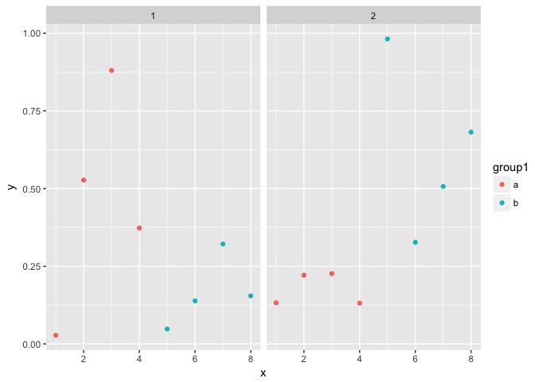

The basic format in this example is:

1.  `ggplot()`: start an object and specify the data

2.  `geom_point()`: we want a scatter plot; this is called a "geom"

3.  `aes()`: specifies the "aesthetic" elements; a legend is automatically created

4.  `facet_grid()`: specifies the "faceting" or panel layout

There are also statistics, scales, and annotation options, among others. At a minimum, you must specify the data, some aesthetics, and a geom and we will focus on those today.

Loading the data
================

We're going to work with morphological data from Galapagos finches, which is available from BIRDD: Beagle Investigation Return with Darwinian Data at <http://bioquest.org/birdd/morph.php>. It is originally from Sato et al. 2000 Mol. Biol. Evol. <http://mbe.oxfordjournals.org/content/18/3/299.full>.

Before we get started, we're going to clean the data up a bit. I've removed some columns and made the column names lower case. I've also removed all but one island. You can do that with this code:

``` r
morph <- read.csv("data/raw/Morph_for_Sato.csv", stringsAsFactors = FALSE)
names(morph) <- tolower(names(morph)) # make columns names lowercase
morph <- filter(morph, islandid == "Flor_Chrl") # take only one island
morph <- select(morph, taxonorig, sex, wingl, beakh, ubeakl) # only keep these columns
morph <- rename(morph, taxon = taxonorig)
morph <- data.frame(na.omit(morph)) # remove all rows with any NAs to make this simple
morph <- as_data_frame(morph)
set.seed(1)
morph <- morph[base::sample(seq_len(nrow(morph)), 200), ] # downsample
```

Take a look at the data. There are columns for taxon, sex, wing length, beak height, and upper beak length:

``` r
morph
glimpse(morph)
```

Geoms
=====

`geom` refers to a geometric object. It determines the “shape” of the plot elements. Some common geoms:

| `geom`              | Description                                |
|---------------------|--------------------------------------------|
| `geom_point()`      | Points                                     |
| `geom_line()`       | Lines                                      |
| `geom_ribbon()`     | Ribbons, y range with continuous x values  |
| `geom_polygon()`    | Polygon, a filled path                     |
| `geom_pointrange()` | Vertical line with a point in the middle   |
| `geom_linerange()`  | An interval represented by a vertical line |
| `geom_path()`       | Connect observations in original order     |
| `geom_histogram()`  | Histograms                                 |
| `geom_text()`       | Text annotations                           |
| `geom_violin()`     | Violin plot (another name for a beanplot)  |
| `geom_map()`        | Polygons on a map                          |

Open the ggplot2 web documentation <http://docs.ggplot2.org/> and keep it open to refer back to it throughout these exercises.

First, let's experiment with some geoms using the `morph` dataset that you downloaded and cleaned up above. I'll start by setting up a basic scatterplot of beak height vs. wing length:

``` r
ggplot(morph, aes(wingl, beakh)) + geom_point()
```

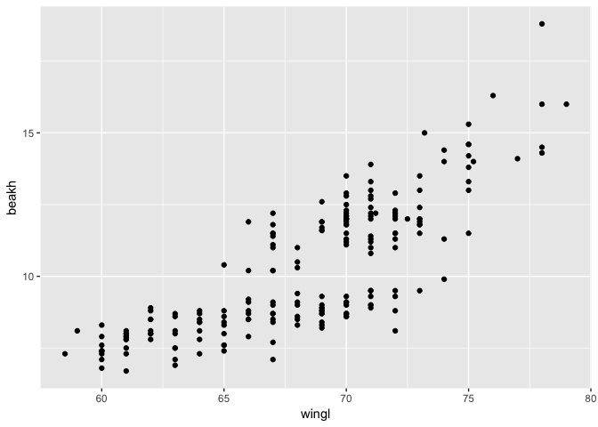

Your turn
---------

Try showing the distribution of wing length for male and female birds by using `geom_violin()`:

``` r
ggplot(morph, aes(sex, wingl)) + 
  geom_violin() # exercise
```


Try showing the distribution of wing length with `geom_histogram()` (note that histograms only require an `x` aesthetic):

``` r
ggplot(morph, aes(wingl)) + 
  geom_histogram() # exercise
```

    ## `stat_bin()` using `bins = 30`. Pick better value with `binwidth`.


Try making a boxplot with `taxon` on the x axis and `wingl` on the y axis.

``` r
ggplot(morph, aes(taxon, wingl)) + 
  geom_boxplot() # exercise
```

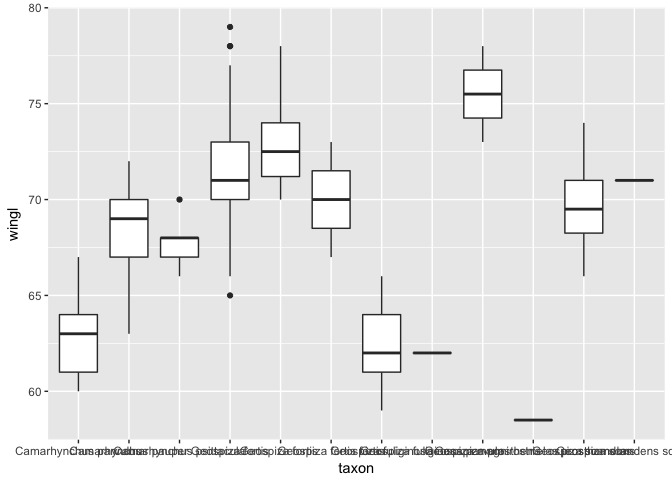

Bonus: If you've made it this far, try flipping the axes on your previous plot so the labels are readable. (Hint: see `?coord_flip`)

``` r
ggplot(morph, aes(taxon, wingl)) + geom_boxplot() + coord_flip() # exercise
```

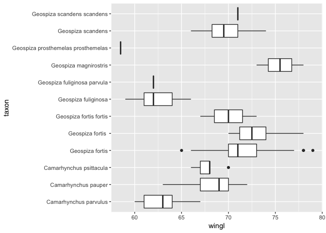

And if you made it this far, try cleaning up the plots above by setting appropriate x and y axis labels. There are multiple ways to do this. Can you find 2 ways?

Aesthetics
==========

Aesthetics refer to the attributes of the data you want to display. They map the data to an attribute (such as the size or shape of a symbol) and generate an appropriate legend. Aesthetics are specified with the `aes()` function.

As an example, the aesthetics available for `geom_point()` are: `x`, `y`, `alpha`, `colour`, `fill`, `shape`, and `size`. Read the help files to see the aesthetic options for the geom you’re using. They’re generally self explanatory. Aesthetics can be specified within the main `ggplot()` function or within a `geom()`. If they’re specified within the main `ggplot()` function then they apply to all geoms you specify.

Note the important difference between specifying characteristics like colour and shape inside or outside the `aes()` function: those inside the `aes()` function are assigned the colour or shape automatically based on the data.

``` r
ggplot(mpg, aes(cty, hwy)) + geom_point(aes(colour = class))
```

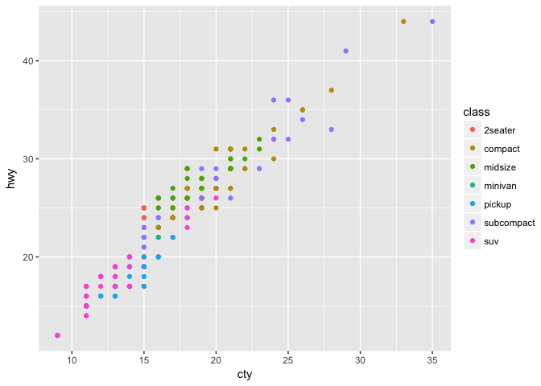

If characteristics like colour or shape are defined outside the `aes()` function, then the characteristic is not mapped to data:

``` r
ggplot(mpg, aes(cty, hwy)) + geom_point(colour = "red")
```

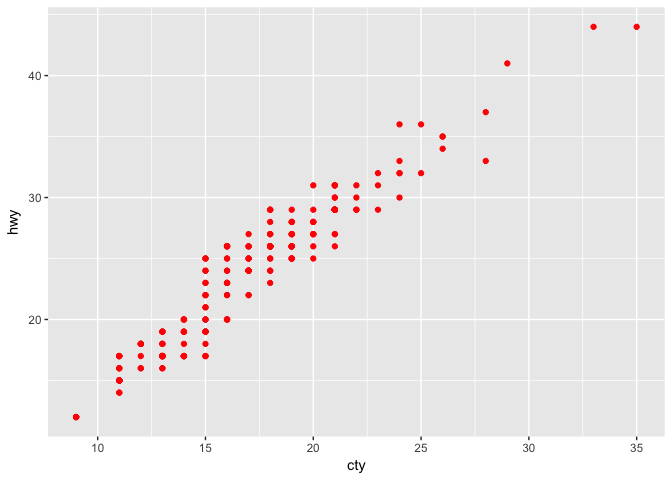

Let's play with mapping some of our data to aesthetics. I'm going to map the male/female value to a colour in our scatterplot of wing length and beak height:

``` r
ggplot(morph, aes(wingl, beakh)) +
  geom_point(aes(colour = sex))
```


Challenge 1
-----------

Explore the `morph` dataset yourself by applying some aesthetics. You can see all the available aesthetics for a given geom by looking at the documentation, e.g. `?geom_point`, or at <http://docs.ggplot2.org/current/>.

Try the same scatterplot but show upper beak length (`ubeakl`) with size. I've started the code:

``` r
ggplot(morph, aes(wingl, beakh)) +
  geom_point(aes(size = ubeakl)) # exercise
```

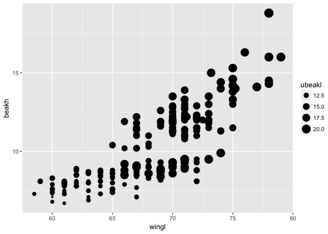

Try the same scatterplot but show the taxon with colour:

``` r
ggplot(morph, aes(wingl, beakh)) +
  geom_point(aes(colour = taxon)) # exercise
```

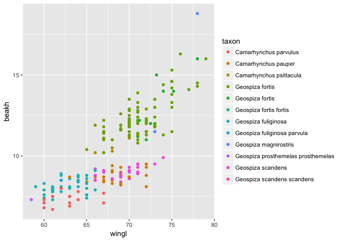

Try the same scatterplot but show the upper beak length with colour (note how ggplot treats `ubeakl` differently than `taxon` when it picks a colour scale -- why is that?):

``` r
ggplot(morph, aes(wingl, beakh)) +
  geom_point(aes(colour = ubeakl)) # exercise
```


Bonus: If you've gotten this far, try combining colour for taxon, shape for sex, and size for upper beak length. This last version is a bit silly, but it illustrates how quickly you can explore multiple dimensions with ggplot2.

``` r
ggplot(morph, aes(wingl, beakh)) +
  geom_point(aes(shape = sex, size = ubeakl, colour = taxon), # exercise
    alpha = 0.4) # exercise
```

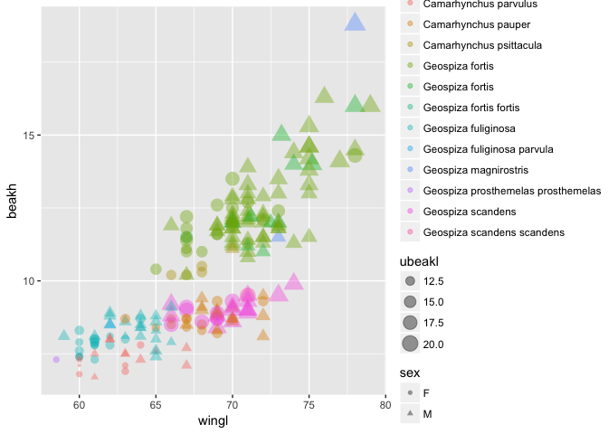

Facets (small multiples)
========================

In ggplot2 parlance, small multiples are referred to as "facets". There are two kinds: `facet_wrap()` and `facet_grid()`. `facet_wrap()` plots the panels in the order of the factor levels. When it gets to the end of a column it wraps to the next column. You can specify the number of columns and rows with `nrow` and `ncol`. `facet_grid()` lays out the panels in a grid with an explicit x and y position. By default all x and y axes will be shared among panels. However, you could, for example, allow the y axes to vary with `facet_wrap(scales = "free_y")` or allow all axes to vary with `facet_wrap(scales = free)`.

To specify the data frame columns that are mapped to the rows and columns of facets, separate them with a tilde. For example: `+ facet_grid(row_name~column_name)`. Usually you'll only give a row or column to `facet_wrap()`, but try and see what happens if you give it both. See the help `?facet_wrap`.

Challenge 2
-----------

Try a scatterplot of beak height against wing length with a different panel for each taxon. I've started it for your. Use `facet_wrap()` (hint: the synatax is `+ facet_wrap(~column_name)`:

``` r
ggplot(morph, aes(wingl, beakh)) + geom_point() + 
  facet_wrap(~taxon) # exercise
```

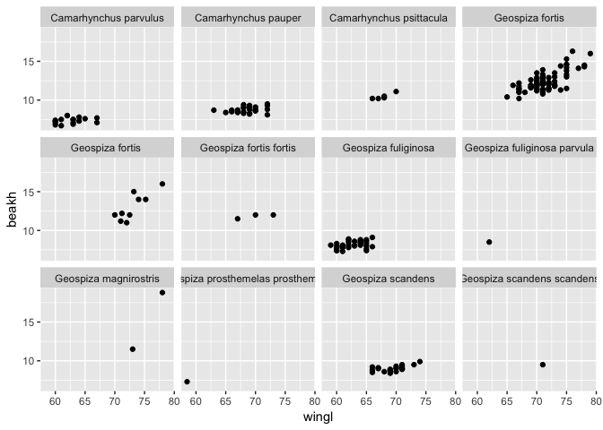

In some cases, it's useful to let the x or y axes have different scales for each panel. Try giving each panel a different axis here using `scales = "free"` in your call to `facet_wrap()`:

``` r
ggplot(morph, aes(wingl, beakh)) + geom_point() +
  facet_wrap(~taxon, scales = "free") # exercise
```

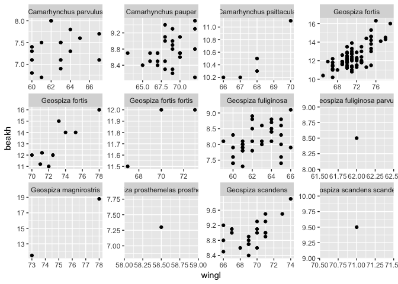

Now try using `facet_grid` to explore the same scatterplot for each combination of sex and taxa.

``` r
ggplot(morph, aes(wingl, beakh)) + geom_point() + 
  facet_grid(sex~taxon) # exercise
```

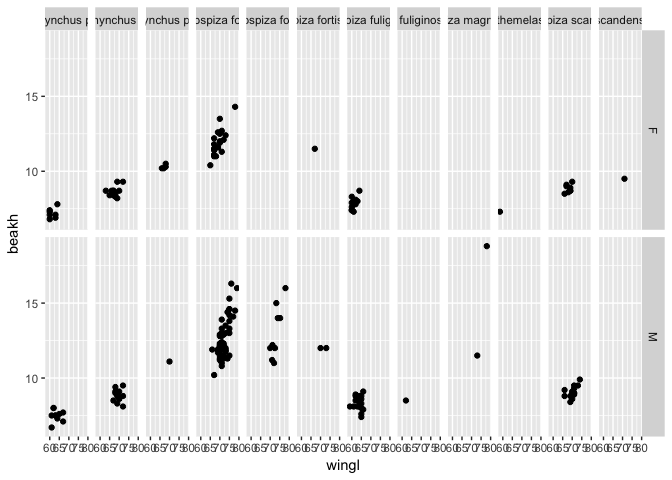

Coefficient plot example
========================

A great way to visualize coefficients from models is with dot and line plots.

To illustrate how to make this style of plot, let's make a plot that shows a dot for the median and line segment for the quantiles. First, we'll calculate these values. For now, just run this code. We'll learn about dplyr next.

``` r
morph_quant <- morph %>%
  group_by(taxon) %>%
  summarise(
    l = quantile(wingl, 0.25)[[1]],
    m = median(wingl),
    u = quantile(wingl, 0.75)[[1]]) %>%
  # re-order factor levels by median for plotting:
  mutate(taxon = reorder(taxon, m, function(x) x))
```

Challenge 3
-----------

Now we'll make the plot. Start by adding the geom `geom_pointrange` to the following code:

``` r
ggplot(morph_quant, aes(x = taxon, y = m, ymin = l, ymax = u)) +
  geom_pointrange() # exercise
```

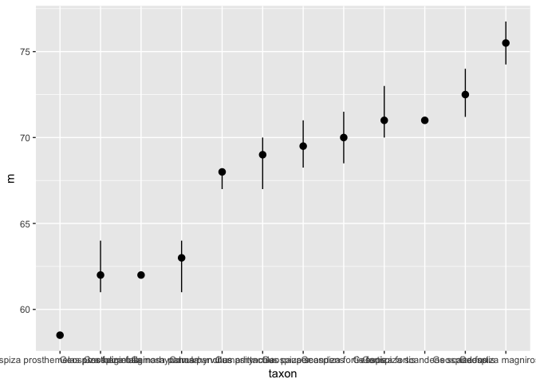

The final plot should have the taxa listed down the y-axis and the wing length value on the x axis so we can read the labels, so you'll need to rotate the whole plot by adding `+ coord_flip()`:

``` r
ggplot(morph_quant, aes(x = taxon, y = m, ymin = l, ymax = u)) +
  ylab("Wing length") + xlab("") +
  geom_pointrange() + # exercise
  coord_flip() # exercise
```

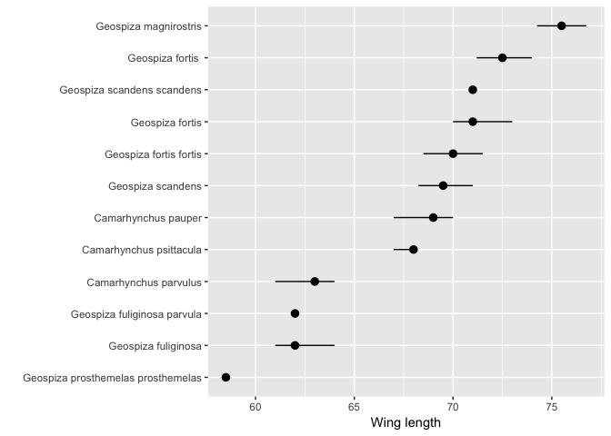

Note that `ymax` and `ymin` refer to the maximum and minimum line segment values and `x` to the taxa, even though they will appear rotated in the end.

Finding help
============

The full version of this document with substantially more ggplot is available as an interactive exercise at <http://seananderson.ca/ggplot2-FISH554/>

The best (and nearly essential) help source is the website, which is based off the package help files. However, the website also shows the example plots and is easier to navigate: <http://docs.ggplot2.org/>. Don’t be afraid to keep it open when you're using ggplot2.

RStudio has a great [ggplot2 cheat sheet](http://www.rstudio.com/wp-content/uploads/2015/03/ggplot2-cheatsheet.pdf)

There's also an active [ggplot2 discussion group](http://groups.google.com/group/ggplot2).

ggplot2 is [heavily featured](http://stackoverflow.com/questions/tagged/ggplot2) on stackoverflow.

Hadley wrote a [book on ggplot2](http://ggplot2.org/book/) and it was recently updated.
