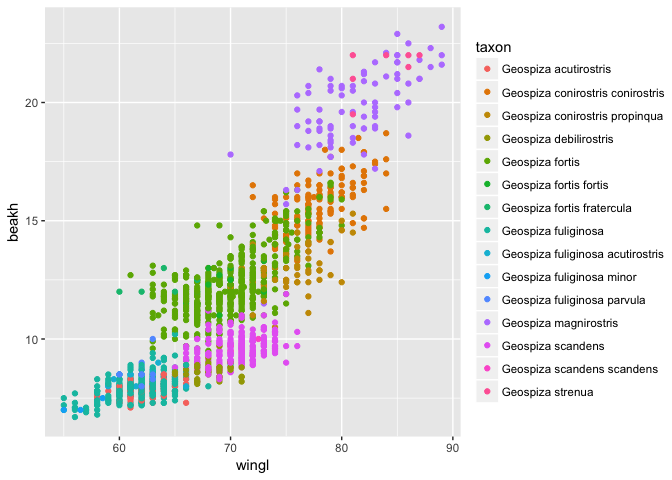
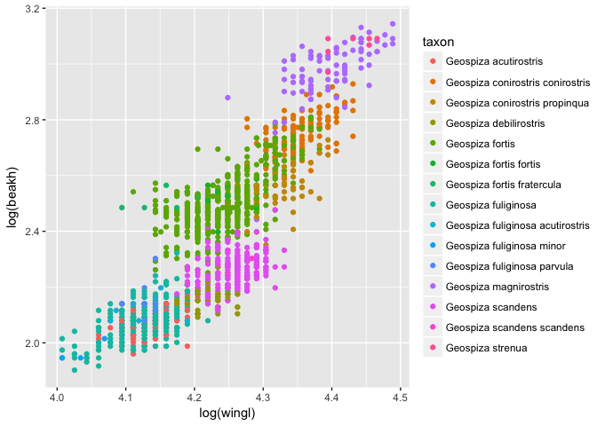
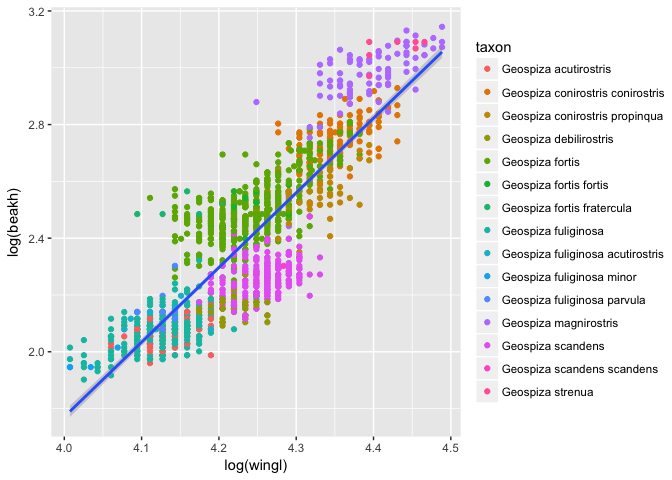
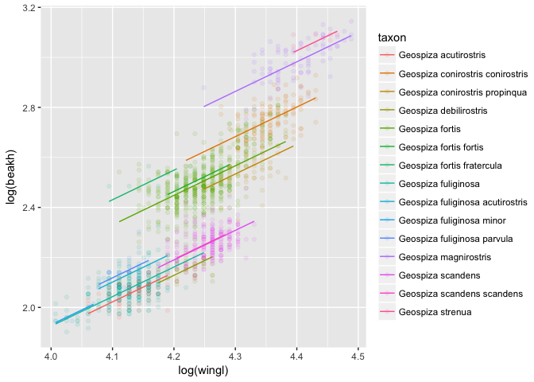
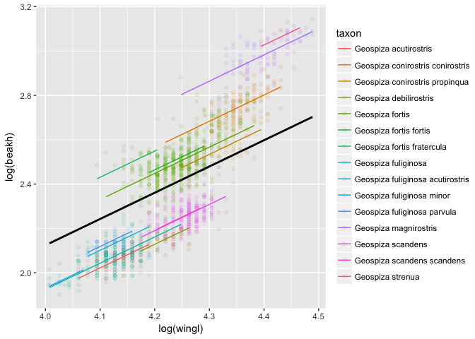
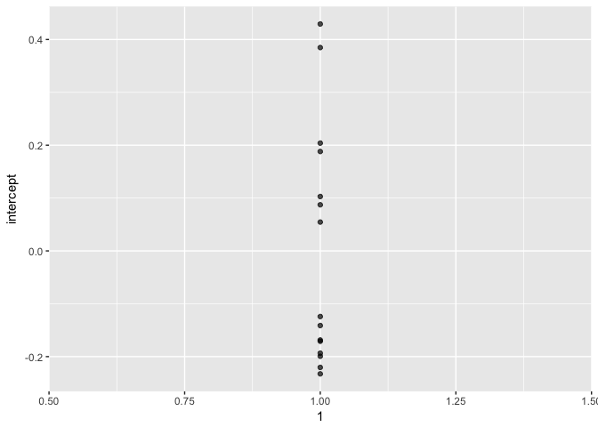

Introduction to random intercept models
=======================================

Goals
=====

-   Learn to fit a "random intercepts" models with the `lme4::lmer` function
-   Learn to plot the output from a `lme4::lmer` model
-   Learn to interpret the output from a `lme4::lmer` model

Data
====

We are going to work with morphological data from Galapagos finches, which is available from BIRDD: Beagle Investigation Return with Darwinian Data at <http://bioquest.org/birdd/morph.php>. It is originally from Sato et al. 2000 Mol. Biol. Evol. <http://mbe.oxfordjournals.org/content/18/3/299.full>.

We'll start by reading in and simplifying the data set for the purposes of this exercise. You can run the following code to do this.

``` r
library(tidyverse)
morph <- read.csv("data/raw/Morph_for_Sato.csv", stringsAsFactors = FALSE, 
  strip.white = TRUE)
names(morph) <- tolower(names(morph)) # make columns names lowercase
morph <- morph %>%
  dplyr::select(islandid, taxonorig, genusl69, speciesl69, sex, wingl, beakh, ubeakl) %>%
  dplyr::rename(taxon = taxonorig, genus = genusl69, species = speciesl69)
morph <- data.frame(na.omit(morph)) # remove all rows with any NAs to make this simple
morph <- dplyr::filter(morph, genus == "Geospiza") %>% as_data_frame()
d <- morph
saveRDS(d, file = "data/generated/morph-geospiza.rds") # save data for later
```

Initial plotting
================

The first rule of any data analysis is to plot the data. It's a common saying that this is also the second and third rule of data analysis. Never underestimate the value of plotting the data creatively. Occasionally, we fit statistical models in between plotting the data.

We are going to look at predicting the height of birds' beaks based on their measured wing length. And we have measurements for a variety of species.

``` r
ggplot(d, aes(wingl, beakh, colour = taxon)) + geom_point()
```



We could fit a model to these data as they are plotted here. But we might want to consider transforming our predictor variable (wing length) and/or our response variable (beak height). What might that transformation be, and why would we want to do that?

Let's plot our data with that transformation:

``` r
ggplot(d, aes(
  log(wingl), log(beakh), colour = taxon)) + # exercise
  geom_point()
```



One option would be to fit a single linear regression to these data. We can quickly do that from within ggplot2. Let's look at what that would look like:

``` r
ggplot(d, aes(log(wingl), log(beakh))) +
  geom_point(aes(colour = taxon)) +
  geom_smooth(method = "lm") # method = [l]inear [m]odel
```



Notice that I moved `aes(colour = taxon)` within the function `geom_point`. What would happen if I hadn't done that? That illustrates another way we could model these data.

``` r
ggplot(d, aes(log(wingl), log(beakh), colour = taxon)) +
  geom_point() +
  geom_smooth(method = "lm", se = FALSE)
```


Neither of these approaches is probably ideal. Why is that?

Fitting a random intercepts model
=================================

A better approach might be to use a mixed effects model. Let's work through that. We are going to use the lme4 package as our default option for fitting these types of models. Later we will explore other packages.

``` r
library(lme4)
```

I'm assuming you've fit a linear regression model in R before. That might look like the following.

``` r
m_lm <- lm(log(beakh) ~ log(wingl), data = d)
```

But we are going to fit a mixed effects model where we let each taxon have its own intercept. And we will constrain those different intercepts by a normal distribution so that information is partially shared across taxa.

This is often referred to as a "random intercept" model.

The workhorse function of the lme4 package for fitting mixed effects models is the function `lmer`. You can pronounce it however you like. Some people would say "lemur", others "ell-m-e-4". The syntax is just like `lm` with the addition of a formula for the "random effects".

You can find extensive details in the documentation `?lme4::lmer`.

``` r
m_lmer <-  lmer(log(beakh) ~ log(wingl) + (1 | taxon), data = d)
```

Notice the new piece `+ (1 | taxon)`. The `1` refers to "intercept" and the `| taxon` tells the function that you want to let the intercept vary by the values in the `taxon` column.

Plotting the predictions
========================

Let's look at what we just did. We'll start by plotting the predictions. To do that, we'll use the `predict` function. Because we are applying it an object of class `merMod` (meaning it was created by the `lmer` function), we can get details on that function at `?predict.merMod`.

``` r
d$predict_lmer <- predict(m_lmer)
```

Now let's plot those predictions:

``` r
ggplot(d, aes(log(wingl), log(beakh), colour = taxon)) +
  geom_point(alpha = 0.1) + # alpha = 0.1 make 10% opaque
  geom_line(aes(y = predict_lmer))
```



What do you notice about the intercepts? What do you notice about the slopes? How does this compare to the previous 2 models we fit?

There is another kind of prediction we can make with a mixed effects model. We can make a prediction at the "population" level. This is our expectation if we sampled a new taxon of unknown identity. With the lme4 package, we can do that by adding the argument `re.form = NA` to the `predict` function:

``` r
d$predict_lmer_population <- predict(m_lmer, re.form = NA)
```

Let's add the population prediction to the plot in black with a thicker line:

``` r
ggplot(d, aes(log(wingl), log(beakh), colour = taxon)) +
  geom_point(alpha = 0.1) +
  geom_line(aes(y = predict_lmer)) +
  geom_line(aes(y = predict_lmer_population), colour = "black", size = 1) 
```



Understanding the model output
==============================

We can extract the random intercepts with the function `ranef`. Let's do that now.

``` r
ranef(m_lmer)
```

    ## $taxon
    ##                                  (Intercept)
    ## Geospiza acutirostris            -0.22040597
    ## Geospiza conirostris conirostris  0.20390888
    ## Geospiza conirostris propinqua    0.05454315
    ## Geospiza debilirostris           -0.23258623
    ## Geospiza fortis                   0.08727254
    ## Geospiza fortis fortis            0.10288834
    ## Geospiza fortis fratercula        0.18804066
    ## Geospiza fuliginosa              -0.19929467
    ## Geospiza fuliginosa acutirostris -0.14120564
    ## Geospiza fuliginosa minor        -0.19349336
    ## Geospiza fuliginosa parvula      -0.12415845
    ## Geospiza magnirostris             0.38471063
    ## Geospiza scandens                -0.17092959
    ## Geospiza scandens scandens       -0.16857032
    ## Geospiza strenua                  0.42928003

Look at the structure of `ranef(m_lmer)`. How might you extract those values?

``` r
ranef(m_lmer)$taxon[, 1] # exercise
```

    ##  [1] -0.22040597  0.20390888  0.05454315 -0.23258623  0.08727254
    ##  [6]  0.10288834  0.18804066 -0.19929467 -0.14120564 -0.19349336
    ## [11] -0.12415845  0.38471063 -0.17092959 -0.16857032  0.42928003

Let's try plotting them. We'll use a little dplyr magic to make a nice data frame.

``` r
 # row.names(.) means the row names of the data frame:
re <- ranef(m_lmer)$taxon %>% mutate(taxon = row.names(.)) %>% 
  rename(intercept = `(Intercept)`) # a nicer column name
ggplot(re, aes(x = 1, y = intercept)) + geom_point(alpha = 0.7)
```



What is the mean of these random intercepts?

``` r
mean(ranef(m_lmer)$taxon[, 1])
```

    ## [1] -3.14747e-12

Is that what you expected? Why or why not?

And what are the estimates of the main effects?

``` r
fixef(m_lmer)
```

    ## (Intercept)  log(wingl) 
    ##   -2.608477    1.183178

``` r
fixef(m_lmer)[[1]]
```

    ## [1] -2.608477

``` r
fixef(m_lmer)[[2]]
```

    ## [1] 1.183178

So the intercept estimate for each taxon is equal to the "fixed effect" intercept plus the "random" deviation.

We can get the intercept estimates for each taxon in a couple of ways. Let's try that. First we can combine the 2 values we just accessed.

``` r
fixef(m_lmer)[[1]] + ranef(m_lmer)$taxon
```

    ##                                  (Intercept)
    ## Geospiza acutirostris              -2.828883
    ## Geospiza conirostris conirostris   -2.404568
    ## Geospiza conirostris propinqua     -2.553934
    ## Geospiza debilirostris             -2.841063
    ## Geospiza fortis                    -2.521204
    ## Geospiza fortis fortis             -2.505589
    ## Geospiza fortis fratercula         -2.420436
    ## Geospiza fuliginosa                -2.807772
    ## Geospiza fuliginosa acutirostris   -2.749683
    ## Geospiza fuliginosa minor          -2.801970
    ## Geospiza fuliginosa parvula        -2.732635
    ## Geospiza magnirostris              -2.223766
    ## Geospiza scandens                  -2.779406
    ## Geospiza scandens scandens         -2.777047
    ## Geospiza strenua                   -2.179197

Or we can use the function `coef` to combine them for us.

``` r
coef(m_lmer)
```

    ## $taxon
    ##                                  (Intercept) log(wingl)
    ## Geospiza acutirostris              -2.828883   1.183178
    ## Geospiza conirostris conirostris   -2.404568   1.183178
    ## Geospiza conirostris propinqua     -2.553934   1.183178
    ## Geospiza debilirostris             -2.841063   1.183178
    ## Geospiza fortis                    -2.521204   1.183178
    ## Geospiza fortis fortis             -2.505589   1.183178
    ## Geospiza fortis fratercula         -2.420436   1.183178
    ## Geospiza fuliginosa                -2.807772   1.183178
    ## Geospiza fuliginosa acutirostris   -2.749683   1.183178
    ## Geospiza fuliginosa minor          -2.801970   1.183178
    ## Geospiza fuliginosa parvula        -2.732635   1.183178
    ## Geospiza magnirostris              -2.223766   1.183178
    ## Geospiza scandens                  -2.779406   1.183178
    ## Geospiza scandens scandens         -2.777047   1.183178
    ## Geospiza strenua                   -2.179197   1.183178
    ## 
    ## attr(,"class")
    ## [1] "coef.mer"

As with most modelling functions in R, we can get details on the model fit with the function `summary`, in this case we are actually calling `summary.merMod`. Let's look at the output and figure out what it means.

``` r
summary(m_lmer)
```

    ## Linear mixed model fit by REML ['lmerMod']
    ## Formula: log(beakh) ~ log(wingl) + (1 | taxon)
    ##    Data: d
    ## 
    ## REML criterion at convergence: -3656.1
    ## 
    ## Scaled residuals: 
    ##     Min      1Q  Median      3Q     Max 
    ## -6.2724 -0.6086 -0.0306  0.6211  3.6835 
    ## 
    ## Random effects:
    ##  Groups   Name        Variance Std.Dev.
    ##  taxon    (Intercept) 0.050586 0.22491 
    ##  Residual             0.004278 0.06541 
    ## Number of obs: 1434, groups:  taxon, 15
    ## 
    ## Fixed effects:
    ##             Estimate Std. Error t value
    ## (Intercept) -2.60848    0.18819  -13.86
    ## log(wingl)   1.18318    0.04232   27.96
    ## 
    ## Correlation of Fixed Effects:
    ##            (Intr)
    ## log(wingl) -0.951

The following are the important pieces:

    Random effects:
     Groups   Name        Variance Std.Dev.
     taxon    (Intercept) 0.050586 0.22491 
     Residual             0.004278 0.06541 
    Number of obs: 1434, groups:  taxon, 15

This tells us the variance and standard deviation (Std.Dev. = sqrt(Variance)) of our random intercept on `taxon` and of the residual variation `Residual`. We are also told how many rows of data we have `Number of obs: 1434` and how many random intercept groups we have `taxon, 15`.

    Fixed effects:
                Estimate Std. Error 
    (Intercept) -2.60848    0.18819
    log(wingl)   1.18318    0.04232  

This tells us our fixed effect estimates and their standard errors. Assuming normality, a 95% confidence interval on those coefficients can be obtained with their estimate +/- 1.96 the standard error. In other words approximately estimate +/- 2\*SE. We'll come back to this topic later.

    Correlation of Fixed Effects:
               (Intr)
    log(wingl) -0.951

This tells us that our intercept and slope are highly correlated. Why is this?

This isn't a great, and if this correlation is very strong and our model is complicated it might result in computational problems. Later we will talk about ways of solving this (hint: we'll "center" the predictor by subtracting the mean).

There are a lot of details in the output from `summary.merMod` and usually a lot more decimal places than are reasonable.

A useful alternative is the function `arm::display` which focuses on the important pieces.

``` r
arm::display(m_lmer)
```

    ## lmer(formula = log(beakh) ~ log(wingl) + (1 | taxon), data = d)
    ##             coef.est coef.se
    ## (Intercept) -2.61     0.19  
    ## log(wingl)   1.18     0.04  
    ## 
    ## Error terms:
    ##  Groups   Name        Std.Dev.
    ##  taxon    (Intercept) 0.22    
    ##  Residual             0.07    
    ## ---
    ## number of obs: 1434, groups: taxon, 15
    ## AIC = -3648.1, DIC = -3672.8
    ## deviance = -3664.4

We will tend to use this function throughout the workshop. I tend not to load the package arm, and instead call its functions directly (e.g. `arm::display`) because the package loads many other functions and packages.

Interpreting the model predictions
==================================

What do the model predictions mean?

We have assumed that the relationship between log(wing length) and log(beak height) is constant across taxa. Therefore, the single slope value is:

``` r
(slope <- fixef(m_lmer)[[2]] %>% round(1))
```

    ## [1] 1.2

Remember that we are modelling a log(predictor) and a log(response). So we are assuming that an X% change in the predictor relates to a Y% change in the response.

Here, our slope indicates that a 1% change in wing length corresponds to a 1.2% change in beak length.

What does our intercept mean?

In this case, it's not very meaningful. It's the expected log(beak length) when log(wing length) = 0. In other words, we would expect a bird with a wing length of 1 to have a beak length of 0.07.

How might we make the intercept more meaningful if we were to refit this model?

Addendum
========

George Box, a famous statistician, once wrote "...all models are wrong, but some are useful".

It's important to know what our models are ignoring and what assumptions we are making. Discuss with your neighbour what is wrong with this model and how it could be done better. How big a problem do you think these issues might be?

For example: <!-- exercise -->

-   we've assumed each taxon is independent but some are obviously more phylogenetically related to each other --- we could incorporate this information <!-- exercise -->
-   we might want to consider letting the slopes vary as well <!-- exercise -->
-   we've combined all the islands together, and it's possible there is some variation by island <!-- exercise -->
-   some islands are closer to each other than others, so we might want to check for spatial autocorrelation <!-- exercise -->
-   we might want to try centering the predictor to reduce correlation between the intercept and slope and make the intercept more interpretable <!-- exercise -->
