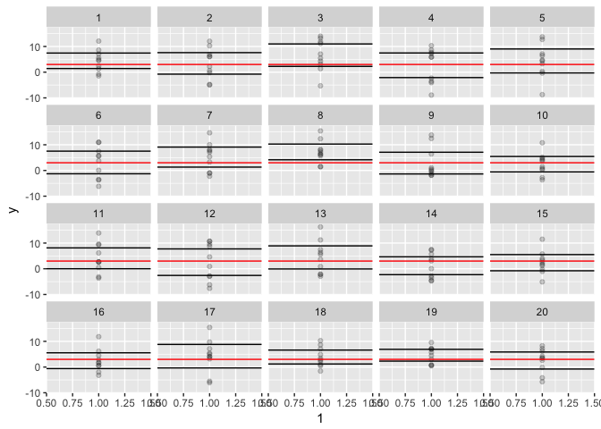
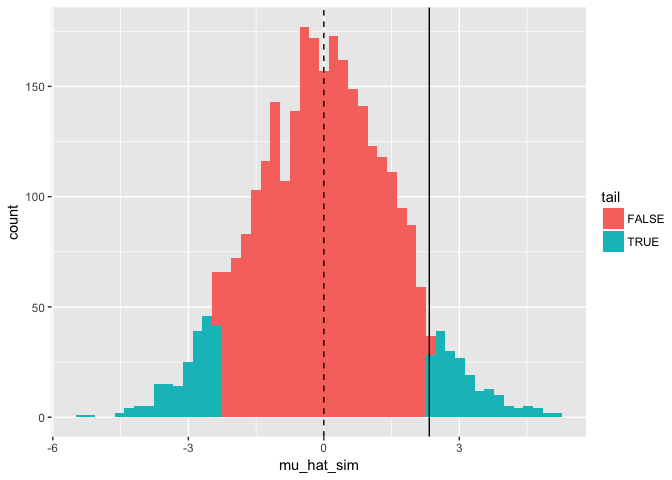
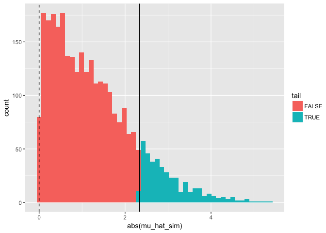

I
Confidence interval and p-value refresher
=========================================

So you think you know what a confidence interval and a p-value represent?

I've created the following small simulation example to hopefully make it clear.

``` r
library(dplyr)
library(ggplot2)
set.seed(12345) # try different values
```

Imagine you are measuring the temperature of a cup of water 10 times but you have an old really bad thermometer. The true temperature is 3 degrees Celsius and the standard deviation on the sampling error is 5.

``` r
# Simulate data:
mu <- 3
sigma <- 5
n <- 10
y <- rnorm(n = n, mean = mu, sd = sigma)
```

We will estimate a mean temperature by fitting an intercept only linear regression model:

``` r
mean(y)
```

    ## [1] 2.335279

``` r
m <- lm(y~1)
mu_hat <- coef(m)[[1]]
ci <- confint(m, level = 0.95)
ci
```

    ##                  2.5 %   97.5 %
    ## (Intercept) -0.5749909 5.245549

``` r
summary(m)
```

    ## 
    ## Call:
    ## lm(formula = y ~ 1)
    ## 
    ## Residuals:
    ##    Min     1Q Median     3Q    Max 
    ## -8.425 -1.391 -0.299  3.669  4.212 
    ## 
    ## Coefficients:
    ##             Estimate Std. Error t value Pr(>|t|)
    ## (Intercept)    2.335      1.287   1.815    0.103
    ## 
    ## Residual standard error: 4.068 on 9 degrees of freedom

Let's illustrate what those confidence intervals really represent.

Imagine you went outside 20 times and each time you measured the cup of water 10 times. Then you fitted a linear regression model with an intercept only each time and plotted the confidence intervals.

``` r
calc_mean <- function(i) {
  y <- rnorm(n = n, mean = mu, sd = sigma)
  m <- lm(y~1)
  ci <- confint(m, level = 0.95)
  tibble(l = ci[1], u = ci[2], y = y, i = i)
}
N <- 20
sim_ci <- lapply(seq_len(N), calc_mean) %>% bind_rows()
sim_ci
```

    ## # A tibble: 200 × 4
    ##           l        u         y     i
    ##       <dbl>    <dbl>     <dbl> <int>
    ## 1  1.418933 7.440845  2.418761     1
    ## 2  1.418933 7.440845 12.086560     1
    ## 3  1.418933 7.440845  4.853139     1
    ## 4  1.418933 7.440845  5.601082     1
    ## 5  1.418933 7.440845 -0.752660     1
    ## 6  1.418933 7.440845  7.084499     1
    ## 7  1.418933 7.440845 -1.431788     1
    ## 8  1.418933 7.440845  1.342112     1
    ## 9  1.418933 7.440845  8.603563     1
    ## 10 1.418933 7.440845  4.493618     1
    ## # ... with 190 more rows

``` r
ggplot(sim_ci, aes(1, y)) + facet_wrap(~i) +
  geom_point(alpha = 0.2) +
  geom_hline(aes(yintercept = l)) +
  geom_hline(aes(yintercept = u)) +
  geom_hline(yintercept = mu, colour = "red")
```



19 times out 20 (95%) the 95% confidence intervals should contain the true value. Check the above plot. Does that look approximately correct?

So that means our calculated confidence intervals are just one realization of a theoretically repeated experiment.

P-values
========

P-values tell us the long term frequency with which we would expect to calculate a value as extreme or more if the null hypothesis were actually true (assuming a two-side p-value). Usually, our null hypothesis is that a parameter is equal to zero.

So now we imagine thousands of parallel universes where he went out and performed the exact same experiment but the true temperature was 0. And we want to know what fraction of those times we would observe calculate a mean temperature at least as extreme as 2.3352793 (i.e. greater than the absolute value of 2.3352793).

Sound convoluted? It kind of is in many cases.

``` r
calc_mean_zero <- function(i) {
  y <- rnorm(n = n, mean = 0, sd = sigma)
  m <- lm(y~1)
  tibble(i = i, mu_hat_sim = coef(m)[[1]])
}
N <- 3000
sim_pvals <- lapply(seq_len(N), calc_mean_zero) %>% bind_rows()
sim_pvals
```

    ## # A tibble: 3,000 × 2
    ##        i mu_hat_sim
    ##    <int>      <dbl>
    ## 1      1 -0.7530811
    ## 2      2  1.0183478
    ## 3      3  0.5732966
    ## 4      4  1.0159382
    ## 5      5 -1.6174588
    ## 6      6  0.6608311
    ## 7      7 -1.1222670
    ## 8      8  0.7659645
    ## 9      9 -2.4006223
    ## 10    10  2.0461647
    ## # ... with 2,990 more rows

``` r
sim_pvals <- mutate(sim_pvals,
  tail = abs(mu_hat_sim) > abs(mu_hat))

ggplot(sim_pvals, aes(mu_hat_sim, fill = tail)) +
  geom_histogram(bins = 50) +
  geom_vline(xintercept = mu_hat, lty = "solid") +
  geom_vline(xintercept = 0, lty = "dashed")
```



``` r
ggplot(sim_pvals, aes(abs(mu_hat_sim), fill = tail)) +
  geom_histogram(bins = 50) +
  geom_vline(xintercept = mu_hat, lty = "solid") +
  geom_vline(xintercept = 0, lty = "dashed")
```



``` r
summary(m)
```

    ## 
    ## Call:
    ## lm(formula = y ~ 1)
    ## 
    ## Residuals:
    ##    Min     1Q Median     3Q    Max 
    ## -8.425 -1.391 -0.299  3.669  4.212 
    ## 
    ## Coefficients:
    ##             Estimate Std. Error t value Pr(>|t|)
    ## (Intercept)    2.335      1.287   1.815    0.103
    ## 
    ## Residual standard error: 4.068 on 9 degrees of freedom

``` r
sum(sim_pvals$tail)/N
```

    ## [1] 0.138
