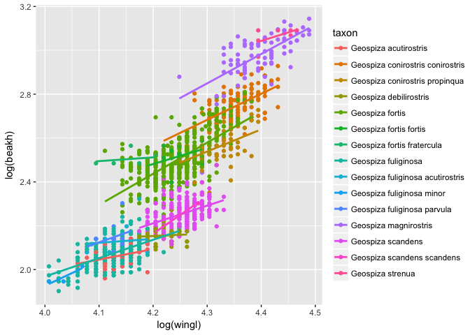
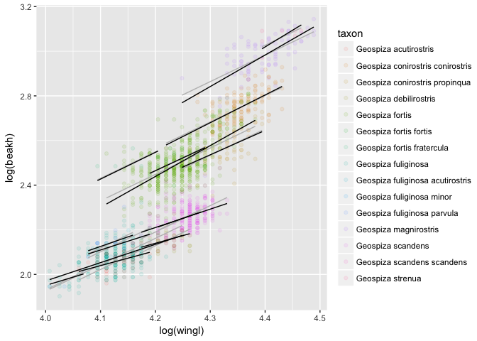
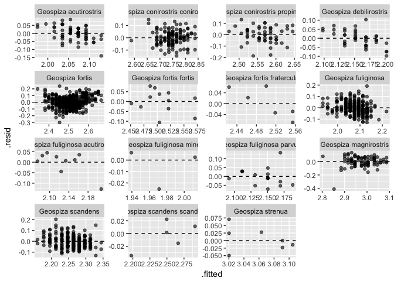
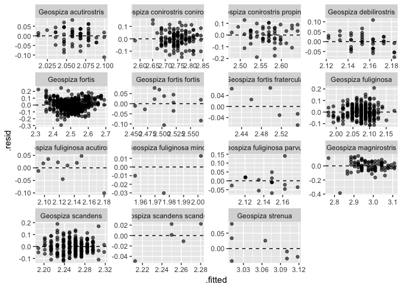
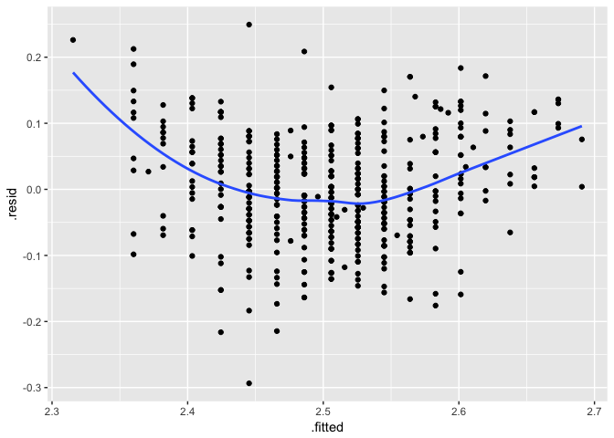
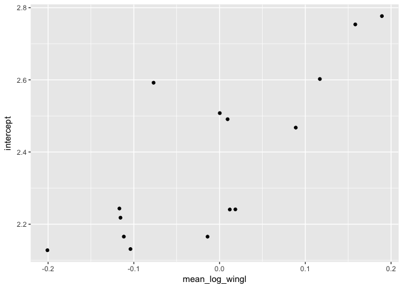
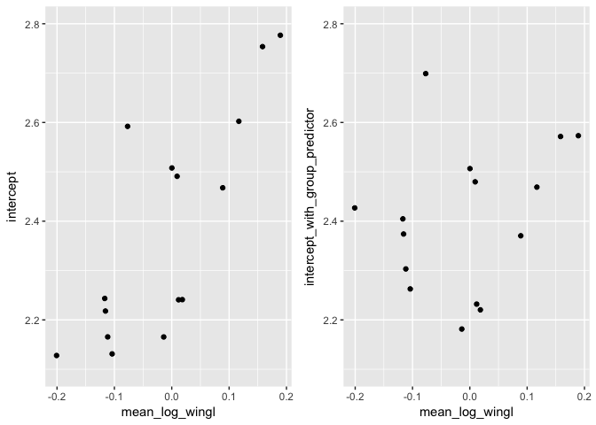
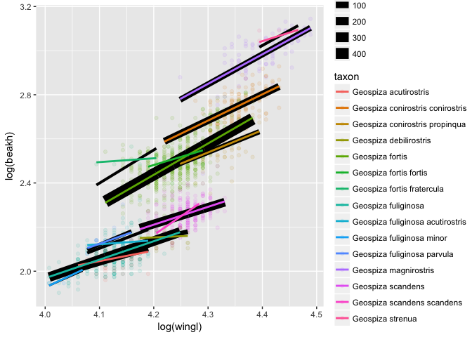
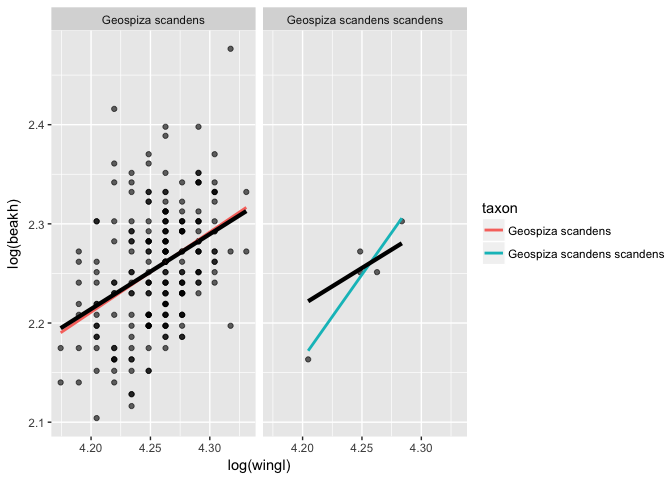
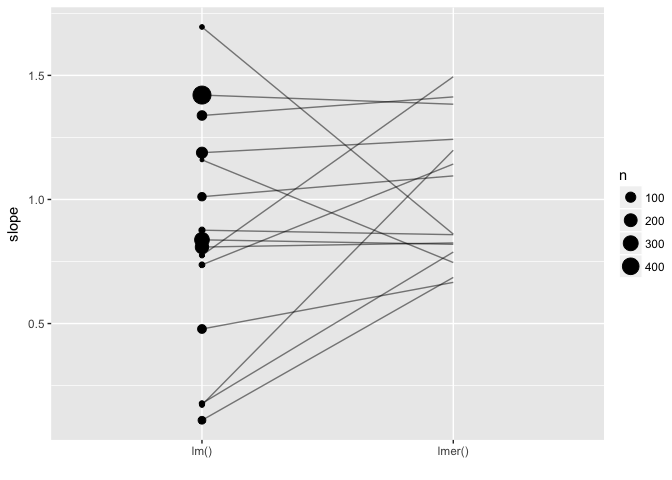

Introduction to random intercept and slope models
=================================================

Goals
=====

-   Extend our understanding of mixed-effects models to random slopes
-   Start thinking about model checking
-   Learn about group-level predictors. What are they? Why might we use them?
-   Develop an intuition about partial pooling of information/shrinkage

Data
====

We're going to start with the same data from the random intercepts exercise and extend the model to have random slopes.

Let's read in the data we cleaned up last time.

``` r
library(tidyverse)
d <- readRDS("data/generated/morph-geospiza.rds")
```

Let's plot the data to remember what they looked like.

``` r
ggplot(d, aes(log(wingl), log(beakh), colour = taxon)) +
  geom_point() +
  geom_smooth(method = "lm", se = FALSE)
```



Fitting a model with random intercepts and slopes
=================================================

Last time we assumed that the slopes were constant across taxa. The above plot suggests that they might not be.

Let's modify the mixed-effects model we fit last time by allowing the slopes to vary.

``` r
library(lme4)
m_int <-  lmer(log(beakh) ~ log(wingl) + (1 | taxon), data = d)
m_slopes <-  lmer(log(beakh) ~ log(wingl) + (1 + log(wingl) | taxon), data = d)
```

We can make predictions just like before.

``` r
d$predict_int <- predict(m_int)
d$predict_slopes <- predict(m_slopes)
```

We'll plot the random intercept predictions in `"grey"` and the random slope predictions in `"black"`. Add a line of code to plot the random slope predictions:

``` r
ggplot(d, aes(log(wingl), log(beakh), colour = taxon, group = taxon)) +
  geom_point(alpha = 0.1) +
  geom_line(aes(y = predict_int), colour = "grey") +
  geom_line(aes(y = predict_slopes), colour = "black") # exercise
```



Interpreting the models
=======================

Let's look at the output from those two models.

``` r
arm::display(m_int)
```

    ## lmer(formula = log(beakh) ~ log(wingl) + (1 | taxon), data = d)
    ##             coef.est coef.se
    ## (Intercept) -2.61     0.19  
    ## log(wingl)   1.18     0.04  
    ## 
    ## Error terms:
    ##  Groups   Name        Std.Dev.
    ##  taxon    (Intercept) 0.22    
    ##  Residual             0.07    
    ## ---
    ## number of obs: 1434, groups: taxon, 15
    ## AIC = -3648.1, DIC = -3672.8
    ## deviance = -3664.4

``` r
arm::display(m_slopes)
```

    ## lmer(formula = log(beakh) ~ log(wingl) + (1 + log(wingl) | taxon), 
    ##     data = d)
    ##             coef.est coef.se
    ## (Intercept) -1.92     0.41  
    ## log(wingl)   1.01     0.11  
    ## 
    ## Error terms:
    ##  Groups   Name        Std.Dev. Corr  
    ##  taxon    (Intercept) 1.14           
    ##           log(wingl)  0.31     -1.00 
    ##  Residual             0.06           
    ## ---
    ## number of obs: 1434, groups: taxon, 15
    ## AIC = -3682, DIC = -3708.4
    ## deviance = -3701.2

A useful package that we will use repeatedly is the broom package. This package provides a set of consistent functions for extracting information from nearly any type of model in R. In particular, we will use the function `broom::tidy`, which returns information about parameter estimates in a tidy data frame, and the function `broom::augment`, which returns a tidy data frame of predictions, residuals, and other useful columns.

To read the documentation for the functions as they apply to `lme4`, see `broom::tidy.merMod` or `broom::augment.merMod`.

``` r
library(broom)
tidy(m_slopes, conf.int = TRUE)
```

    ##                               term    estimate std.error statistic
    ## 1                      (Intercept) -1.91806308 0.4102068 -4.675844
    ## 2                       log(wingl)  1.01463568 0.1060516  9.567378
    ## 3             sd_(Intercept).taxon  1.13840855        NA        NA
    ## 4              sd_log(wingl).taxon  0.31476823        NA        NA
    ## 5 cor_(Intercept).log(wingl).taxon -0.99521020        NA        NA
    ## 6          sd_Observation.Residual  0.06442101        NA        NA
    ##     conf.low conf.high    group
    ## 1 -2.7220536 -1.114073    fixed
    ## 2  0.8067784  1.222493    fixed
    ## 3         NA        NA    taxon
    ## 4         NA        NA    taxon
    ## 5         NA        NA    taxon
    ## 6         NA        NA Residual

``` r
tidy(m_int, conf.int = TRUE)
```

    ##                      term    estimate  std.error statistic  conf.low
    ## 1             (Intercept) -2.60847690 0.18818918 -13.86093 -2.977321
    ## 2              log(wingl)  1.18317817 0.04232105  27.95720  1.100230
    ## 3    sd_(Intercept).taxon  0.22491427         NA        NA        NA
    ## 4 sd_Observation.Residual  0.06540796         NA        NA        NA
    ##   conf.high    group
    ## 1 -2.239633    fixed
    ## 2  1.266126    fixed
    ## 3        NA    taxon
    ## 4        NA Residual

Inspect the output. Do you understand what all the terms mean?

What has changed? In particular, what has changed about the main effect slope estimate for `log(wingl)` and uncertainty about this estimate? Why might this be?

Criticizing the models
======================

Let's extract residuals, predictions, and fitted values from the model objects using the `broom::augment` functions.

``` r
aug_int <- augment(m_int)
aug_slopes <- augment(m_slopes)
```

One important model diagnostic is plotting the residuals against the fitted values. Here, "fitted" is another word for the predictions.

We'll start with the random intercepts model:

``` r
ggplot(aug_int, aes(.fitted, .resid)) + 
  geom_point(alpha = 0.6) + 
  facet_wrap(~taxon, scales = "free") +
  geom_hline(yintercept = 0, linetype = 2)
```



Is there anything concerning with the above plot?

And now, the random intercepts and slopes model:

``` r
ggplot(aug_slopes, aes(.fitted, .resid)) + 
  geom_point(alpha = 0.6) + 
  facet_wrap(~taxon, scales = "free") +
  geom_hline(yintercept = 0, linetype = 2)
```



This looks a bit better. Why is that? But there are still some problems. The biggest issue, to me, is the curve that we see for *Geospiza forti*:

``` r
filter(aug_slopes, taxon == "Geospiza fortis") %>%
  ggplot(aes(.fitted, .resid)) + geom_point() + 
  geom_smooth(se = FALSE)
```



For now, we are going to move on. But how might we fix this?

Group-level predictors
======================

There is another, perhaps less obvious, issue with our model.

Before we dig into this, we're going to refit the models with a centered predictor. This just means we will subtract the mean of log(wing length) from the predictor. In a later exercise we will dive more into this. For now, just know that this will make the rest of this exercise easier to interpret because our intercept estimates will be at `log(wingl)` = 4.2 instead of `log(wingl)` = 0.

``` r
d <- d %>% mutate(log_wingl_centered = log(wingl) - mean(log(wingl)))
m_int <-  lmer(log(beakh) ~ log_wingl_centered + (1 | taxon), data = d)
m_slopes <- lmer(log(beakh) ~ log_wingl_centered + (1 + log_wingl_centered | taxon), data = d)
```

Let's look at our model predictions overlaid with the data again:

``` r
ggplot(d, aes(log_wingl_centered, log(beakh), colour = taxon, group = taxon)) +
  geom_point(alpha = 0.1) +
  geom_line(aes(y = predict_slopes), colour = "black") +
  geom_vline(xintercept = 0, linetype = 2)
```


Challenge
---------

Ignoring phylogenetic relatedness (some taxa are more related to each other than others), what is an issue with our model?

Hint 1: "random" intercepts are supposed to be just that: random. There shouldn't be any systematic pattern in their values that we can explain. If there is, we can include that in the model.

Hint 2: What do you think a plot of the intercepts (where the solid prediction lines cross the dashed zero line) against mean log(wing length) would look like?

Let's make a plot of the intercepts against the mean of log(wing length). Try finishing the last line of dplyr code to calculate the mean log(wing length) for each value of the `taxon` column.

``` r
taxa_dat <- group_by(d, taxon) %>% 
  summarise(mean_log_wingl = 
      mean(log_wingl_centered)) # exercise
```

In the last lesson, we learned how to extract the random effect coefficient estimates. Write a line of code below to extract the random intercept estimates from `m_slopes` including the global/main-effect intercept. Hint: use the function `coef`, the `$`, and access the correct column with `[,]`.

``` r
re_int <- 
  coef(m_slopes)$taxon[,1] # exercise
taxa_dat$intercept <- re_int
```

``` r
ggplot(taxa_dat, aes(mean_log_wingl, intercept)) + geom_point()
```



How can we include this information in our model?

Adding a group-level predictor
------------------------------

``` r
d <- left_join(d, taxa_dat, by = "taxon")
d %>% select(taxon, wingl, log_wingl_centered, mean_log_wingl)
```

    ## # A tibble: 1,434 × 4
    ##              taxon wingl log_wingl_centered mean_log_wingl
    ##              <chr> <dbl>              <dbl>          <dbl>
    ## 1  Geospiza fortis    69       -0.003557961    0.009340336
    ## 2  Geospiza fortis    65       -0.063277195    0.009340336
    ## 3  Geospiza fortis    65       -0.063277195    0.009340336
    ## 4  Geospiza fortis    68       -0.018156760    0.009340336
    ## 5  Geospiza fortis    66       -0.048009723    0.009340336
    ## 6  Geospiza fortis    68       -0.018156760    0.009340336
    ## 7  Geospiza fortis    67       -0.032971846    0.009340336
    ## 8  Geospiza fortis    69       -0.003557961    0.009340336
    ## 9  Geospiza fortis    67       -0.032971846    0.009340336
    ## 10 Geospiza fortis    68       -0.018156760    0.009340336
    ## # ... with 1,424 more rows

``` r
m_slopes_gr <- lmer(log(beakh) ~ log_wingl_centered + mean_log_wingl +
    (1 + log_wingl_centered | taxon), data = d)
```

``` r
arm::display(m_slopes)
```

    ## lmer(formula = log(beakh) ~ log_wingl_centered + (1 + log_wingl_centered | 
    ##     taxon), data = d)
    ##                    coef.est coef.se
    ## (Intercept)        2.38     0.06   
    ## log_wingl_centered 1.01     0.11   
    ## 
    ## Error terms:
    ##  Groups   Name               Std.Dev. Corr 
    ##  taxon    (Intercept)        0.23          
    ##           log_wingl_centered 0.31     0.87 
    ##  Residual                    0.06          
    ## ---
    ## number of obs: 1434, groups: taxon, 15
    ## AIC = -3682, DIC = -3708.4
    ## deviance = -3701.2

``` r
arm::display(m_slopes_gr)
```

    ## lmer(formula = log(beakh) ~ log_wingl_centered + mean_log_wingl + 
    ##     (1 + log_wingl_centered | taxon), data = d)
    ##                    coef.est coef.se
    ## (Intercept)        2.40     0.04   
    ## log_wingl_centered 1.05     0.11   
    ## mean_log_wingl     1.21     0.27   
    ## 
    ## Error terms:
    ##  Groups   Name               Std.Dev. Corr 
    ##  taxon    (Intercept)        0.15          
    ##           log_wingl_centered 0.32     0.90 
    ##  Residual                    0.06          
    ## ---
    ## number of obs: 1434, groups: taxon, 15
    ## AIC = -3690.5, DIC = -3722.8
    ## deviance = -3713.6

In particular, take a look at the standard deviation of the random intercepts. Notice that our model with a group-level predictor has a lower random intercept standard deviation.

We have added useful information to the model to explain what was before considered "random" noise. And we have increased the partial pooling of information across groups.

Let's check our random intercepts again:

``` r
taxa_dat$intercept_with_group_predictor <- coef(m_slopes_gr)$taxon[,1]
p1 <- ggplot(taxa_dat, aes(mean_log_wingl, intercept)) + geom_point() +
  ylim(2.1, 2.8)
p2 <- ggplot(taxa_dat, aes(mean_log_wingl, intercept_with_group_predictor)) + 
  geom_point() + ylim(2.1, 2.8)
gridExtra::grid.arrange(p1, p2, ncol = 2)
```



Illustrating partial-pooling/shrinkage
======================================

One of the major benefits of mixed-effects modeling is something we call "shrinkage". The mixed-effects model should partially pool information across groups allowing us to make better predictions for all groups, and especially for groups that we have less information about.

Here are two quick ways we can look at the partial pooling in our model. We'll compare our predictions from our full mixed-effects model (black) against the predictions from separate linear models (coloured). We'll indicate the sample size by the width of the mixed-effects model prediction lines.

``` r
d$predict_slopes_gr <- predict(m_slopes_gr)
d <- d %>% group_by(taxon) %>% mutate(n = n())
ggplot(d, aes(log(wingl), log(beakh), colour = taxon, group = taxon)) +
  geom_point(alpha = 0.1) +
  geom_line(aes(y = predict_slopes_gr, size = n), colour = "black") +
  geom_smooth(method = "lm", se = FALSE)
```



What do you notice in the above plot? When do the predictions differ the most? Why is that? Which makes more sense?

Let's dig into two taxa. What's happening for *Geospiza scandens scandens*? Note that *Geospiza scandens scandens* is a subspecies of *Geospiza scandens*.

``` r
filter(d, taxon %in% c("Geospiza scandens", "Geospiza scandens scandens")) %>%
  ggplot(aes(log(wingl), log(beakh))) +
  facet_wrap(~taxon) +
  geom_point(alpha = 0.6) +
  geom_smooth(aes(colour = taxon), method = "lm", se = FALSE) +
  geom_line(aes(y = predict_slopes_gr), colour = "black", lwd = 1.5)
```



The following is a common way to show shrinkage. Hopefully it makes a bit more sense after seeing the above plot.

``` r
estimates <- d %>% group_by(taxon) %>%
  do(mod = lm(log(beakh) ~ log_wingl_centered, data = .)) %>%
  mutate(int = coef(mod)[1], slope = coef(mod)[2], method = "Separate") %>%
  select(-mod)
estimates$re_int <- coef(m_slopes_gr)$taxon[,1]
estimates$re_slope <- coef(m_slopes)$taxon[,2]

sample_sizes <- d %>% group_by(taxon) %>%
  summarise(n = n())
estimates$n <- sample_sizes$n

ggplot(estimates, aes(x = "lm()", y = slope, xend = "lmer()", yend = re_slope)) +
  geom_segment(alpha = 0.5) +
  geom_point(aes(size = n)) +
  xlab("")
```



Addendum
========

Our model still isn't perfect. (No model is!) What are some assumptions we are making in this model that probably aren't correct? How might we check these assumptions and how might we make the model better?
