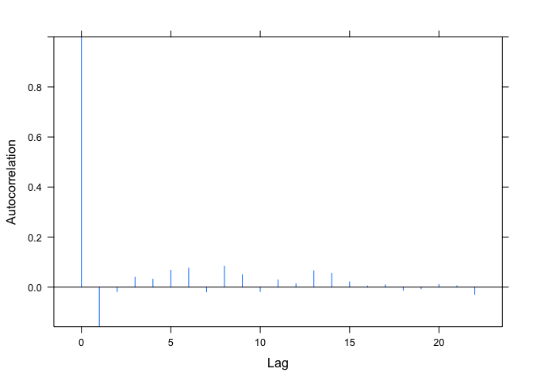

Dealing with correlation in residuals
=====================================

Goals
=====

-   Learn how to identify temporal autocorrelation in mixed-effect model residuals
-   Learn how to model temporal autocorrelation with the nlme package
-   Practice translating models from lme4 to nlme

Data
====

We are going to use data from: Freitas, C., E. M. Olsen, H. Knutsen, J. Albretsen, and E. Moland. 2016. Temperature-associated habitat selection in a cold-water marine fish. Journal of Animal Ecology 85:628–637.

In this paper, the authors looked at the effect of ocean temperature on how deep individually tagged Atlantic cod dove along the Norwegian coast.

Let's read in the data and clean it up a bit:

``` r
library(tidyverse)
d <- read_csv("data/raw/freitas-2016/Cod_daily_depth_data.csv") %>%
  mutate(date = lubridate::dmy(date)) %>%
  rename(temperature = Temperature_1m) %>%
  na.omit %>% 
  as_data_frame() %>%
  arrange(fish, date)
d
```

    ## # A tibble: 5,083 × 5
    ##        fish       date depth_mean_day depth_mean_night temperature
    ##       <chr>     <date>          <dbl>            <dbl>       <dbl>
    ## 1  Cod_6755 2013-06-28       19.64417         19.59565    18.00542
    ## 2  Cod_6755 2013-06-29       19.98276         19.72679    17.75596
    ## 3  Cod_6755 2013-06-30       19.94709         20.04062    17.18113
    ## 4  Cod_6755 2013-07-01       19.96828         19.94154    17.49952
    ## 5  Cod_6755 2013-07-02       17.74378         19.93000    17.60138
    ## 6  Cod_6755 2013-07-03       14.47237         19.12308    17.60550
    ## 7  Cod_6755 2013-07-04       13.27979         15.99556    17.61354
    ## 8  Cod_6755 2013-07-05       16.00823         14.53206    18.11671
    ## 9  Cod_6755 2013-07-06       14.06752         19.43747    17.94629
    ## 10 Cod_6755 2013-07-07       17.39794         17.03698    18.91737
    ## # ... with 5,073 more rows

Let's plot the data:

``` r
ggplot(d, aes(temperature, -log(depth_mean_day))) + 
  geom_point(alpha = 0.3) +
  facet_wrap(~fish)
```


Why does it make sense to work with log(depth)?

Let's fit a basic mixed effects model predicting dive depth from temperature that allows the intercept and sloped to vary with each fish. We are going to center the temperature predictor first to reduce correlation between the intercepts and slopes.

``` r
d <- d %>% mutate(temperature_centered = temperature - mean(temperature))
library(lme4)
```

Try filling in the following model. We want a random intercept and random `temperature_centered` slope:

``` r
m1 <- lmer(log(depth_mean_day) ~ temperature_centered +
    (1 + temperature_centered | fish), data = d) # exercise
arm::display(m1)
```

    ## lmer(formula = log(depth_mean_day) ~ temperature_centered + (1 + 
    ##     temperature_centered | fish), data = d)
    ##                      coef.est coef.se
    ## (Intercept)          2.78     0.04   
    ## temperature_centered 0.09     0.01   
    ## 
    ## Error terms:
    ##  Groups   Name                 Std.Dev. Corr  
    ##  fish     (Intercept)          0.30           
    ##           temperature_centered 0.08     -0.65 
    ##  Residual                      0.27           
    ## ---
    ## number of obs: 5083, groups: fish, 48
    ## AIC = 1690.7, DIC = 1654.7
    ## deviance = 1666.7

Let's look at the model fit.

``` r
aug <- broom::augment(m1)

ggplot(aug, aes(temperature_centered, log.depth_mean_day.)) +
  geom_point(alpha = 0.3) +
  facet_wrap(~fish) +
  geom_line(aes(x = temperature_centered, y = .fitted), colour = "red")
```


And plot the residuals versus the fitted values:

``` r
ggplot(aug, aes(.fitted, .resid)) +
  geom_point(alpha = 0.3) +
  facet_wrap(~fish) +
  geom_hline(yintercept = 0, colour = "red")
```


Something looks a bit funny there with the strips of residuals, but it's not yet clear what is causing that. Can you guess what might be doing this?

We also know the day of each measurement. Let's try plotting the residuals against date with a panel for each fish.

``` r
aug$date <- d$date
ggplot(aug, aes(date, .resid)) +
  geom_point(alpha = 0.3) +
  facet_wrap(~fish) +
  geom_hline(yintercept = 0, colour = "red")
```


That doesn't look good! There are clear patterns in the residuals over time. We call this temporal autocorrelation.

One possibility for fixing this might be to include a linear predictor for time. But that's unlikely to fix the problem here because the residual patterns look highly nonlinear. What might cause this type of pattern?

We can't model the correlation in the residuals using the lme4 package. Instead, we will have to turn to the nlme package. Let's start by fitting the same model with `nlme::lme`.

Your turn, rewrite the above model using `nlme::lme`:

``` r
library(nlme)
m2 <- lme(
  log(depth_mean_day) ~ temperature_centered, random = ~ 1 + temperature_centered | fish, data = d) # exercise
```

Verify that the two modeling functions give us qualitatively similar answers:

``` r
arm::display(m1)
```

    ## lmer(formula = log(depth_mean_day) ~ temperature_centered + (1 + 
    ##     temperature_centered | fish), data = d)
    ##                      coef.est coef.se
    ## (Intercept)          2.78     0.04   
    ## temperature_centered 0.09     0.01   
    ## 
    ## Error terms:
    ##  Groups   Name                 Std.Dev. Corr  
    ##  fish     (Intercept)          0.30           
    ##           temperature_centered 0.08     -0.65 
    ##  Residual                      0.27           
    ## ---
    ## number of obs: 5083, groups: fish, 48
    ## AIC = 1690.7, DIC = 1654.7
    ## deviance = 1666.7

``` r
summary(m2)
```

    ## Linear mixed-effects model fit by REML
    ##  Data: d 
    ##        AIC      BIC    logLik
    ##   1690.718 1729.917 -839.3588
    ## 
    ## Random effects:
    ##  Formula: ~1 + temperature_centered | fish
    ##  Structure: General positive-definite, Log-Cholesky parametrization
    ##                      StdDev     Corr  
    ## (Intercept)          0.29716455 (Intr)
    ## temperature_centered 0.07877688 -0.648
    ## Residual             0.27468928       
    ## 
    ## Fixed effects: log(depth_mean_day) ~ temperature_centered 
    ##                          Value  Std.Error   DF  t-value p-value
    ## (Intercept)          2.7828017 0.04360373 5034 63.82026       0
    ## temperature_centered 0.0863622 0.01183717 5034  7.29585       0
    ##  Correlation: 
    ##                      (Intr)
    ## temperature_centered -0.648
    ## 
    ## Standardized Within-Group Residuals:
    ##         Min          Q1         Med          Q3         Max 
    ## -6.05499942 -0.34500745  0.05643243  0.47158222  4.92566485 
    ## 
    ## Number of Observations: 5083
    ## Number of Groups: 48

nlme has some built in residual plotting functions that we will use. (Alternatively, we could easily extract the residuals like we have before and plot them with ggplot2.) Let's reproduce our last plot. It's important that we specify `type = "normalized"`. The reason will become apparent soon. The `.` it refers to our model. The syntax might look strange, but just go with it because it will save us writing a lot of code.

``` r
plot(m2, resid(., type = "normalized") ~ fitted(.) | fish, abline = 0)
```


Another useful plot to look at is an "autocorrelation function" plot (ACF). This calculates the correlation at increasingly large lags for the residuals within each group (individual tagged fish). We will be using the function `ACF.lme`. Again, we will specify `resType = "normalized"`:

``` r
plot(ACF(m2, resType = "normalized"))
```


So the residuals one day apart are correlated at a value of almost 0.8! That's far from our assumption of independent residuals.

Let's add a temporal autocorrelation structure. We'll start with the simplest: `corAR1()`. By default, this will estimate a correlation between subsequent residuals within each fish. This correlation value will be shared across all fish and assume that our data were correctly ordered by time with no gaps.

``` r
m3 <- lme(log(depth_mean_day) ~ temperature_centered, 
  random = ~ 1 + temperature_centered | fish, data = d,
  correlation = 
    corAR1()# exercise
    )
```

Let's look at the residuals again:

``` r
plot(m3, resid(., type = "normalized") ~ fitted(.) | fish, abline = 0)
```


``` r
plot(ACF(m3, resType = "normalized"))
```



That looks much better. What if we hadn't specified `type = "normalized"`? Take a look at `?residuals.lme` to see what the default is.

Let's try making the plots with the default residual type.

``` r
plot(m3, resid(.) ~ fitted(.) | fish, abline = 0)
```


The default, "response", does not incorporate the correlation structure. That's not very helpful when we are trying to tell if our correlation structure helped.

Making a more useful plot of our predictions
============================================

Let's make a more finished version of our model predictions. Our model is predicting log(depth). Let's transform our predictions to depth itself as a function of temperature.

Because we will be plotting a curved line, we can't rely on just making predictions at the temperatures that we observed. Instead, we need to create a data frame with a fine scale and regular series of temperatures (otherwise our lines would be jagged). We also want to make sure we don't predict outside the range of temperatures observed for any one fish. There are many ways we could create this new data frame to predict on. Below is one concise way to do it with dplyr:

``` r
sample_size <- d %>% group_by(fish) %>%
  summarize(n = n())
newdata <- d %>% 
  group_by(fish) %>% 
  summarise(
    min_temp = min(temperature_centered),
    max_temp = max(temperature_centered)) %>%
  group_by(fish) %>%
  do({
    data_frame(
      fish = rep(.$fish, 50), 
      temperature_centered = seq(.$min_temp, .$max_temp, length.out = 50))
  }) %>%
  mutate(temperature = temperature_centered + mean(d$temperature)) %>%
  left_join(sample_size)
```

    ## Joining, by = "fish"

``` r
newdata
```

    ## Source: local data frame [2,400 x 4]
    ## Groups: fish [?]
    ## 
    ##        fish temperature_centered temperature     n
    ##       <chr>                <dbl>       <dbl> <int>
    ## 1  Cod_6755            -3.036390    13.48150   101
    ## 2  Cod_6755            -2.880840    13.63705   101
    ## 3  Cod_6755            -2.725289    13.79260   101
    ## 4  Cod_6755            -2.569739    13.94815   101
    ## 5  Cod_6755            -2.414189    14.10370   101
    ## 6  Cod_6755            -2.258639    14.25925   101
    ## 7  Cod_6755            -2.103089    14.41480   101
    ## 8  Cod_6755            -1.947539    14.57035   101
    ## 9  Cod_6755            -1.791988    14.72590   101
    ## 10 Cod_6755            -1.636438    14.88145   101
    ## # ... with 2,390 more rows

``` r
newdata$pred_fish <- predict(m3, newdata = newdata)
```

We'll also make predictions for an average or "population"-level fish. This is our prediction for a new fish of unknown identity.

``` r
source("drafts/predict_pop_ci.R")
pop_predictions <- predict_pop_ci(m3, newdata = newdata)
head(pop_predictions)
```

    ##        fit      lwr      upr
    ## 1 2.605793 2.493357 2.718228
    ## 2 2.615626 2.505371 2.725880
    ## 3 2.625459 2.517373 2.733544
    ## 4 2.635291 2.529362 2.741221
    ## 5 2.645124 2.541338 2.748911
    ## 6 2.654957 2.553299 2.756616

``` r
newdata <- data.frame(newdata, pop_predictions)
```

And make a fancy plot:

``` r
ggplot(newdata) + 
  geom_line(aes(temperature, -exp(pred_fish), group = fish, colour = n), alpha = 0.5) +
  geom_line(aes(temperature, y = -exp(fit)), colour = "red", lwd = 1.25) +
  geom_ribbon(aes(temperature, ymax = -exp(upr), ymin = -exp(lwr)), fill = "red", alpha = 0.2) +
  labs(y = "Depth (m)", x = "Temperature (C)", colour = "Samples") +
  theme_light() +
  scale_colour_distiller(palette = "Greys", direction = 1)
```


Writing out our model
=====================

\[
\log(D_i) = \alpha_j + \beta_j T_i + \epsilon_i, 
  \; \epsilon_i \sim \text{N}(\phi \epsilon_{i-1}, \sigma^2), 
  \; \text{for } i = 1, ..., n, \\
\alpha_j \sim \text{N}(\mu_\alpha, \sigma_\alpha^2),
  \; \beta_j \sim \text{N}(\mu_\beta, \sigma_\beta^2),
  \; \text{for } j = 1, ..., J.\]
