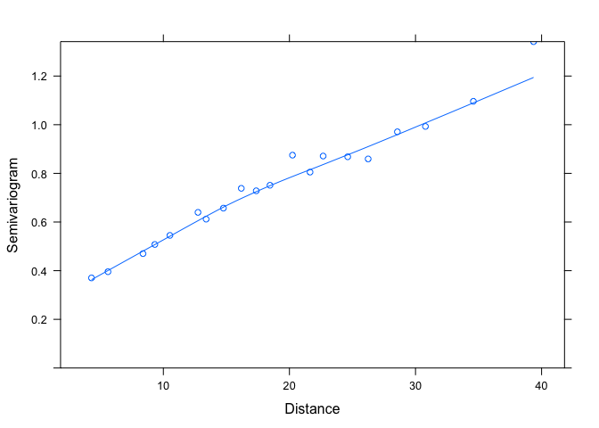
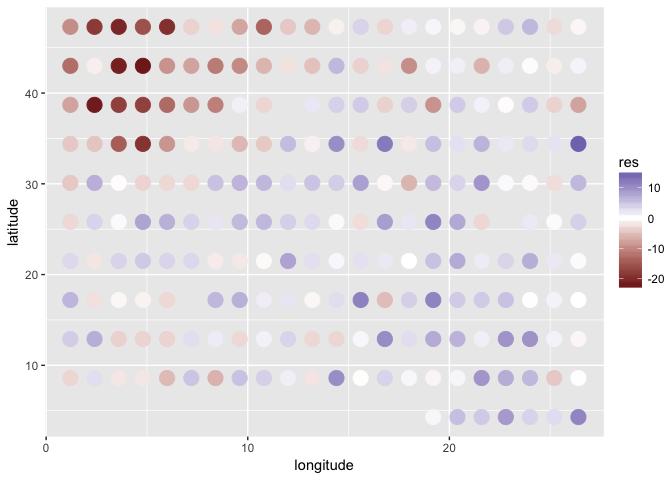
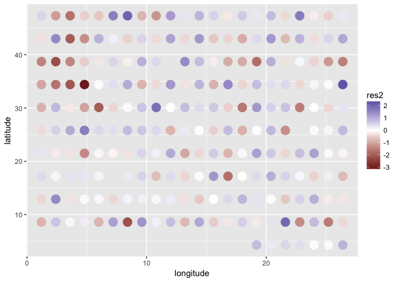
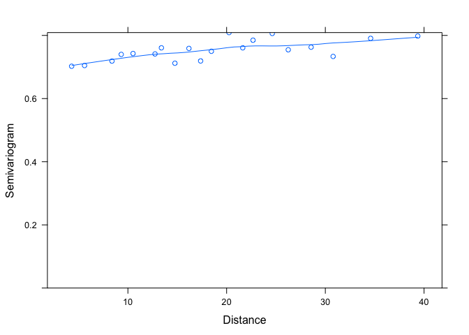
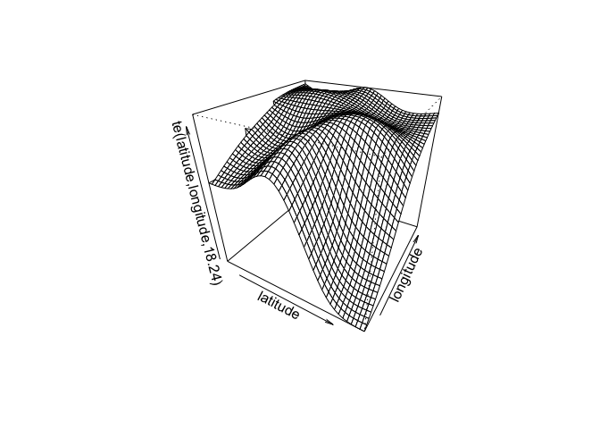
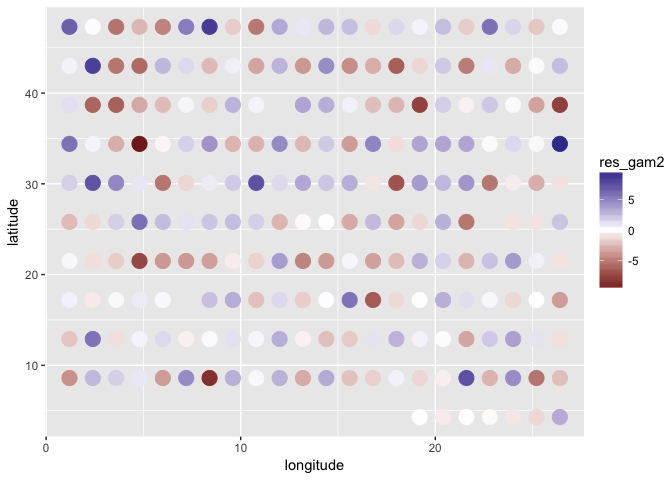

Spatial autocorrelation
=======================

Goals
=====

-   Learn to identify and deal with spatial autocorrelation through correlation structures in nlme
-   Very briefly get introduced to the idea of GAMs

Loading the data
================

We will work with an example data set from the nlme package. This data set is also used as an example in the accompanying textbook by Pinheiro and Bates.

``` r
library(nlme)
library(tidyverse)
d <- nlme::Wheat2
glimpse(d)
```

    ## Observations: 224
    ## Variables: 5
    ## $ Block     <ord> 1, 1, 1, 1, 1, 1, 1, 1, 1, 1, 1, 1, 1, 1, 1, 1, 1, 1...
    ## $ variety   <fctr> LANCER, BRULE, REDLAND, CODY, ARAPAHOE, NE83404, NE...
    ## $ yield     <dbl> 29.25, 31.55, 35.05, 30.10, 33.05, 30.25, 35.20, 19....
    ## $ latitude  <dbl> 4.3, 4.3, 4.3, 4.3, 4.3, 4.3, 4.3, 8.6, 8.6, 8.6, 8....
    ## $ longitude <dbl> 19.2, 20.4, 21.6, 22.8, 24.0, 25.2, 26.4, 1.2, 2.4, ...

So far we have used the `lme` function from the nlme package to fit linear mixed effect models. This package also has the function `gls`, which lets you use the features of nlme when fitting linear models without random effects.

This data set represents yield from various varieties of wheat collected at different latitudes and longitudes.

``` r
m1 <- gls(yield ~ variety - 1, data = d)
m1
```

    ## Generalized least squares fit by REML
    ##   Model: yield ~ variety - 1 
    ##   Data: d 
    ##   Log-restricted-likelihood: -620.3709
    ## 
    ## Coefficients:
    ##   varietyARAPAHOE      varietyBRULE   varietyBUCKSKIN    varietyCENTURA 
    ##           29.4375           26.0750           25.5625           21.6500 
    ##  varietyCENTURK78   varietyCHEYENNE       varietyCODY       varietyCOLT 
    ##           30.3000           28.0625           21.2125           27.0000 
    ##       varietyGAGE  varietyHOMESTEAD   varietyKS831374     varietyLANCER 
    ##           24.5125           27.6375           24.1250           28.5625 
    ##    varietyLANCOTA    varietyNE83404    varietyNE83406    varietyNE83407 
    ##           26.5500           27.3875           24.2750           22.6875 
    ##    varietyNE83432    varietyNE83498    varietyNE83T12    varietyNE84557 
    ##           19.7250           30.1250           21.5625           20.5250 
    ##    varietyNE85556    varietyNE85623    varietyNE86482    varietyNE86501 
    ##           26.3875           21.7250           24.2875           30.9375 
    ##    varietyNE86503    varietyNE86507    varietyNE86509    varietyNE86527 
    ##           32.6500           23.7875           26.8500           22.0125 
    ##    varietyNE86582    varietyNE86606    varietyNE86607   varietyNE86T666 
    ##           24.5375           29.7625           29.3250           21.5375 
    ##    varietyNE87403    varietyNE87408    varietyNE87409    varietyNE87446 
    ##           25.1250           26.3000           21.3750           27.6750 
    ##    varietyNE87451    varietyNE87457    varietyNE87463    varietyNE87499 
    ##           24.6125           23.9125           25.9125           20.4125 
    ##    varietyNE87512    varietyNE87513    varietyNE87522    varietyNE87612 
    ##           23.2500           26.8125           25.0000           21.8000 
    ##    varietyNE87613    varietyNE87615    varietyNE87619    varietyNE87627 
    ##           29.4000           25.6875           31.2625           23.2250 
    ##     varietyNORKAN    varietyREDLAND varietyROUGHRIDER    varietySCOUT66 
    ##           24.4125           30.5000           21.1875           27.5250 
    ##  varietySIOUXLAND     varietyTAM107     varietyTAM200       varietyVONA 
    ##           30.1125           28.4000           21.2375           23.6000 
    ## 
    ## Degrees of freedom: 224 total; 168 residual
    ## Residual standard error: 7.711373

The nlme package comes with a built in function for plotting a semivariogram. You can think of this like an inverse of a correlation of the residuals at increasing distance. So low values correspond to high correlation and high values correspond to low correlation.

``` r
plot(Variogram(m1, form = ~ latitude + longitude))
```



We can also extract and plot the residuals spatially ourselves.

``` r
d$res <- as.numeric(residuals(m1))
ggplot(d, aes(longitude, latitude, colour = res)) + 
  geom_point(size = 5) + scale_color_gradient2()
```



We can clearly see that the residuals have spatial clumping patterns. Why is this a problem?

If we look at the semivariogram that we plotted earlier, we can take a guess at good initial starting values for a range value and nugget effect. The nugget represents the intercept value and the range represents the distance at which the semivariogram reaches 1.

``` r
m2 <- update(m1, 
  corr = corSpher(c(30, 0.2), form = ~ latitude + longitude, nugget = TRUE))
m2
```

    ## Generalized least squares fit by REML
    ##   Model: yield ~ variety - 1 
    ##   Data: d 
    ##   Log-restricted-likelihood: -533.7434
    ## 
    ## Coefficients:
    ##   varietyARAPAHOE      varietyBRULE   varietyBUCKSKIN    varietyCENTURA 
    ##          26.29172          25.40414          34.45700          24.52584 
    ##  varietyCENTURK78   varietyCHEYENNE       varietyCODY       varietyCOLT 
    ##          25.87596          24.14411          22.20200          24.70141 
    ##       varietyGAGE  varietyHOMESTEAD   varietyKS831374     varietyLANCER 
    ##          23.82967          20.98434          26.33685          22.94141 
    ##    varietyLANCOTA    varietyNE83404    varietyNE83406    varietyNE83407 
    ##          20.56723          23.65603          24.97219          24.79631 
    ##    varietyNE83432    varietyNE83498    varietyNE83T12    varietyNE84557 
    ##          21.31759          28.20807          21.58906          21.22258 
    ##    varietyNE85556    varietyNE85623    varietyNE86482    varietyNE86501 
    ##          27.42098          23.41259          24.31692          24.30283 
    ##    varietyNE86503    varietyNE86507    varietyNE86509    varietyNE86527 
    ##          26.63980          26.85517          21.79884          25.37968 
    ##    varietyNE86582    varietyNE86606    varietyNE86607   varietyNE86T666 
    ##          22.14159          26.29925          25.34420          16.27247 
    ##    varietyNE87403    varietyNE87408    varietyNE87409    varietyNE87446 
    ##          20.99635          23.93769          25.82093          21.65845 
    ##    varietyNE87451    varietyNE87457    varietyNE87463    varietyNE87499 
    ##          23.74264          22.99238          22.74849          21.58222 
    ##    varietyNE87512    varietyNE87513    varietyNE87522    varietyNE87612 
    ##          22.08302          21.19583          18.94380          26.97463 
    ##    varietyNE87613    varietyNE87615    varietyNE87619    varietyNE87627 
    ##          27.05888          23.35243          27.98778          18.00086 
    ##     varietyNORKAN    varietyREDLAND varietyROUGHRIDER    varietySCOUT66 
    ##          21.65188          27.50704          25.19359          26.37660 
    ##  varietySIOUXLAND     varietyTAM107     varietyTAM200       varietyVONA 
    ##          25.07302          22.20175          18.16824          24.30172 
    ## 
    ## Correlation Structure: Spherical spatial correlation
    ##  Formula: ~latitude + longitude 
    ##  Parameter estimate(s):
    ##      range     nugget 
    ## 36.1575749  0.1758493 
    ## Degrees of freedom: 224 total; 168 residual
    ## Residual standard error: 8.152016

In fact, this is an example where if we don't give the correlation structure decent starting values it comes up with the wrong answer:

``` r
m3 <- update(m1, 
  corr = corSpher(form = ~ latitude + longitude, nugget = TRUE))
m3
```

    ## Generalized least squares fit by REML
    ##   Model: yield ~ variety - 1 
    ##   Data: d 
    ##   Log-restricted-likelihood: -533.4185
    ## 
    ## Coefficients:
    ##   varietyARAPAHOE      varietyBRULE   varietyBUCKSKIN    varietyCENTURA 
    ##          24.06748          23.09139          32.36359          22.28048 
    ##  varietyCENTURK78   varietyCHEYENNE       varietyCODY       varietyCOLT 
    ##          23.73542          21.85313          20.05429          22.46440 
    ##       varietyGAGE  varietyHOMESTEAD   varietyKS831374     varietyLANCER 
    ##          21.68332          18.83814          24.26147          20.63253 
    ##    varietyLANCOTA    varietyNE83404    varietyNE83406    varietyNE83407 
    ##          18.39756          21.41498          22.59285          22.70988 
    ##    varietyNE83432    varietyNE83498    varietyNE83T12    varietyNE84557 
    ##          19.11256          26.05438          19.38776          18.99581 
    ##    varietyNE85556    varietyNE85623    varietyNE86482    varietyNE86501 
    ##          25.22357          21.24152          22.14542          22.14517 
    ##    varietyNE86503    varietyNE86507    varietyNE86509    varietyNE86527 
    ##          24.52163          24.66726          19.61309          23.19077 
    ##    varietyNE86582    varietyNE86606    varietyNE86607   varietyNE86T666 
    ##          20.03600          24.13989          23.14719          14.19994 
    ##    varietyNE87403    varietyNE87408    varietyNE87409    varietyNE87446 
    ##          18.91094          21.86931          23.62340          19.50588 
    ##    varietyNE87451    varietyNE87457    varietyNE87463    varietyNE87499 
    ##          21.59556          20.82015          20.63231          19.37557 
    ##    varietyNE87512    varietyNE87513    varietyNE87522    varietyNE87612 
    ##          20.01143          18.95798          16.69786          24.98695 
    ##    varietyNE87613    varietyNE87615    varietyNE87619    varietyNE87627 
    ##          24.96652          21.22331          25.83378          15.87494 
    ##     varietyNORKAN    varietyREDLAND varietyROUGHRIDER    varietySCOUT66 
    ##          19.52395          25.17026          23.00084          24.14220 
    ##  varietySIOUXLAND     varietyTAM107     varietyTAM200       varietyVONA 
    ##          22.86798          19.96537          16.03736          22.21390 
    ## 
    ## Correlation Structure: Spherical spatial correlation
    ##  Formula: ~latitude + longitude 
    ##  Parameter estimate(s):
    ##        range       nugget 
    ## 5.336522e+04 1.553016e-04 
    ## Degrees of freedom: 224 total; 168 residual
    ## Residual standard error: 277.0655

Let's try plotting the residuals spatially and making another semivariogram. Note again how it is critical that we use `type = "normalized"` in order to incorporate the correlation structure into the residual calculations.

``` r
d$res2 <- as.numeric(residuals(m2, type = "normalized"))
ggplot(d, aes(longitude, latitude, colour = res2)) + geom_point(size = 5) +
  scale_color_gradient2()
```



``` r
plot(Variogram(m2, form = ~ latitude + longitude, resType = "normalized"))
```



That looks much better.

We can also compare the models with AIC:

``` r
bbmle::AICtab(m1, m2)
```

    ##    dAIC  df
    ## m2   0.0 59
    ## m1 169.3 57

So we are estimating 2 extra parameters as part of the spatial correlation structure, but the AIC strongly supports adding this model complexity.

A disadvantage of modeling spatial correlation this way is that there is no easy way to extract a spatial surface of predictions. An alternative and common way of dealing with spatial autocorrelation is to model the spatial process as a two-dimensional smooth term with a GAM. GAMs are beyond the scope of this workshop, but it's important to know that they exist.

GAMs are just like GLMs except that predictors can be allowed to follow a smoothed squiggly line. And the degree of squiggliness can be determined objectively within the fitting algorithm.

As a demonstration, we will fit version of this model with a GAM. The main package for fitting these models in R is mgcv. We will refit the `gls` model with maximum likelihood so that we can compare it to the GAM.

``` r
library(mgcv)
m1_ml <- gls(yield ~ variety - 1, data = d, method = "ML")
m_gam1 <- gam(yield ~ variety - 1, data = d) # the same
bbmle::AICtab(m_gam1, m1_ml)
```

    ##        dAIC df
    ## m_gam1  0   57
    ## m1_ml   0   57

``` r
m_gam2 <- gam(yield ~ variety - 1 + te(latitude, longitude), data = d)

bbmle::AICtab(m_gam1, m_gam2)
```

    ##        dAIC  df              
    ## m_gam2   0.0 75.2368920962106
    ## m_gam1 269.8 57

We can now plot of the spatial predictions:

``` r
plot(m_gam2, pers = TRUE)
```



And inspected the residuals spatially as before:

``` r
d$res_gam2 <- as.numeric(residuals(m_gam2))
ggplot(d, aes(longitude, latitude, colour = res_gam2)) + 
  geom_point(size = 5) + scale_color_gradient2()
```


