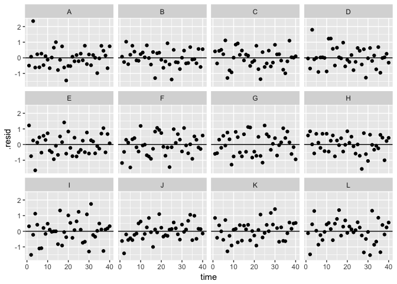

Variance structures
===================

Goals
=====

-   Gain familiarity with graphical model checking
-   Learn about variance structures in the nlme package
-   Learn to identify and deal with violations of assumptions about variance

A simulated data set
====================

I've simulated a data set with the predictor `x`, the response variables `y` through `y4`, collected for groups (`group`) A through L, and collected over time (`time`). Let's load that data set:

``` r
library(tidyverse)
library(nlme)
library(lme4)
d <- readRDS("data/generated/model-checking.rds")
d
```

    ## # A tibble: 480 × 8
    ##     group  time           x           y         y1         y2         y3
    ##    <fctr> <int>       <dbl>       <dbl>      <dbl>      <dbl>      <dbl>
    ## 1       A     1 -0.62124058 -1.08050850 -0.9599622 -0.4117448  0.2895616
    ## 2       A     2 -2.21469989 -1.27920375 -1.4219260 -0.8556033 -1.1917182
    ## 3       A     3  1.12493092  2.61011380  3.0594716 -0.1497541  1.1795339
    ## 4       A     4 -0.04493361 -0.92633047 -0.1920425  0.3679455 -1.4784386
    ## 5       A     5 -0.01619026 -0.06207282 -0.1183674  0.6835813 -0.1855607
    ## 6       A     6  0.94383621 -0.43073625  2.9827630  0.5154643  0.3233302
    ## 7       A     7  0.82122120  0.38068512  0.8670339  1.1687410  0.9773743
    ## 8       A     8  0.59390132 -0.46552573 -1.6440218 -0.3535327 -1.7948436
    ## 9       A     9  0.91897737  0.26735289 -0.8664985 -0.1737731 -0.8766547
    ## 10      A    10  0.78213630 -0.02557070 -0.5063872 -0.6035558  0.7270605
    ## # ... with 470 more rows, and 1 more variables: y4 <dbl>

``` r
# View(d)
```

All of the response variables are continuous with both negative and positive values and can be fitted with a linear mixed effects model.

Let's quickly plot the data.

``` r
ggplot(d, aes(x, y)) + geom_point() + facet_wrap(~group)
```


The response variable `y` can be fit without any issues with the following model:

``` r
m <- lme(y ~ x, random = ~ 1 | group, data = d)
summary(m)
```

    ## Linear mixed-effects model fit by REML
    ##  Data: d 
    ##        AIC      BIC    logLik
    ##   1000.418 1017.097 -496.2092
    ## 
    ## Random effects:
    ##  Formula: ~1 | group
    ##         (Intercept)  Residual
    ## StdDev:   0.5497619 0.6487004
    ## 
    ## Fixed effects: y ~ x 
    ##                 Value  Std.Error  DF   t-value p-value
    ## (Intercept) 0.3652447 0.16144170 467  2.262394  0.0241
    ## x           0.4827373 0.02969835 467 16.254683  0.0000
    ##  Correlation: 
    ##   (Intr)
    ## x -0.003
    ## 
    ## Standardized Within-Group Residuals:
    ##          Min           Q1          Med           Q3          Max 
    ## -2.539838199 -0.714632913  0.007583312  0.681951991  3.624174104 
    ## 
    ## Number of Observations: 480
    ## Number of Groups: 12

Some of the most important ways that we can check our model are to plot our fitted (predicted) values overlaid on the data, plot the residuals against the fitted values, plot the fitted values against the observed values, and plot residuals against each of our predictors in the model and any predictors that were not included in the model.

What are the model assumptions that these various plots help us check? What are we looking for when we make these plots?

We will plot the residuals various ways now using the augment function from the broom package.

``` r
aug <- broom::augment(m)

ggplot(aug, aes(x, y)) + geom_point() + facet_wrap(~group) +
  geom_line(aes(x, .fitted), colour = "red")
```


``` r
ggplot(aug, aes(.fitted, .resid)) + geom_point() + facet_wrap(~group) +
  geom_hline(yintercept = 0)
```


``` r
ggplot(aug, aes(.fitted, y)) + geom_point() + facet_wrap(~group) +
  geom_abline(intercept = 0, slope = 1)
```


``` r
ggplot(aug, aes(time, .resid)) + geom_point() + facet_wrap(~group) +
  geom_hline(yintercept = 0)
```



``` r
ggplot(aug, aes(x, .resid)) + geom_point() + facet_wrap(~group) +
  geom_hline(yintercept = 0)
```


Alternatively, as we have done before, we can use the plot functions built into the nlme (or the lme4) package. We will use this shortcut here and below for speed and to quickly access the "normalized" residuals which incorporate any variance or correlation structure.

``` r
plot(m, resid(., type = "normalized") ~ fitted(.), abline = 0)
```


``` r
plot(m, resid(., type = "normalized") ~ fitted(.) | group, abline = 0)
```


``` r
plot(m, resid(., type = "normalized") ~ time | group, abline = 0)
```


``` r
plot(ACF(m, resType = "normalized"))
```


We can also check the normality of the random effects, although we don't need to get too caught up checking these and there is no need to check these for the rest of these exercises.

``` r
qqnorm(ranef(m)[,"(Intercept)"])
```


When things go wrong
====================

There are at least 3 major ways I can think of that things might look wrong with residual plots.

1.  There might be large-scale trends in the residuals.
2.  There might be localized clumping or patterns in the residuals.
3.  The spread of the residuals may not be constant.

Challenge 0
-----------

Turn to your neighbor and discuss the approaches you would try to solve the first 2 problems.

Variance structures
===================

The third problem, a problem with the variance of the residuals, can be solved by adding covariates to the variance of the residuals.

The package nlme makes this relatively easy. (There is no other major R package that implements variance structures to my knowledge.)

There are a number of possible variance structures. You can see a list of them with `?nlme::varClasses`. The best reference on these variance structures is in Pinheiro and Bates (2000) "Mixed-Effects Models in S and S-PLUS".

The most common ones I've seen used are `nlme::varIdent`, `nlme::varExp`, and `nlme::varPower`.

Let's take a look at the shape of the exponential and power variance functions in nlme:

``` r
get_varPower <- function(v, t1) abs(v)^(2 * t1)
get_varConstPower <- function(v, t1, t2) (t1 + abs(v)^t2)^2
get_varExp <- function(v, t1) exp(2 * t1 * v)

library(manipulate)

v <- seq(0.05, 4, length.out = 100)

manipulate({plot(v, get_varPower(v, t1), type = "l", main = "nlme::varPower()")},
  t1 = slider(-1, 2, 0.1, step = 0.1))

manipulate({plot(v, get_varConstPower(v, t1, t2), type = "l",
  main = "nlme::varConstPower()")},
  t1 = slider(-4, 4, 1, step = 0.1),
  t2 = slider(-1, 2, 0.1, step = 0.1))

manipulate({plot(v, get_varExp(v, t1), type = "l", main = "nlme::varExp()")},
  t1 = slider(-0.5, 1, 0.1, step = 0.1))
```

We can add one of these variant structures by passing it to the `weights` argument in `nlme::lme` or `nlme::gls`. E.g. `weights = varExp()`. Read the help for each of these functions to see what the default value for the argument `form` is inside the variance function. `?nlme::varExp`

Model checking exercises
========================

In the following challenges, there is something wrong in each case. The solution involves adding one of `varExp`, `varIdent`, or `corAR1` temporal correlation.

I've started each one off. You will need to plot the residuals and figure out what variance or correlation structure is missing.

Remember that you can use the `update` function to reduce copying and pasting of code.

Challenge 1
===========

``` r
ggplot(d, aes(x, y1)) + geom_point() + facet_wrap(~group)
```


``` r
m1 <- lme(y1 ~ x, random = ~ 1 | group, data = d)

m1_right <- update(m1, weights = varExp(form = ~ fitted(.))) # exercise
```

Challenge 2
===========

``` r
ggplot(d, aes(x, y2)) + geom_point() + facet_wrap(~group)
```


``` r
m2 <- lme(y2 ~ x, random = ~ 1 | group, data = d)

m2_right <- update(m2, correlation = corAR1()) # exercise
```

Challenge 3
===========

``` r
ggplot(d, aes(x, y3)) + geom_point() + facet_wrap(~group)
```


``` r
m3 <- lme(y3 ~ x, random = ~ 1 | group, data = d)

m3_right <- update(m3, correlation = varIdent()) # exercise
```

Challenge 4
===========

This bonus question is harder. Hint: you can combine multiple variance structures with `varComb` and will need to do that here.

``` r
ggplot(d, aes(x, y4)) + geom_point() + facet_wrap(~group)
```


``` r
m4 <- lme(y4 ~ x, random = ~ 1 | group, data = d)

m4_right <- update(m4, weights = varComb(varIdent(), varExp())) # exercise
```
