GLM crash course
================

Goals
=====

-   Gain familiarity and intuition with common GLMs
-   Learn to detect and deal with overdispersion

Data
====

We are going to simulate our own data for this exercise. The following will be common parameters. `N` is the number of data points. `x` is our predictor variable. `a` is the intercept. And `b` is the slope.

``` r
library(ggplot2)
library(dplyr)
set.seed(111)
N <- 200
x <- runif(N, -1, 1)
a <- 0.5
b <- 1.3
d <- data_frame(x = x)
d
```

    ## # A tibble: 200 × 1
    ##              x
    ##          <dbl>
    ## 1   0.18596257
    ## 2   0.45296224
    ## 3  -0.25915599
    ## 4   0.02984766
    ## 5  -0.24467357
    ## 6  -0.16332535
    ## 7  -0.97868431
    ## 8   0.06459048
    ## 9  -0.13567877
    ## 10 -0.81263696
    ## # ... with 190 more rows

So our data frame includes a column for one predictor, `x`. This can represent any variable that you might try and predict some other process with.

We will use the following function to quickly plot the predictions from our models.

``` r
plot_glm <- function(model, dat) {
  fit <- predict(model, type = "link", se = FALSE)
  se <- predict(model, type = "link", se = TRUE)$se
  dat$lwr <- family(model)$linkinv(fit - 1.96 * se)
  dat$upr <- family(model)$linkinv(fit + 1.96 * se)
  dat$fit <- family(model)$linkinv(fit)
  p <- ggplot(dat) + geom_point(aes(x, y), alpha = 0.6) + 
    geom_line(aes(x, fit), colour = "red", lwd = 1) +
    geom_ribbon(aes(x, ymax = upr, ymin = lwr), alpha = 0.2)
  print(p)
  invisible(p)
}
```

Remember that there are two components to a GLM: a link function that describes what is happening with the mean of the data, and an error distribution that describes the variability around the mean.

Put another way, the "link" is the transformation you need to apply to make your data linear with respect to the predictors.

The error distribution describes the spread of the data around the raw untransformed mean.

The two most common link functions, and the only two we are going to work with in this workshop, are the log and logit links.

Let's look at those now. So if we want to fit a curve that looks like this:

``` r
xx <- seq(0, 5, length.out = 200)
plot(xx, exp(xx), type = "l")
```

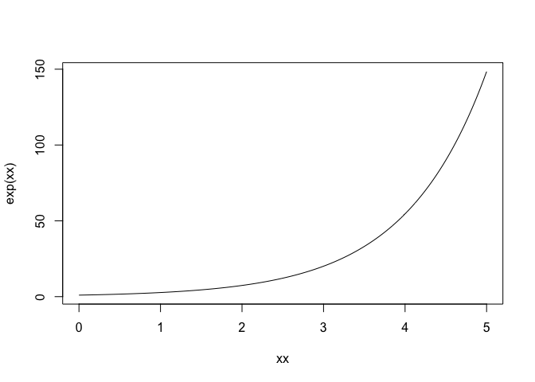

A log link will make the data look linear:

``` r
plot(xx, log(exp(xx)), type = "l")
```

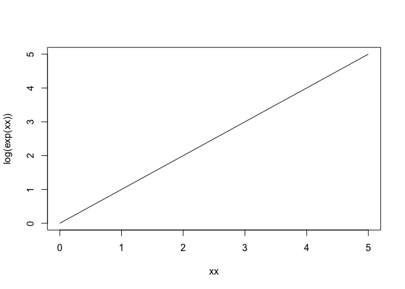

And if this is the curve we ultimately want to fit:

``` r
xx <- seq(-5, 5, length.out = 200)
plot(xx, plogis(xx), type = "l")
```

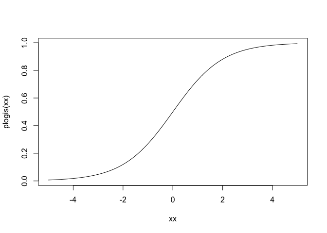

Then we can make it linear by applying the logit link:

``` r
plot(xx, qlogis(plogis(xx)), type = "l")
```

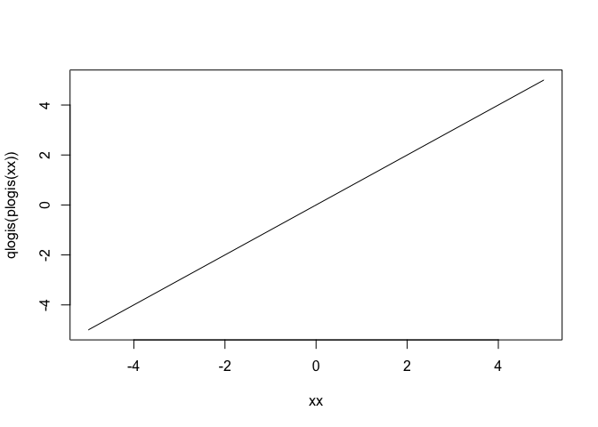

Note that of the `qlogis()` function is also known as the logit function and the `plogis()` function is also known as the inverse logit function. logit(p) = log(p/(1-p)).

There are many ways you can specify a distribution family and link function in R. I'm going to try and be consistent and specify them like this `family(link = "link")`.

When in doubt, read the help for `?family`.

Common GLMs
===========

Gamma, log link
---------------

The Gamma distribution combined with a log link is commonly used to model continuous positive data. (Therefore, this can often be used interchangeably with a linear regression where the response data are log transformed.)

Here, and throughout, we will generate a true set of response data `y_true`. We will then add variability around the true values according to each distribution that we work with.

``` r
y_true <- exp(a + b * x)
shape <- 8
y <- rgamma(N, rate = shape / y_true, shape = shape)
plot(x, y);lines(sort(x), y_true[order(x)])
```

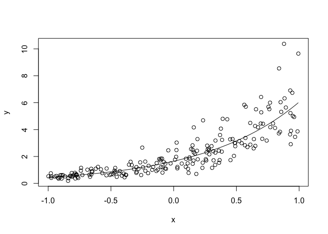

What are some examples of data sets that might resemble this?

Let's fit a GLM that reflects these data.

``` r
(m_gamma <- glm(y ~ x, family = 
    Gamma(link = "log"))) # exercise
```

    ## 
    ## Call:  glm(formula = y ~ x, family = Gamma(link = "log"))
    ## 
    ## Coefficients:
    ## (Intercept)            x  
    ##      0.5202       1.3065  
    ## 
    ## Degrees of Freedom: 199 Total (i.e. Null);  198 Residual
    ## Null Deviance:       128.9 
    ## Residual Deviance: 22.6  AIC: 332.2

``` r
plot_glm(m_gamma, d)
```

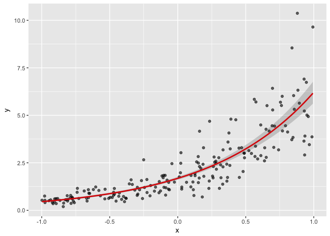

Poisson, log link
-----------------

The poisson distribution with a log link is commonly used to model count data or any data where the response is a whole number. The poisson distribution assumes that the variance scales one-to-one with the mean.

``` r
y_true <- exp(a + b * x)
y <- rpois(N, lambda = y_true)
plot(x, y);lines(sort(x), y_true[order(x)])
```

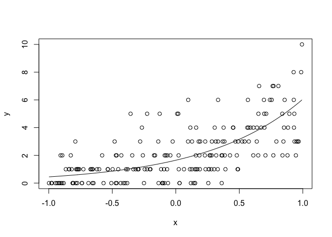

What are some examples of data sets that might resemble this?

``` r
(m_poisson <- glm(y ~ x, family = 
    poisson(link = "log"))) # exercise
```

    ## 
    ## Call:  glm(formula = y ~ x, family = poisson(link = "log"))
    ## 
    ## Coefficients:
    ## (Intercept)            x  
    ##      0.5348       1.1670  
    ## 
    ## Degrees of Freedom: 199 Total (i.e. Null);  198 Residual
    ## Null Deviance:       386.4 
    ## Residual Deviance: 221.2     AIC: 649.7

``` r
plot_glm(m_gamma, d)
```

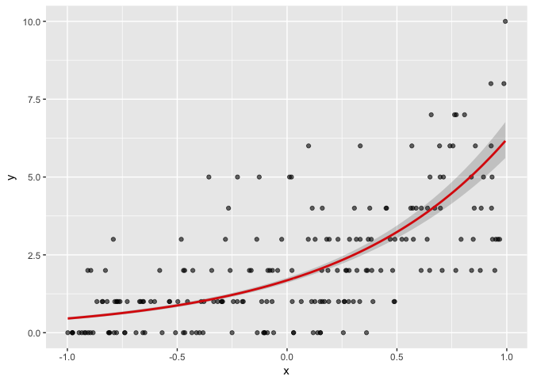

Negative binomial, log link
---------------------------

The negative binomial distribution with a log link can also model count data but allows the variance to grow as a quadratic function of the mean. In real data sets, it's probably more common to see the negative binomial than the poisson.

``` r
y_true <- exp(a + b * x)
y <- MASS::rnegbin(N, mu = y_true, theta = 0.6)
plot(x, y);lines(sort(x), y_true[order(x)])
```

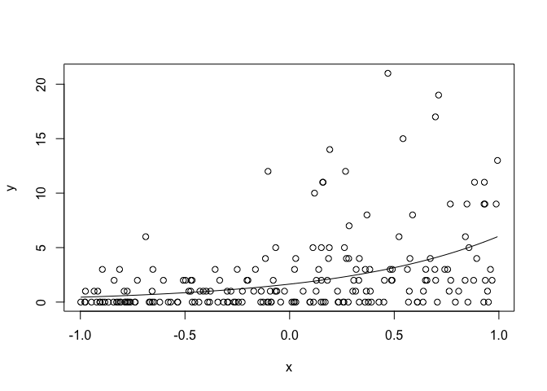

Notice the much larger values on the right side of the graph.

(Also note that there is another common parameterization of the negative binomial which allows the variance to grow linearly with the mean.)

We have to use a special function to fit the negative binomial GLM in R:

``` r
(m_nb <- MASS::glm.nb(y ~ x))
```

    ## 
    ## Call:  MASS::glm.nb(formula = y ~ x, init.theta = 0.7617602597, link = log)
    ## 
    ## Coefficients:
    ## (Intercept)            x  
    ##      0.5992       1.3161  
    ## 
    ## Degrees of Freedom: 199 Total (i.e. Null);  198 Residual
    ## Null Deviance:       257 
    ## Residual Deviance: 203.3     AIC: 757.7

``` r
plot_glm(m_nb, d)
```

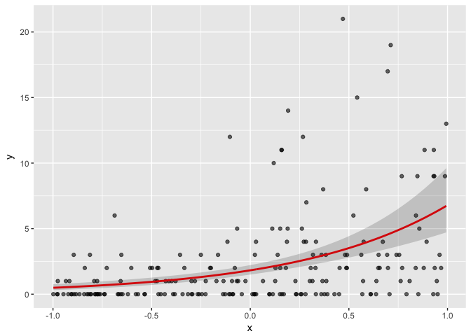

Binomial, logit link
--------------------

We can use a binomial response and logit link if we have response data represented by 0s and 1s. This is commonly referred to as a logistic regression.

``` r
y_linear <- a + b * x
# prob_true <- 1/(1+exp(-y_linear)) # inverse logit
prob_true <- plogis(y_linear) # inverse logit
y <- rbinom(N, 1, prob_true)
plot(x, jitter(y, 0.1));lines(sort(x), prob_true[order(x)])
```

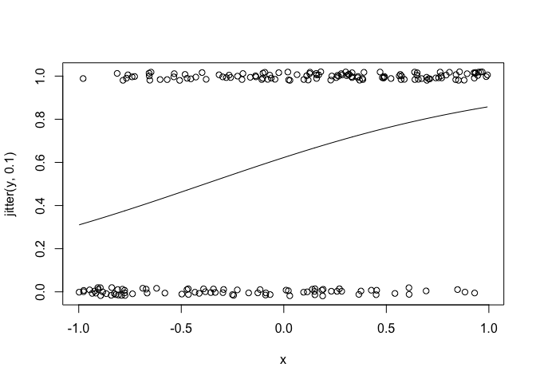

What does the true probabilities line indicate in the above plot and how does it correspond to the dots?

In what scenario might you see this kind of data?

``` r
(m_bin <- glm(y ~ x, family = 
    binomial(link = "logit"))) # exercise
```

    ## 
    ## Call:  glm(formula = y ~ x, family = binomial(link = "logit"))
    ## 
    ## Coefficients:
    ## (Intercept)            x  
    ##      0.4654       1.6016  
    ## 
    ## Degrees of Freedom: 199 Total (i.e. Null);  198 Residual
    ## Null Deviance:       269.2 
    ## Residual Deviance: 235.2     AIC: 239.2

``` r
g <- plot_glm(m_bin, d)
```

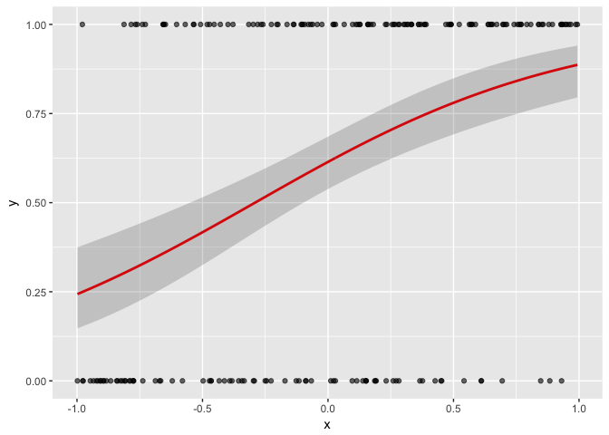

``` r
coef(m_bin)
```

    ## (Intercept)           x 
    ##   0.4653642   1.6015722

``` r
(slope <- round(coef(m_bin)[[2]], 3)) # slope
```

    ## [1] 1.602

``` r
(int <- round(coef(m_bin)[[1]], 3)) # intercept
```

    ## [1] 0.465

How do we interpret the slope coefficient? A unit increase in `x` corresponds to a 1.602 increase in the log odds of a `1` being observed.

That means the inverse-logit transformed true probabilities follow our estimated intercept and slope.

``` r
plot(sort(x), prob_true[order(x)]) # true probabilities 
```

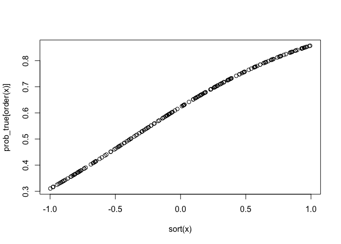

``` r
# inverse-logit transformed probabilities (aka log odds)
plot(sort(x), qlogis(prob_true[order(x)]), ylab = "log odds")
abline(a = int, b = slope, col = "red")
```

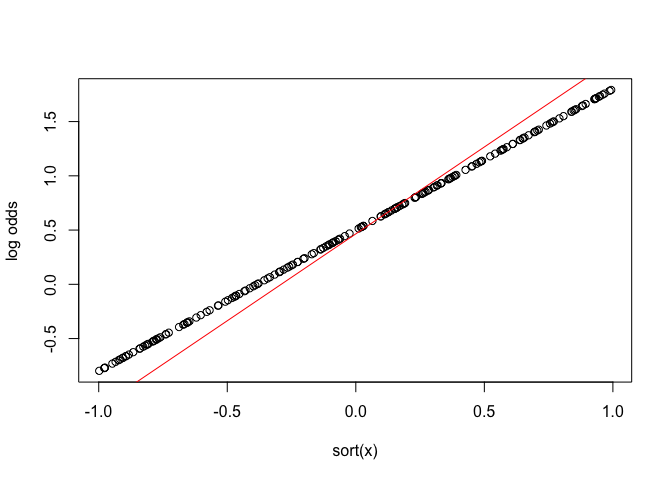

What does that mean? If we exponentiate the slope coefficient we get the expected fold increase in the *odds* of observing a `1`: 4.9629484 per unit increase in `x`.

Of course, most people have trouble wrapping their heads around odds and log odds, but those are the only scales on which our slope is constant.

If we want to show that in terms of probability then we need to pick 2 values to compare or plot out the function as we did above. The relationship is not linear on the probability scale.

A quick trick is to take the slope of the logistic regression and divide it by 4. This will give you approximately the expected change in probability per unit change in the x variable at the steepest part of the line.

Here's a quick illustration of that:

``` r
(approximate_slope <- slope/4)
```

    ## [1] 0.4005

``` r
intercept <- plogis(int)

g + geom_vline(xintercept = c(-0.5, 0, 0.5), lty = 2) +
  geom_abline(intercept = intercept, 
    slope = approximate_slope, size = 1) +
  ylab("Probability of y = 1")
```

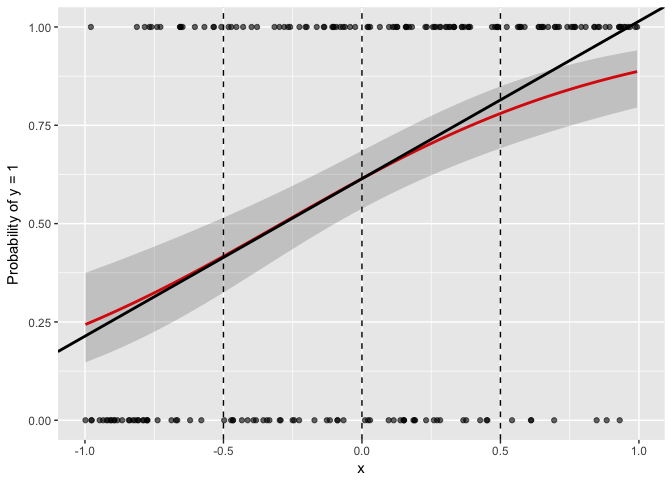

For more details see: Gelman, A., and J. Hill. 2006. Data Analysis Using Regression and Multilevel/Hierarchical Models. Cambridge University Press, Cambridge, UK.

Overdispersion
==============

“Overdispersion is the polite statistician’s version of Murphy’s Law: if something can go wrong, it will”

Crawley (2007, p. 522)

So far, all our fitted models have matched the simulated data. One common thing that can go wrong is that there is more variability in the data than allowed by a distribution.

This isn't a problem for distributions like the normal, Gamma, or negative binomial, because these distributions have a parameter that lets them be as narrow or wide as they need to be.

But some distributions, notably the poisson and binomial, assume a fixed level of variability for a given mean value. But the real world is messy and this isn't always the case. Let's take a look at what that means.

Quasipoisson, log link
----------------------

We'll start by using the negative binomial distribution to generate count data that we know are overdispersed for a poisson.

``` r
y_true <- exp(a + b * x)
set.seed(99)
y <- MASS::rnegbin(N, mu = y_true, theta = 0.25)
plot(x, y)
```

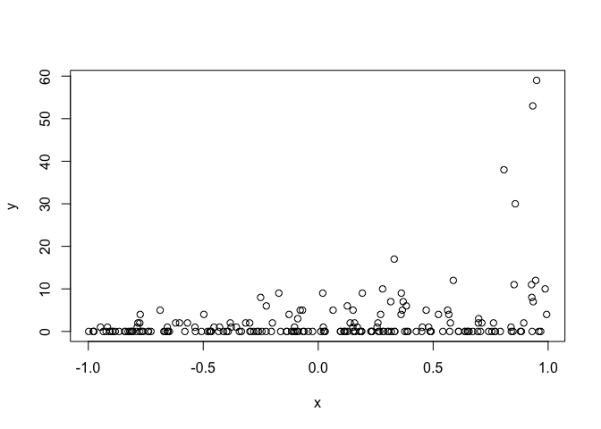

Let's fit a GLM with a poisson distribution and a log link even though we know that the true underlying distribution is negative binomial.

``` r
(m_poisson_nb <- glm(y ~ x, family = poisson(link = "log")))
```

    ## 
    ## Call:  glm(formula = y ~ x, family = poisson(link = "log"))
    ## 
    ## Coefficients:
    ## (Intercept)            x  
    ##      0.3439       1.8827  
    ## 
    ## Degrees of Freedom: 199 Total (i.e. Null);  198 Residual
    ## Null Deviance:       1593 
    ## Residual Deviance: 1181  AIC: 1422

``` r
plot_glm(m_poisson_nb, d)
```

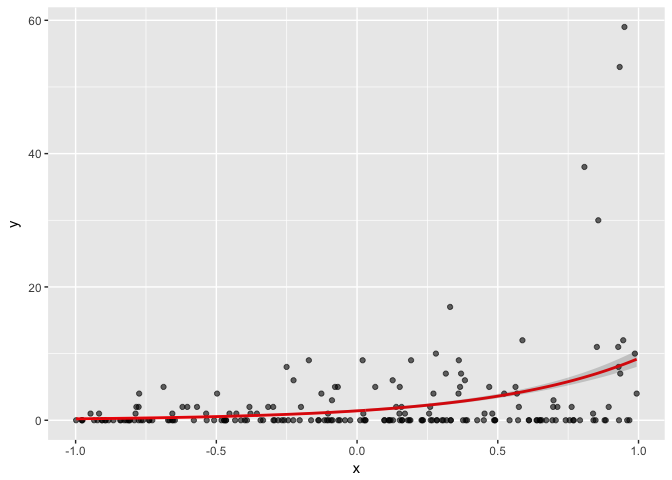

If we look at the deviance residuals, these should be constant with the predicted mean value:

``` r
plot(fitted(m_poisson_nb), residuals(m_poisson_nb, type = "deviance"))
```

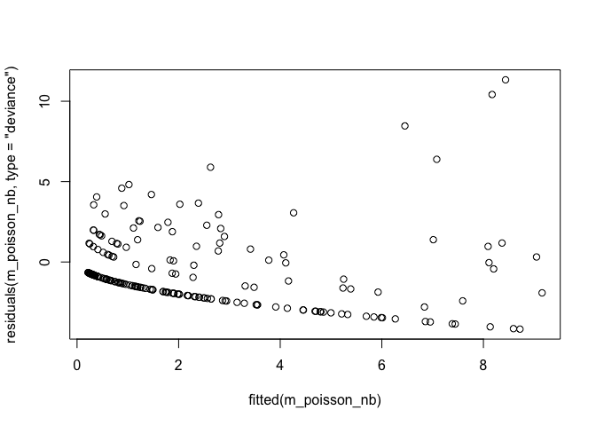

TODO TESTING

But they aren't.

We can compare these to what we would have expected when the model was correctly specified.

``` r
plot(fitted(m_nb), residuals(m_nb, type = "deviance"))
```

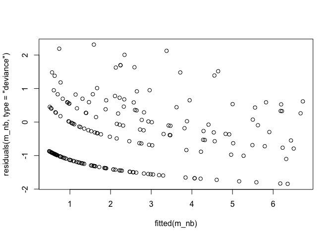

``` r
plot(fitted(m_poisson), residuals(m_poisson, type = "deviance"))
```

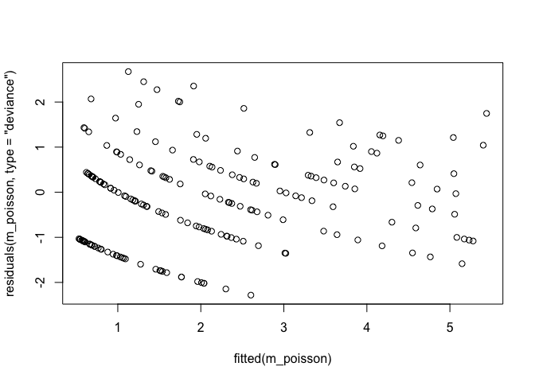

Note that this does not look the same as the residuals on the "response" scale.

TODO FIX THIS UP

``` r
plot(fitted(m_nb), residuals(m_nb, type = "response"))
```

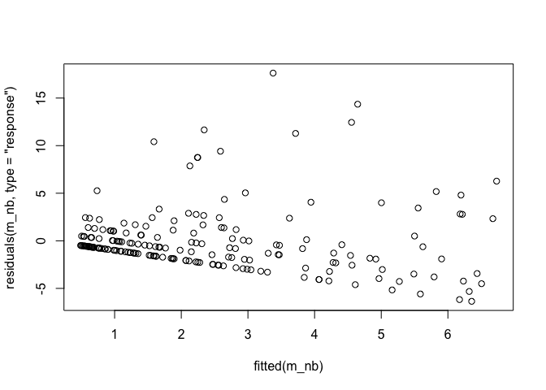

``` r
plot(fitted(m_nb), residuals(m_nb, type = "pearson"))
```

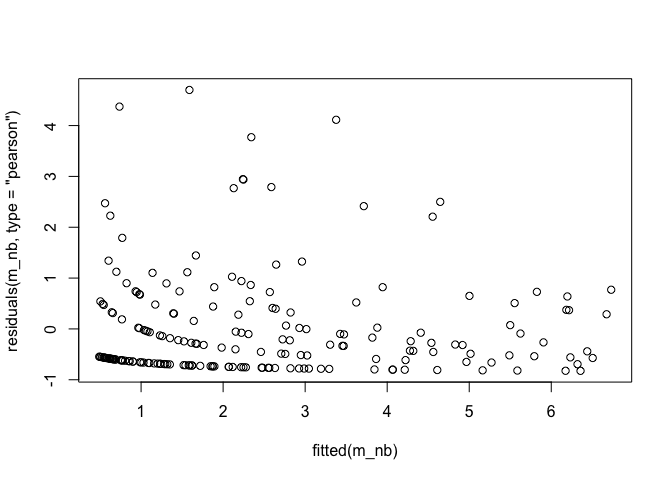

``` r
plot(fitted(m_nb), residuals(m_nb, type = "deviance"))
```


What are we looking at here?

We can also look at whether the deviance is approximately equal to the residual degrees of freedom.

TODO DEFINE DEVIANCe

``` r
deviance(m_poisson_nb)/m_poisson_nb$df.residual
```

    ## [1] 5.963846

``` r
AER::dispersiontest(m_poisson_nb) # Cameron, A.C. & Trivedi, P.K. (1990). Regression-based tests for overdispersion in the Poisson model. Journal of Econometrics, 46, 347–364.
```

    ## 
    ##  Overdispersion test
    ## 
    ## data:  m_poisson_nb
    ## z = 3.3805, p-value = 0.0003618
    ## alternative hypothesis: true dispersion is greater than 1
    ## sample estimates:
    ## dispersion 
    ##   8.165878

We know the correct model to fit here would be the negative binomial. But in reality we would not know this. An alternative, and simpler model to fit, is one with a "quasipoisson" error distribution.

This simply estimates how overdispersed the data are and scales the standard errors on our parameter estimates appropriately.

``` r
(m_qp <- glm(y ~ x, family = quasipoisson(link = "log")))
```

    ## 
    ## Call:  glm(formula = y ~ x, family = quasipoisson(link = "log"))
    ## 
    ## Coefficients:
    ## (Intercept)            x  
    ##      0.3439       1.8827  
    ## 
    ## Degrees of Freedom: 199 Total (i.e. Null);  198 Residual
    ## Null Deviance:       1593 
    ## Residual Deviance: 1181  AIC: NA

``` r
confint(m_qp)
```

    ## Waiting for profiling to be done...

    ##                   2.5 %    97.5 %
    ## (Intercept) -0.09390946 0.7155837
    ## x            1.30650319 2.5175303

``` r
confint(m_poisson_nb)
```

    ## Waiting for profiling to be done...

    ##                 2.5 %    97.5 %
    ## (Intercept) 0.2006474 0.4792419
    ## x           1.6774600 2.0950229

Quasibinomial, logit link
=========================

We can end up with overdispersed data from a binomial distribution if we have repeated trials.

When might that happen? For example, maybe you are measuring the proportion of frogs that survive in a given tank.

For this example, let's say you have 30 frogs per tank and 40 tanks.

Let's simulate the proportion of frogs that survived after some experiment in a case with overdispersed data, and in a case with no overdispersion:

``` r
set.seed(1)
n <- 30
y <- emdbook::rbetabinom(40, 0.5, size = n, theta=1)
y2 <- rbinom(40, 0.5, size = n)
par(mfrow = c(2, 1))
plot(table(y/n)/length(y), xlim = c(0, 1), ylab = "prop.", 
  main = "Overdispersed")
plot(table(y2/n)/length(y2), xlim = c(0, 1), ylab = "prop.",
  main = "Not overdispersed")
```

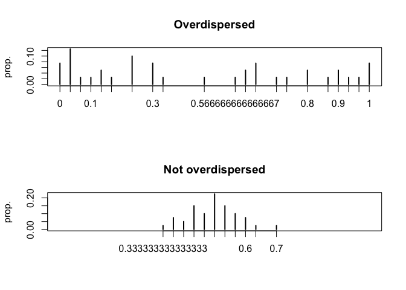

What we are looking at here is a histogram of the proportion of frogs that survived in each tank. Note how much more spread out the values are in the overdispersed scenario compared to the pure binomial distribution.

Let's plot the estimated mean proportion survived with a GLM fitted with the binomial error distribution, and a GLM that allows for overdispersion with the quasibinomial distribution.

``` r
par(mfrow = c(1, 1))
plot(table(y/n)/length(y), xlim = c(0, 1), ylab = "prop.", col = "grey80")
abline(v = 0.5, col = "black", lwd = 10)

m <- glm(y/n ~ 1, family = binomial(link = "logit"),
  weights = rep(n, length(y)))
ci <- plogis(confint(m))
```

    ## Waiting for profiling to be done...

``` r
abline(v = ci, col = "red", lwd = 5)

m2 <- glm(y/n ~ 1, family = quasibinomial(link = "logit"),
  weights = rep(n, length(y)))
ci2 <- plogis(confint(m2))
```

    ## Waiting for profiling to be done...

``` r
abline(v = ci2, col = "blue", lwd = 5)
```

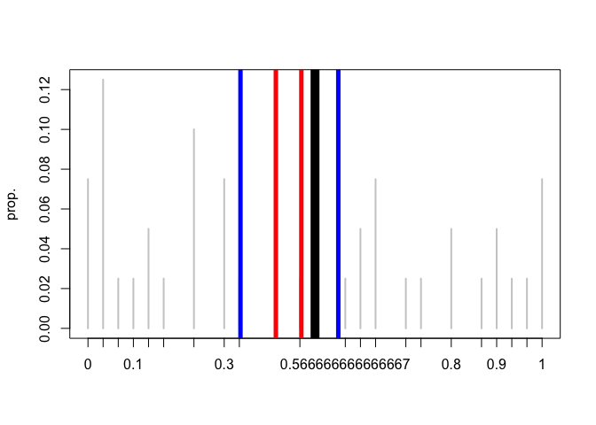

In the above plot, the true value is indicated by the thick black vertical line.

The binomial GLM 95% confidence interval is indicated by the red vertical lines.

And the quasibinomial GLM 95% confidence interval is indicated by the blue vertical lines.

Note how our confidence intervals look too small if we don't allow for overdispersion.

Since this is a course on GLMMs, an alternative way to deal with over dispersion here would be to model a random intercept for each tank. But we won't get into that yet.
