Binomial GLMMs
==============

Goals
=====

-   Gain familiarity with building, checking, and plotting a binomial GLMM
-   Learn about binned residual plots for checking binomial models

Loading the data
================

We are going to work with a data set from [O'Regan et al. 2013](http://doi.org/10.1890/13-0916.1). These data represent time to metamorphosis for 3 amphibian species in a mesocosm experiment. The experiment had 2 levels of warming (normal and accelerated) and 2 levels of pond drying (normal/permanent and accelerated/temporary). There were multiple tanks per treatment condition.

Let's read in and wrangle the data for our purposes.

``` r
library(tidyverse)
dt <- read_csv("data/raw/oregan-etal-2013/meso.csv")
dt$date <- lubridate::mdy(dt$date)
dt <- filter(dt, !tank %in% c(23, 30, 35)) # simplify

max_time <- max(dt$time)
dat <- list()
for (i in seq_len(nrow(dt))) {
  ti <- dt[i,]$time
  dat[[i]] <- data.frame(day = seq(1, max_time), 
    meta = c(rep(0, ti-1), rep(1, max_time - ti + 1)),
    frog = i, tank = dt[i,"tank"], warming = dt[i,"climate"], 
    drying = dt[i,"drying"], species = dt[i,"species"])
}
dat <- bind_rows(dat)
d <- filter(dat, day %in% unique(dt$time)) # downsample to the observed days 
species_letters <- tibble(species = c("spadefoot", "treefrog", "redlegged"),
  sp = c("b", "c", "a"))
d <- inner_join(d, species_letters) %>%
  rename(species_true = species, species = sp) %>%
  mutate(treatment = paste(climate, drying, sep = "+")) %>% 
  mutate(warming = ifelse(climate == "warming", 1, 0),
    drying = ifelse(drying == "temp", 1, 0))  %>% 
    select(-climate)  %>% 
  mutate(species = as.factor(species))
d <- mutate(d, day_centered = day - mean(day), week_centered = day_centered/7)
```

Plot the data
=============

We are going to model the expected probability of a randomly chosen amphibian having reached metamorphosis at any given point in time and for each of the treatments.

In other words, `meta` (1 = metamorphosis) will be our response, and the predictors will be `week_centered`, `warming`, `drying`, and `species`. I've also included columns for `treatment` (warming and drying combination) and `species_true` to make plotting easier.

Why might I have chosen to work with `week_centered` instead of `day`?

What are some useful ways we could look at the data before fitting a model?

Here is one way I thought of:

``` r
ggplot(d, aes(day, meta, color = treatment)) +
  facet_grid(treatment~species_true) +
  geom_point(alpha = 0.05, position = position_jitter(height = 0.15)) +
  ylab("Probability of metamorphosis")
```

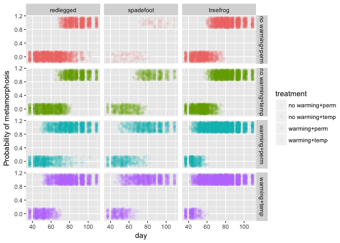

Fitting a global model and separate models
==========================================

A good first step is to fit a global model with no random effects and separate models for each potential random effect level.

We will use the convenience function `lme4::lmList` to fit the separate GLMs.

``` r
library(lme4)

m_global <- glm(meta ~ week_centered + species + warming * drying, 
  family = binomial(link = "logit"), data = d)
arm::display(m_global)
```

    ## glm(formula = meta ~ week_centered + species + warming * drying, 
    ##     family = binomial(link = "logit"), data = d)
    ##                coef.est coef.se
    ## (Intercept)    -1.87     0.05  
    ## week_centered   1.78     0.02  
    ## speciesb        0.42     0.07  
    ## speciesc        2.94     0.06  
    ## warming         4.06     0.08  
    ## drying          0.66     0.06  
    ## warming:drying  0.23     0.08  
    ## ---
    ##   n = 34776, k = 7
    ##   residual deviance = 14516.7, null deviance = 45294.4 (difference = 30777.7)

``` r
m_list <- lme4::lmList(meta ~ week_centered | tank, data = d, 
  family = binomial(link = "logit"))
```

    ## Warning: glm.fit: fitted probabilities numerically 0 or 1 occurred

    ## Warning: glm.fit: fitted probabilities numerically 0 or 1 occurred

``` r
intercepts <- map_dbl(m_list, function(x) coef(x)[[1]])
slopes <- map_dbl(m_list, function(x) coef(x)[[2]])
```

We can check that the tank-level estimates are approximately normally distributed:

``` r
hist(intercepts)
```

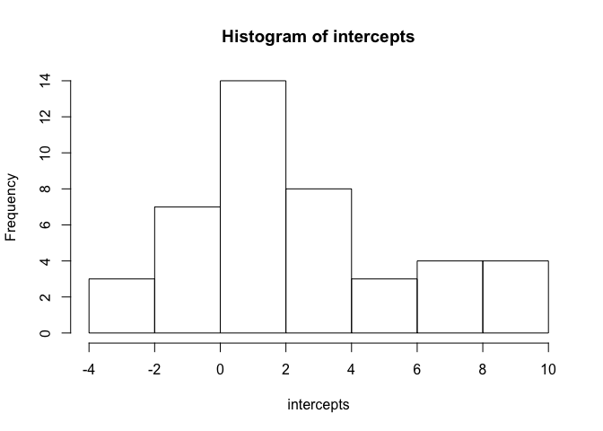

``` r
hist(slopes)
```

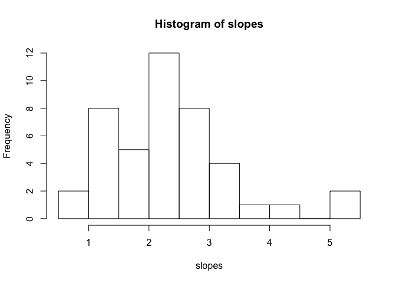

Although we won't here, it would be a good idea to plot the model fits on top of the data for each tank.

We can do something similar with ggplot:

``` r
ggplot(d, aes(day, meta, color = treatment)) +
  facet_grid(treatment~species_true) +
  geom_point(alpha = 0.05, position = position_jitter(height = 0.15)) +
  ylab("Probability of metamorphosis") +
  geom_smooth(method = "glm", 
    method.args = list(family = binomial(link = "logit")), 
      se = FALSE, alpha = 0.7, colour = "black")
```

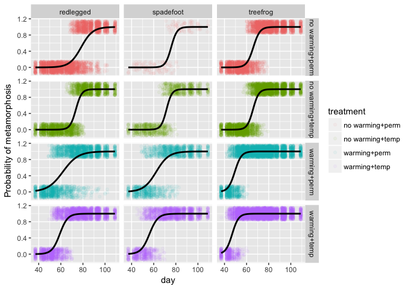

``` r
ggplot(d, aes(day, meta, group = tank, color = treatment)) +
  facet_grid(treatment~species_true) +
  geom_point(alpha = 0.05, position = position_jitter(height = 0.15)) +
  ylab("Probability of metamorphosis") +
  geom_smooth(method = "glm", 
    method.args = list(family = binomial(link = "logit")), 
      se = FALSE, colour = "black")
```

    ## Warning: glm.fit: fitted probabilities numerically 0 or 1 occurred

    ## Warning: glm.fit: fitted probabilities numerically 0 or 1 occurred

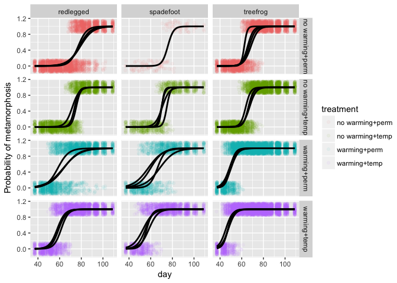

How do these plots help build our intuition about what we expect to find when we fit more complicated GLMMs?

Fitting an initial GLMM
=======================

Let's try fitting a binomial GLMM with a random intercept for each tank:

``` r
m <- glmer(meta ~ week_centered + species + warming * drying + (1 | tank), 
  family = binomial(link = "logit"), data = d)
```

Let's look at the model:

``` r
summary(m, correlation = FALSE)
```

    ## Generalized linear mixed model fit by maximum likelihood (Laplace
    ##   Approximation) [glmerMod]
    ##  Family: binomial  ( logit )
    ## Formula: meta ~ week_centered + species + warming * drying + (1 | tank)
    ##    Data: d
    ## 
    ##      AIC      BIC   logLik deviance df.resid 
    ##  14058.8  14126.4  -7021.4  14042.8    34768 
    ## 
    ## Scaled residuals: 
    ##      Min       1Q   Median       3Q      Max 
    ## -153.488   -0.095    0.015    0.148    7.214 
    ## 
    ## Random effects:
    ##  Groups Name        Variance Std.Dev.
    ##  tank   (Intercept) 0.3636   0.603   
    ## Number of obs: 34776, groups:  tank, 43
    ## 
    ## Fixed effects:
    ##                Estimate Std. Error z value Pr(>|z|)    
    ## (Intercept)     -1.9195     0.2379   -8.07 7.12e-16 ***
    ## week_centered    1.8516     0.0236   78.47  < 2e-16 ***
    ## speciesb         0.4975     0.2485    2.00  0.04530 *  
    ## speciesc         3.1040     0.2289   13.56  < 2e-16 ***
    ## warming          4.0083     0.2889   13.88  < 2e-16 ***
    ## drying           0.7545     0.2850    2.65  0.00811 ** 
    ## warming:drying   0.3659     0.3865    0.95  0.34382    
    ## ---
    ## Signif. codes:  0 '***' 0.001 '**' 0.01 '*' 0.05 '.' 0.1 ' ' 1

``` r
VarCorr(m)
```

    ##  Groups Name        Std.Dev.
    ##  tank   (Intercept) 0.60302

Default residual plots are not particularly useful for a binomial response, although adding a smooth function helps a little bit.

``` r
plot(m, type = c("p", "smooth"))
```

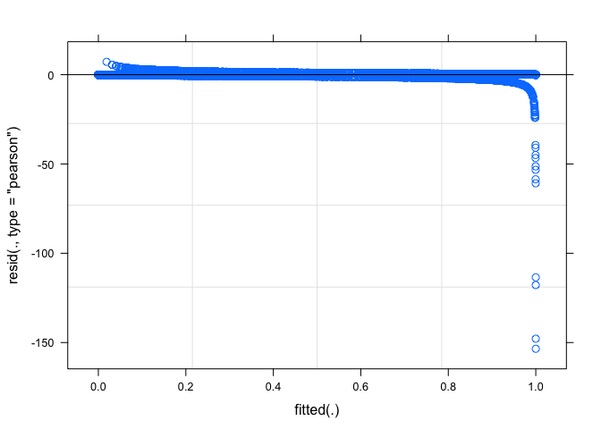

``` r
plot(m, type = c("p", "smooth"), ylim = c(-2, 2))
```

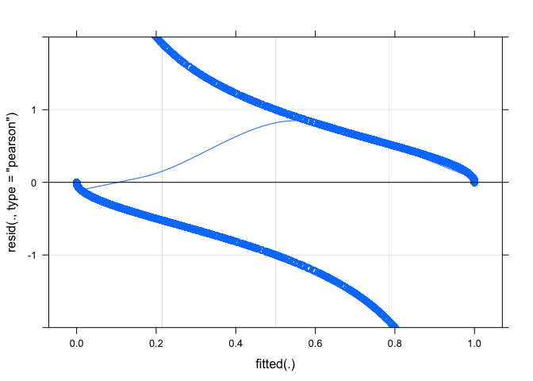

Looking at the residuals by group can also be useful. What are we looking for here?

``` r
plot(m, species~resid(.,type = "pearson"), xlim = c(-5, 5))
```

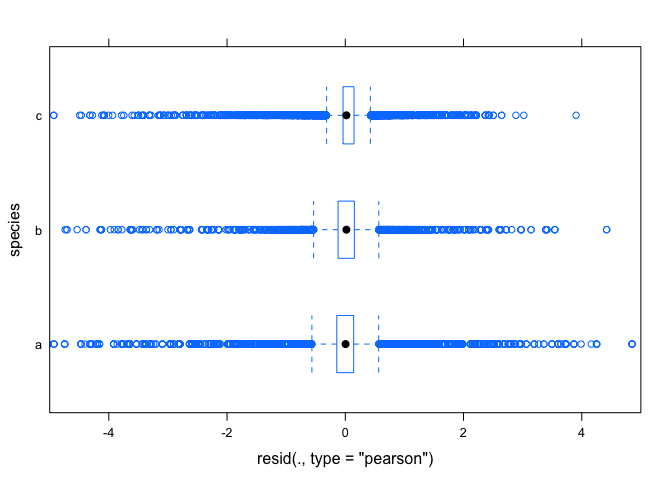

``` r
plot(m, treatment~resid(.,type = "pearson"), xlim = c(-5, 5))
```

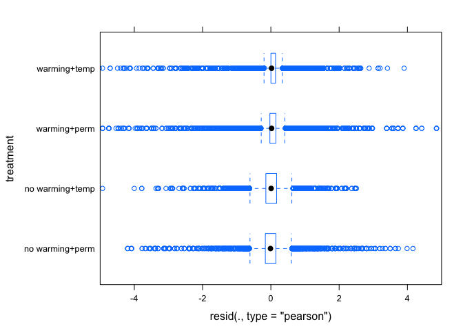

Binned residuals
================

One useful way of checking residuals for a binomial response is by using a binned residual plot. Gelman and Hill (2007) cover this type of plot in their textbook on multilevel modeling.

The idea is to group the residuals into bins based on the predictor values. The trick is picking an appropriate number of bins for this to be useful. We can make all the same types of plots with these binned residuals.

``` r
aug <- broom::augment(m)
aug <- aug %>% mutate(week_binned = findInterval(week_centered, 
      seq(min(week_centered), max(week_centered), length.out = 25)))
binned <- group_by(aug, species, week_binned, tank) %>%
  summarise(mean_week_centered = mean(week_centered), mean_residual = mean(.resid),
    mean_fitted = mean(.fitted))

ggplot(binned, aes(mean_fitted, mean_residual, color = species)) +
  geom_point(alpha = 0.8) +
  geom_smooth(se = FALSE, method = "loess") +
  geom_smooth(se = FALSE, method = "loess", colour = "black")
```

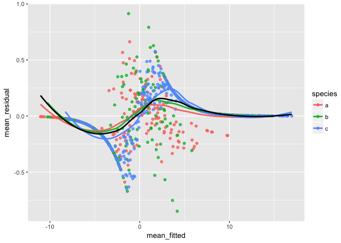

This does not look great.

Plotting the random and fixed estimates
=======================================

We can use built-in functions to plot the random intercept estimates:

``` r
lattice::dotplot(ranef(m, condVar = TRUE))
```

    ## $tank

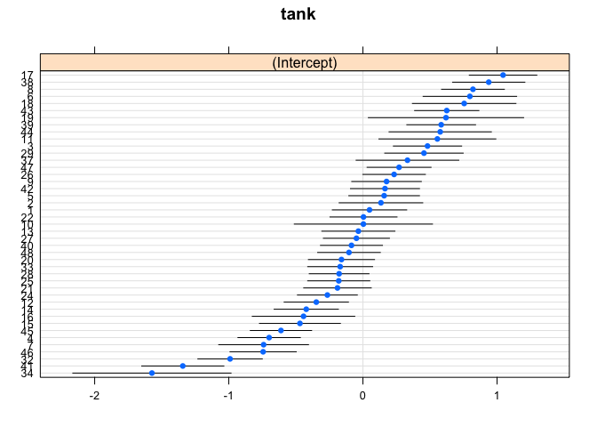

We can access the various confidence intervals with:

``` r
confint(m, method = "Wald")
```

    ##                     2.5 %     97.5 %
    ## .sig01                 NA         NA
    ## (Intercept)    -2.3857171 -1.4531778
    ## week_centered   1.8053724  1.8978650
    ## speciesb        0.0104011  0.9845725
    ## speciesc        2.6553593  3.5526957
    ## warming         3.4421384  4.5744610
    ## drying          0.1959731  1.3130402
    ## warming:drying -0.3916425  1.1233760

We can use the sjPlot package to make some quick plots:

``` r
sjPlot::sjp.glmer(m)
```

    ## Plotting random effects...

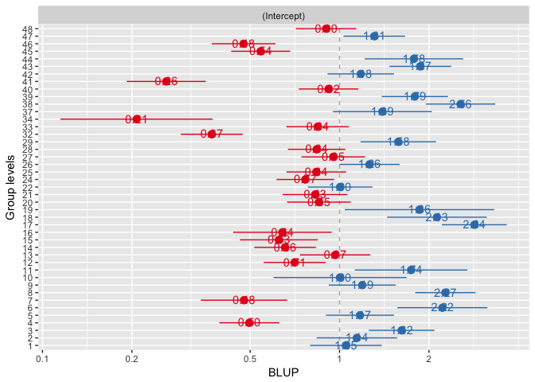

``` r
sjPlot::sjp.glmer(m, type = "re.qq")
```

    ## Testing for normal distribution. Dots should be plotted along the line.

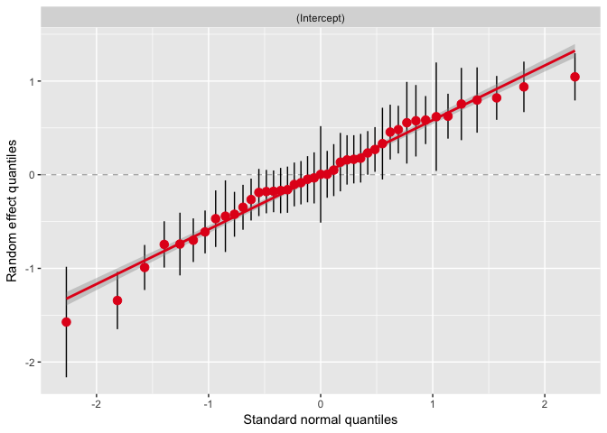

``` r
sjPlot::sjp.glmer(m, type = "fe")
```

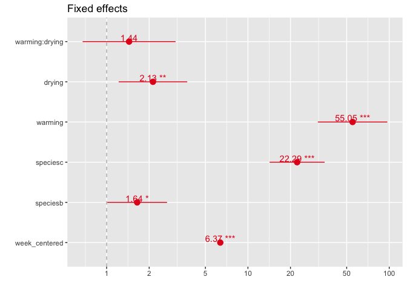

``` r
p <- sjPlot::sjp.glmer(m, type = "eff", show.ci = T)
```

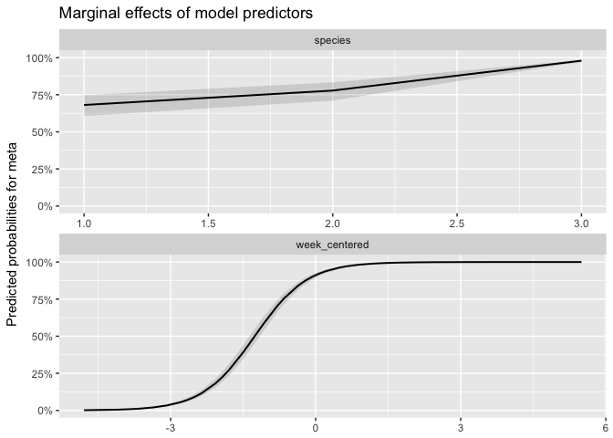

``` r
head(p$data)
```

    ##           x           y    conf.low   conf.high          term
    ## 1 -4.789116 0.001453124 0.001123218 0.001879746 week_centered
    ## 2 -4.074830 0.005432004 0.004287712 0.006879570 week_centered
    ## 3 -3.789116 0.009184905 0.007308020 0.011538220 week_centered
    ## 4 -3.646259 0.011932921 0.009532012 0.014929452 week_centered
    ## 5 -3.360544 0.020086514 0.016173032 0.024922975 week_centered
    ## 6 -3.074830 0.033621764 0.027296742 0.041350074 week_centered
    ##              labels         label
    ## 1  -4.7891156462585 week_centered
    ## 2 -4.07482993197279 week_centered
    ## 3  -3.7891156462585 week_centered
    ## 4 -3.64625850340136 week_centered
    ## 5 -3.36054421768707 week_centered
    ## 6 -3.07482993197279 week_centered

Model comparison
================

And compare our model without a predictor, say species, via AIC or likelihood ratio test:

``` r
m1 <- update(m,.~.-species)
bbmle::AICtab(m, m1)
```

    ##    dAIC df
    ## m   0   8 
    ## m1 72   6

``` r
anova(m, m1)
```

    ## Data: d
    ## Models:
    ## m1: meta ~ week_centered + warming + drying + (1 | tank) + warming:drying
    ## m: meta ~ week_centered + species + warming * drying + (1 | tank)
    ##    Df   AIC   BIC  logLik deviance  Chisq Chi Df Pr(>Chisq)    
    ## m1  6 14131 14182 -7059.4    14119                             
    ## m   8 14059 14126 -7021.4    14043 76.019      2  < 2.2e-16 ***
    ## ---
    ## Signif. codes:  0 '***' 0.001 '**' 0.01 '*' 0.05 '.' 0.1 ' ' 1

Perhaps we want to let the effect of time vary by species:

``` r
m2 <- update(m,.~. + week_centered:species) 
summary(m2, correlation = FALSE)
```

    ## Generalized linear mixed model fit by maximum likelihood (Laplace
    ##   Approximation) [glmerMod]
    ##  Family: binomial  ( logit )
    ## Formula: meta ~ week_centered + species + warming + drying + (1 | tank) +  
    ##     warming:drying + week_centered:species
    ##    Data: d
    ## 
    ##      AIC      BIC   logLik deviance df.resid 
    ##  13737.1  13821.7  -6858.6  13717.1    34766 
    ## 
    ## Scaled residuals: 
    ##     Min      1Q  Median      3Q     Max 
    ## -61.688  -0.096   0.008   0.139   7.010 
    ## 
    ## Random effects:
    ##  Groups Name        Variance Std.Dev.
    ##  tank   (Intercept) 0.8384   0.9157  
    ## Number of obs: 34776, groups:  tank, 43
    ## 
    ## Fixed effects:
    ##                        Estimate Std. Error z value Pr(>|z|)    
    ## (Intercept)            -2.16001    0.35625   -6.06 1.33e-09 ***
    ## week_centered           1.51283    0.02834   53.39  < 2e-16 ***
    ## speciesb                0.50664    0.37078    1.37   0.1718    
    ## speciesc                4.40695    0.35350   12.47  < 2e-16 ***
    ## warming                 4.31083    0.43001   10.02  < 2e-16 ***
    ## drying                  0.72132    0.42530    1.70   0.0899 .  
    ## warming:drying          0.37507    0.57771    0.65   0.5162    
    ## week_centered:speciesb  0.27209    0.06200    4.39 1.14e-05 ***
    ## week_centered:speciesc  1.00025    0.06083   16.44  < 2e-16 ***
    ## ---
    ## Signif. codes:  0 '***' 0.001 '**' 0.01 '*' 0.05 '.' 0.1 ' ' 1

``` r
bbmle::AICtab(m, m2)
```

    ##    dAIC  df
    ## m2   0.0 10
    ## m  321.7 8

So the AIC is substantially lower letting the slope vary by species.

Plotting the predictions
========================

Let's try plotting the predictions for each frog in each tank:

``` r
new_data <- unique(select(d, day:week_centered, -frog))
new_data$prediction <- predict(m2, type = "response", newdata = new_data)
ggplot(new_data, aes(day, prediction, group = tank, color = treatment)) +
  geom_line(alpha = 0.8) +
  facet_wrap(~species_true) +
  geom_point(aes(y = meta), alpha = 0.3, 
    position = position_jitter(height = 0.05)) +
  ylab("Probability of metamorphosis")
```

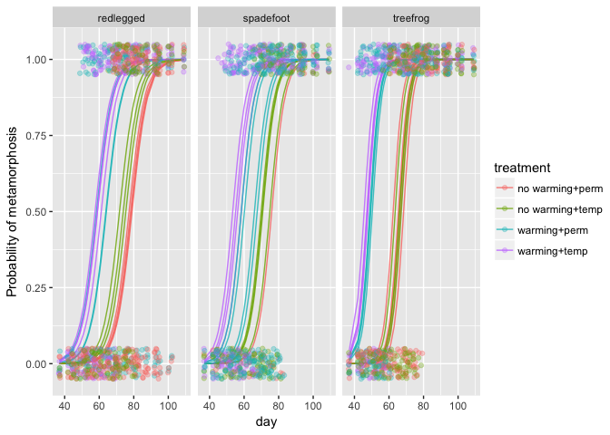

Expanding the model with glmmTMB
================================

We might want to consider letting some of these effects vary by tank. This model will not fit with lme4. Instead we will rely on TMB.

If I was publishing this analysis I would want to be extra careful that the model had converged given that it failed with default settings in lme4. I might play with the control settings for lme4 or try fitting the model with glmmADMB or `MASS::glmmPQL`.

``` r
library(glmmTMB)
m3 <- glmmTMB(meta ~ week_centered * species + warming * drying + 
  (1 + week_centered | tank), 
  family = binomial(link = "logit"), data = d)
summary(m3)
```

    ##  Family: binomial  ( logit )
    ## Formula: 
    ## meta ~ week_centered * species + warming * drying + (1 + week_centered |  
    ##     tank)
    ##    Data: d
    ## 
    ##      AIC      BIC   logLik deviance df.resid 
    ##  13283.8  13385.3  -6629.9  13259.8    34764 
    ## 
    ## Random effects:
    ## 
    ## Conditional model:
    ##  Groups Name          Variance Std.Dev. Corr
    ##  tank   (Intercept)   1.3111   1.1450       
    ##         week_centered 0.4476   0.6691   0.69
    ## Number of obs: 34776, groups:  tank, 43
    ## 
    ## Conditional model:
    ##                        Estimate Std. Error z value Pr(>|z|)    
    ## (Intercept)             -1.8919     0.3954  -4.784 1.72e-06 ***
    ## week_centered            1.8355     0.1836   9.994  < 2e-16 ***
    ## speciesb                 0.4264     0.4620   0.923  0.35607    
    ## speciesc                 4.4609     0.4438  10.051  < 2e-16 ***
    ## warming                  4.3301     0.4346   9.962  < 2e-16 ***
    ## drying                  -0.4878     0.4695  -1.039  0.29879    
    ## week_centered:speciesb   0.3142     0.2733   1.150  0.25026    
    ## week_centered:speciesc   0.8010     0.2551   3.140  0.00169 ** 
    ## warming:drying           1.7007     0.5558   3.060  0.00221 ** 
    ## ---
    ## Signif. codes:  0 '***' 0.001 '**' 0.01 '*' 0.05 '.' 0.1 ' ' 1

``` r
new_data$prediction3 <- predict(m3, type = "response", newdata = new_data)
```

In fact, `MASS::glmmPQL` does give us similar inference:

``` r
m_pql <- MASS::glmmPQL(meta ~ week_centered * species + warming * drying,
  random = ~ 1 + week_centered | tank, 
  family = binomial(link = "logit"), data = d)
summary(m_pql)
```

We would probably also want to consider if the effect of time varies by treatment:

``` r
m4 <- glmmTMB(meta ~ (week_centered + species + warming + drying)^2 + 
  (1 + week_centered | tank), 
  family = binomial(link = "logit"), data = d)
summary(m4)
```

    ##  Family: binomial  ( logit )
    ## Formula: meta ~ (week_centered + species + warming + drying)^2 + (1 +  
    ##     week_centered | tank)
    ##    Data: d
    ## 
    ##      AIC      BIC   logLik deviance df.resid 
    ##  13243.3  13395.5  -6603.6  13207.3    34758 
    ## 
    ## Random effects:
    ## 
    ## Conditional model:
    ##  Groups Name          Variance Std.Dev. Corr
    ##  tank   (Intercept)   0.6516   0.8072       
    ##         week_centered 0.1585   0.3981   0.73
    ## Number of obs: 34776, groups:  tank, 43
    ## 
    ## Conditional model:
    ##                        Estimate Std. Error z value Pr(>|z|)    
    ## (Intercept)             -1.1378     0.3590  -3.169  0.00153 ** 
    ## week_centered            1.7525     0.1510  11.604  < 2e-16 ***
    ## speciesb                -0.7563     0.6334  -1.194  0.23243    
    ## speciesc                 2.9879     0.4481   6.668 2.60e-11 ***
    ## warming                  2.7529     0.4336   6.349 2.17e-10 ***
    ## drying                  -0.4323     0.4570  -0.946  0.34418    
    ## week_centered:speciesb   0.2896     0.1814   1.597  0.11029    
    ## week_centered:speciesc   0.8502     0.1621   5.246 1.55e-07 ***
    ## week_centered:warming   -0.5861     0.1460  -4.013 5.98e-05 ***
    ## week_centered:drying     0.6848     0.1385   4.943 7.70e-07 ***
    ## speciesb:warming         0.6751     0.6234   1.083  0.27880    
    ## speciesc:warming         1.9563     0.4593   4.259 2.05e-05 ***
    ## speciesb:drying          1.5818     0.5298   2.986  0.00283 ** 
    ## speciesc:drying          1.0187     0.5399   1.887  0.05920 .  
    ## warming:drying           1.7181     0.4277   4.017 5.88e-05 ***
    ## ---
    ## Signif. codes:  0 '***' 0.001 '**' 0.01 '*' 0.05 '.' 0.1 ' ' 1

``` r
bbmle::AICtab(m3, m4)
```

    ##    dAIC df
    ## m4  0.0 18
    ## m3 40.5 12

Indeed the data support including both of these interactions with time and given this was part of the experiment it is likely a scientific question we would want to explore.

Let's plot these final probability of metamorphosis curves:

``` r
new_data$prediction4 <- predict(m4, type = "response", newdata = new_data)
ggplot(new_data, aes(day, prediction4, group = tank, color = treatment)) +
  geom_line(alpha = 0.8) +
  facet_wrap(~species_true) +
  geom_point(aes(y = meta), alpha = 0.3, 
    position = position_jitter(height = 0.05)) +
  ylab("Probability of metamorphosis")
```

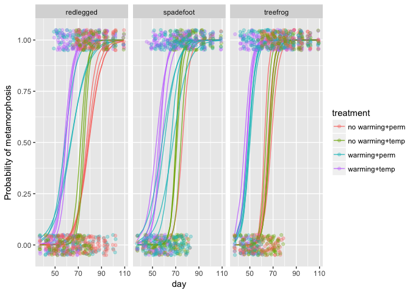

How can we derive estimates at any given factor levels? What does the slope estimate for `week_centered` represent? What is the slope estimate for `week_centered` for species `b`? How can we get a quick estimate of the rate of change of proportion metamorphosed per week at the steepest point on the curve? (Hint: remember the divide by 4 rule.)

``` r
comparison_effect <- function(model, base_par, comparison_par) {
  if (class(model) == "glmmTMB") {
    fe <- fixef(model)$cond
  } else {
    fe <- fixef(model)
  }
  if (base_par != comparison_par) {
    fe_comp <- fe[[comparison_par]] + fe[[base_par]]
  } else {
    fe_comp <- fe[[base_par]]
  }
  fe_comp
}

coef(summary(m4))
```

    ## $cond
    ##                          Estimate Std. Error    z value     Pr(>|z|)
    ## (Intercept)            -1.1377659  0.3589863 -3.1693854 1.527617e-03
    ## week_centered           1.7524894  0.1510306 11.6035375 3.953895e-31
    ## speciesb               -0.7563204  0.6333666 -1.1941275 2.324281e-01
    ## speciesc                2.9879241  0.4481084  6.6678602 2.595598e-11
    ## warming                 2.7528852  0.4335873  6.3490912 2.165905e-10
    ## drying                 -0.4323313  0.4570421 -0.9459332 3.441826e-01
    ## week_centered:speciesb  0.2896462  0.1813830  1.5968758 1.102934e-01
    ## week_centered:speciesc  0.8502147  0.1620572  5.2463865 1.551114e-07
    ## week_centered:warming  -0.5861440  0.1460453 -4.0134394 5.984038e-05
    ## week_centered:drying    0.6847724  0.1385373  4.9428748 7.697891e-07
    ## speciesb:warming        0.6751007  0.6233511  1.0830184 2.788002e-01
    ## speciesc:warming        1.9562767  0.4592846  4.2593997 2.049766e-05
    ## speciesb:drying         1.5817572  0.5297587  2.9858069 2.828312e-03
    ## speciesc:drying         1.0186693  0.5399195  1.8867060 5.919988e-02
    ## warming:drying          1.7181330  0.4276745  4.0173849 5.884757e-05
    ## 
    ## $zi
    ## NULL
    ## 
    ## $disp
    ## NULL

``` r
comparison_effect(m4, "week_centered", "week_centered")/4
```

    ## [1] 0.4381223

``` r
comparison_effect(m4, "week_centered", "week_centered:speciesb")/4
```

    ## [1] 0.5105339

``` r
comparison_effect(m4, "week_centered", "week_centered:speciesc")/4
```

    ## [1] 0.650676

Let's look at the binned residuals from this more complicated model:

``` r
aug <- d
aug$.resid <- residuals(m4)
aug$.fitted <- fitted(m4)
aug <- aug %>% mutate(week_binned = findInterval(week_centered, 
      seq(min(week_centered), max(week_centered), length.out = 25)))
binned4 <- group_by(aug, species, week_centered, tank) %>%
  summarise(mean_week_centered = mean(week_centered), mean_residual = mean(.resid),
    mean_fitted = mean(.fitted))

ggplot(binned4, aes(mean_fitted, mean_residual, colour = species)) +
  geom_point(alpha = 0.8) +
  geom_smooth(se = FALSE, method = "loess") +
  geom_smooth(se = FALSE, method = "loess", colour = "black")
```

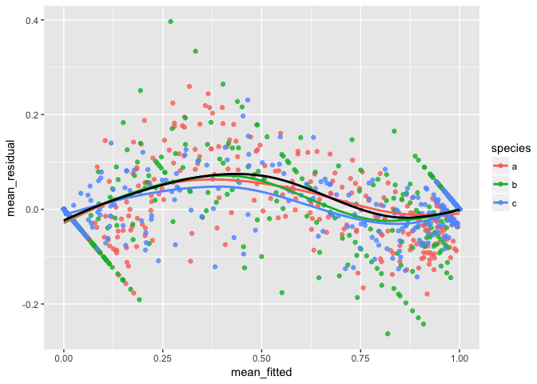

This looks substantially better, although not perfect. It's possible that a different link function would fit the data better although none of the obvious alternatives looked much better to me. For example:

``` r
m5 <- glmmTMB(meta ~ (week_centered + species + warming + drying)^2 + 
  (1 + week_centered | tank), 
  family = binomial(link = "probit"), data = d)
```

Addendum
========

What assumptions does our model make?

If we are primarily interested in the effect of these treatments on time to metamorphosis what is another simpler way we could have modeled these data?
