Count-data GLMMs
================

Goals
=====

-   Learn to fit poisson and negative binomial GLMMs with various packages in R
-   Learn how to criticize GLMM fit
-   Learn how to check for overdispersion in GLMMs
-   Learn how to interpret and plot output from count GLMMs

We are going to work with one of the data sets from: Artelle, K. A., S. C. Anderson, J. D. Reynolds, A. B. Cooper, P. C. Paquet, and C. T. Darimont. 2016. Ecology of conflict: marine food supply affects human-wildlife interactions on land. Scientific Reports 6:25936.

Let's read in the data and look at it:

``` r
library(tidyverse)
d <- readRDS("data/raw/conflict-salmon-for-modelling.rds") %>%
  select(late_kills,
    gbpu,
    salmon_biomass_geo_mean, 
    prev_3yr_conflict_scaled,
    mean_annual_temp_scaled,
    mean_temp_scaled,
    total_log_precip_scaled,
    year_centered,
    log_humanpop_scaled,
    log_grizzly_pop_est_scaled,
    gbpu_usable_area) %>%
  mutate(
    year_scaled = year_centered / (2 * sd(year_centered)),
    gbpu_usable_area = gbpu_usable_area / 1e9) %>%
  rename(salmon_scaled = salmon_biomass_geo_mean)
saveRDS(d, file = "data/generated/artelle-et-all-conflict.rds")
head(d)
```

    ##   late_kills   gbpu salmon_scaled prev_3yr_conflict_scaled
    ## 1          0 Babine    -0.2987871                0.3620023
    ## 2          0 Babine    -0.7443832               -0.3543002
    ## 3          0 Babine     0.4986037               -0.5930676
    ## 4          1 Babine    -0.8392494               -0.3543002
    ## 5          0 Babine     0.1712643               -0.1155327
    ## 6          0 Babine    -0.1382205               -0.1155327
    ##   mean_annual_temp_scaled mean_temp_scaled total_log_precip_scaled
    ## 1             0.010536894       -0.4213593              -0.4315156
    ## 2            -0.034710534       -0.4213593              -0.4315156
    ## 3            -0.045227934       -0.4213593              -0.4315156
    ## 4            -0.010088453       -0.4213593              -0.4315156
    ## 5             0.006155153       -0.4213593              -0.4315156
    ## 6            -0.011041803       -0.4213593              -0.4315156
    ##   year_centered log_humanpop_scaled log_grizzly_pop_est_scaled
    ## 1           -15           0.1575682                 0.05050962
    ## 2           -14           0.1575682                 0.05050962
    ## 3           -13           0.1575682                 0.05050962
    ## 4           -12           0.1575682                 0.05050962
    ## 5           -11           0.1575682                 0.05050962
    ## 6           -10           0.1575682                 0.05050962
    ##   gbpu_usable_area year_scaled
    ## 1         13.70167  -0.8379105
    ## 2         13.70167  -0.7820498
    ## 3         13.70167  -0.7261891
    ## 4         13.70167  -0.6703284
    ## 5         13.70167  -0.6144677
    ## 6         13.70167  -0.5586070

We are going to use the below formula a number of times. So let's store it in a variable we will call `f`.

``` r
f <- late_kills ~ 
  salmon_scaled + 
  prev_3yr_conflict_scaled +
  mean_annual_temp_scaled +
  mean_temp_scaled +
  total_log_precip_scaled +
  year_scaled +
  log_humanpop_scaled +
  log_grizzly_pop_est_scaled +
  offset(log(gbpu_usable_area))
```

Let's look at the data in a few ways.

``` r
ggplot(d, aes(year_centered, late_kills, color = salmon_scaled)) +
  geom_point() +
  facet_wrap(~gbpu)
```

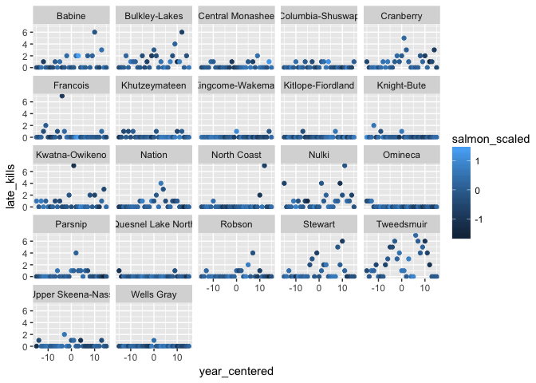

``` r
ggplot(d, aes(salmon_scaled, log(late_kills+0.5), color = gbpu)) +
  geom_point(position = position_jitter(height = 0.4, width = 0))
```

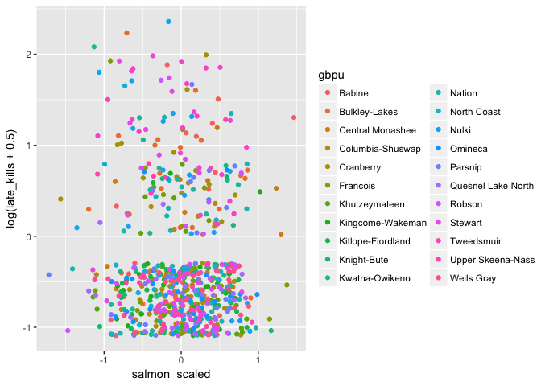

``` r
ggplot(d, aes(salmon_scaled, log((late_kills+0.5)/gbpu_usable_area), 
  color = gbpu)) +
  geom_point(position = position_jitter(height = 0.4, width = 0)) +
  geom_smooth(method = "lm", se = FALSE)
```

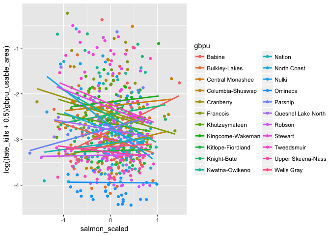

``` r
ggplot(d, aes(salmon_scaled, log((late_kills+0.5)), color = gbpu)) +
  geom_point(position = position_jitter(height = 0.4, width = 0), alpha = 0.3) +
  geom_smooth(method = "lm", se = FALSE, colour = "black")
```

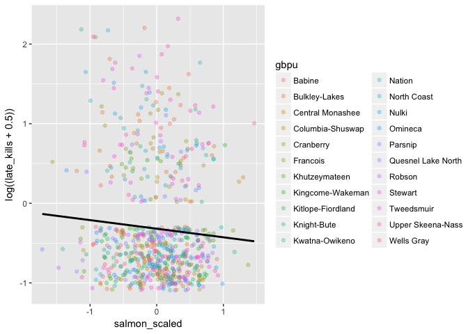

``` r
ggplot(d, aes(salmon_scaled, log((late_kills+0.5)), 
  color = gbpu, group = gbpu)) +
  geom_point(position = position_jitter(height = 0.4, width = 0), 
    alpha = 0.3) +
  geom_smooth(method = "lm", se = FALSE, alpha = 0.7, colour = "black")
```

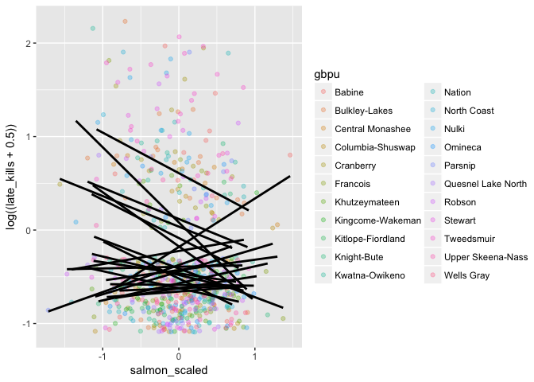

Modeling
========

Let's start by using the lme4 package as we have before. Instead of using the `lmer` function we will use the `glmer` function. (Although `lmer` will work too.)

We have count data. So one obvious place to start is with the Poisson distribution and a log link.

``` r
library(lme4)
f_lme4 <- paste(c(f, "+ (1 | gbpu)"), collapse = " ")
f_lme4
```

    ## [1] "late_kills ~ salmon_scaled + prev_3yr_conflict_scaled + mean_annual_temp_scaled + mean_temp_scaled + total_log_precip_scaled + year_scaled + log_humanpop_scaled + log_grizzly_pop_est_scaled + offset(log(gbpu_usable_area)) + (1 | gbpu)"

``` r
m_glmer <- glmer(f_lme4, data = d, family = poisson(link = "log"))
summary(m_glmer)
```

    ## Generalized linear mixed model fit by maximum likelihood (Laplace
    ##   Approximation) [glmerMod]
    ##  Family: poisson  ( log )
    ## Formula: 
    ## late_kills ~ salmon_scaled + prev_3yr_conflict_scaled + mean_annual_temp_scaled +  
    ##     mean_temp_scaled + total_log_precip_scaled + year_scaled +  
    ##     log_humanpop_scaled + log_grizzly_pop_est_scaled + offset(log(gbpu_usable_area)) +  
    ##     (1 | gbpu)
    ##    Data: d
    ## 
    ##      AIC      BIC   logLik deviance df.resid 
    ##   1266.3   1311.5   -623.1   1246.3      672 
    ## 
    ## Scaled residuals: 
    ##     Min      1Q  Median      3Q     Max 
    ## -1.7230 -0.6135 -0.4035 -0.2273  8.7411 
    ## 
    ## Random effects:
    ##  Groups Name        Variance Std.Dev.
    ##  gbpu   (Intercept) 0.6693   0.8181  
    ## Number of obs: 682, groups:  gbpu, 22
    ## 
    ## Fixed effects:
    ##                            Estimate Std. Error z value Pr(>|z|)    
    ## (Intercept)                 -3.6710     0.1935 -18.975  < 2e-16 ***
    ## salmon_scaled               -0.4467     0.1032  -4.330 1.49e-05 ***
    ## prev_3yr_conflict_scaled     0.3110     0.1050   2.963  0.00305 ** 
    ## mean_annual_temp_scaled      0.4567     0.4282   1.066  0.28624    
    ## mean_temp_scaled             0.8319     0.8856   0.939  0.34756    
    ## total_log_precip_scaled     -0.9984     0.9115  -1.095  0.27336    
    ## year_scaled                  0.3570     0.1175   3.039  0.00237 ** 
    ## log_humanpop_scaled         -0.1058     0.5428  -0.195  0.84545    
    ## log_grizzly_pop_est_scaled   0.3236     0.6626   0.488  0.62530    
    ## ---
    ## Signif. codes:  0 '***' 0.001 '**' 0.01 '*' 0.05 '.' 0.1 ' ' 1
    ## 
    ## Correlation of Fixed Effects:
    ##             (Intr) slmn_s pr_3__ mn_n__ mn_tm_ ttl___ yr_scl lg_hm_
    ## salmon_scld  0.058                                                 
    ## prv_3yr_cn_ -0.031 -0.036                                          
    ## mn_nnl_tmp_ -0.029  0.025  0.092                                   
    ## mn_tmp_scld -0.003 -0.011 -0.019 -0.297                            
    ## ttl_lg_prc_  0.026  0.011  0.025  0.362 -0.864                     
    ## year_scaled -0.039  0.154 -0.372  0.044 -0.012  0.017              
    ## lg_hmnpp_sc -0.001 -0.003 -0.016 -0.070 -0.522  0.393 -0.005       
    ## lg_grzzl___  0.002 -0.009 -0.026 -0.353  0.655 -0.746 -0.017 -0.008

We can look at these default plots, but the default residual plot is not that helpful here.

``` r
plot(m_glmer)
```

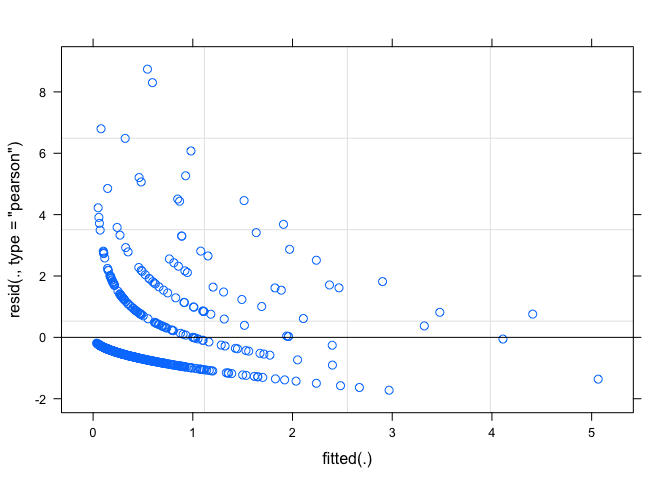

``` r
lattice::dotplot(ranef(m_glmer, condVar = TRUE))
```

    ## $gbpu

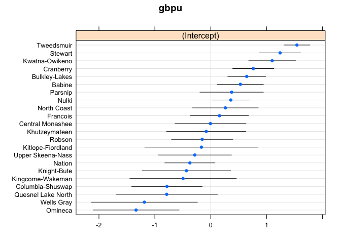

We can also extract fixed effects, random effects, and their standard errors with:

``` r
fixef(m_glmer)
```

    ##                (Intercept)              salmon_scaled 
    ##                 -3.6710421                 -0.4466765 
    ##   prev_3yr_conflict_scaled    mean_annual_temp_scaled 
    ##                  0.3109533                  0.4566665 
    ##           mean_temp_scaled    total_log_precip_scaled 
    ##                  0.8318805                 -0.9983898 
    ##                year_scaled        log_humanpop_scaled 
    ##                  0.3570264                 -0.1058092 
    ## log_grizzly_pop_est_scaled 
    ##                  0.3235804

``` r
arm::se.fixef(m_glmer)
```

    ##                (Intercept)              salmon_scaled 
    ##                  0.1934716                  0.1031648 
    ##   prev_3yr_conflict_scaled    mean_annual_temp_scaled 
    ##                  0.1049517                  0.4282338 
    ##           mean_temp_scaled    total_log_precip_scaled 
    ##                  0.8856056                  0.9114768 
    ##                year_scaled        log_humanpop_scaled 
    ##                  0.1174847                  0.5428268 
    ## log_grizzly_pop_est_scaled 
    ##                  0.6625880

``` r
ranef(m_glmer)
```

    ## $gbpu
    ##                     (Intercept)
    ## Babine              0.530290571
    ## Bulkley-Lakes       0.643739895
    ## Central Monashee   -0.005099741
    ## Columbia-Shuswap   -0.783339374
    ## Cranberry           0.761738852
    ## Francois            0.156757083
    ## Khutzeymateen      -0.080169148
    ## Kingcome-Wakeman   -0.494590647
    ## Kitlope-Fiordland  -0.167110026
    ## Knight-Bute        -0.434548018
    ## Kwatna-Owikeno      1.098791024
    ## Nation             -0.372893888
    ## North Coast         0.262108894
    ## Nulki               0.358677779
    ## Omineca            -1.336216898
    ## Parsnip             0.374133448
    ## Quesnel Lake North -0.787782493
    ## Robson             -0.152448906
    ## Stewart             1.240591604
    ## Tweedsmuir          1.542333536
    ## Upper Skeena-Nass  -0.285307476
    ## Wells Gray         -1.186897201

``` r
arm::se.ranef(m_glmer)
```

    ## $gbpu
    ##                    (Intercept)
    ## Babine               0.2098790
    ## Bulkley-Lakes        0.1726903
    ## Central Monashee     0.3244101
    ## Columbia-Shuswap     0.3216668
    ## Cranberry            0.1877919
    ## Francois             0.2648140
    ## Khutzeymateen        0.3623988
    ## Kingcome-Wakeman     0.4860130
    ## Kitlope-Fiordland    0.5167329
    ## Knight-Bute          0.4034430
    ## Kwatna-Owikeno       0.2139186
    ## Nation               0.2291064
    ## North Coast          0.3001125
    ## Nulki                0.1691317
    ## Omineca              0.3925142
    ## Parsnip              0.2894562
    ## Quesnel Lake North   0.4626780
    ## Robson               0.2803636
    ## Stewart              0.1868566
    ## Tweedsmuir           0.1185199
    ## Upper Skeena-Nass    0.3348141
    ## Wells Gray           0.4840647

There are 3 kinds of confidence intervals we can get out of lme4, but only one that will run quickly right now.

``` r
confint(m_glmer, method = "Wald")
```

    ##                                 2.5 %     97.5 %
    ## .sig01                             NA         NA
    ## (Intercept)                -4.0502393 -3.2918448
    ## salmon_scaled              -0.6488757 -0.2444773
    ## prev_3yr_conflict_scaled    0.1052519  0.5166548
    ## mean_annual_temp_scaled    -0.3826563  1.2959893
    ## mean_temp_scaled           -0.9038747  2.5676356
    ## total_log_precip_scaled    -2.7848515  0.7880719
    ## year_scaled                 0.1267607  0.5872921
    ## log_humanpop_scaled        -1.1697302  0.9581118
    ## log_grizzly_pop_est_scaled -0.9750683  1.6222291

``` r
# confint(m_glmer, method = "profile")
# confint(m_glmer, method = "boot")
```

One useful summary function is

``` r
coef(summary(m_glmer))
```

    ##                              Estimate Std. Error     z value     Pr(>|z|)
    ## (Intercept)                -3.6710421  0.1934716 -18.9745832 2.766971e-80
    ## salmon_scaled              -0.4466765  0.1031648  -4.3297396 1.492857e-05
    ## prev_3yr_conflict_scaled    0.3109533  0.1049517   2.9628244 3.048304e-03
    ## mean_annual_temp_scaled     0.4566665  0.4282338   1.0663954 2.862449e-01
    ## mean_temp_scaled            0.8318805  0.8856056   0.9393351 3.475587e-01
    ## total_log_precip_scaled    -0.9983898  0.9114768  -1.0953540 2.733616e-01
    ## year_scaled                 0.3570264  0.1174847   3.0389188 2.374288e-03
    ## log_humanpop_scaled        -0.1058092  0.5428268  -0.1949226 8.454535e-01
    ## log_grizzly_pop_est_scaled  0.3235804  0.6625880   0.4883583 6.252961e-01

Now we should check for overdispersion.

We can do that by comparing the sum of the pearson residuals squared with the residual degrees of freedom.

We can see the degrees of freedom from the output of `summary()`.

And we can calculate the sum of the pearson residuals squared:

``` r
sum(residuals(m_glmer, "pearson")^2)
```

    ## [1] 1061.857

``` r
aods3::gof(m_glmer) # alternative
```

    ## $D
    ## [1] 758.1431
    ## 
    ## $X2
    ## [1] 1061.857
    ## 
    ## $df
    ## [1] 672
    ## 
    ## attr(,"class")
    ## [1] "gof"

So it looks like we have some overdispersion here.

We can try dealing with this by adding an observation-level random intercept or by switching to a negative binomial distribution.

Theoretically, we could fit a negative binomial GLMM with the function `lme4::glmer.nb`, but the following fails to converge for me.

``` r
# m_glmer_nb <- glmer.nb(f_lme4, data = d)
# summary(m_glmer_nb)
```

We could try removing the offset term.

``` r
f2 <- late_kills ~ 
  salmon_scaled + 
  prev_3yr_conflict_scaled +
  mean_annual_temp_scaled +
  mean_temp_scaled +
  total_log_precip_scaled +
  year_scaled +
  log_humanpop_scaled +
  log_grizzly_pop_est_scaled

f_lme4_no_offset <- paste(c(f2, "+ (1 | gbpu)"), collapse = " ")
# m_glmer_nb <- glmer.nb(f_lme4_no_offset, data = d)
```

But that doesn't converge for me either.

So instead, let's start by adding an observation-level random intercept. This simply requires making a dummy variable with a level for each row of data:

``` r
d$obs <- seq_len(nrow(d))
f_lme4_obs <- paste(c(f2, "+ (1 | gbpu) + (1 | obs)"), collapse = " ")
m_lme4_obs <- glmer(f_lme4_obs, data = d, family = poisson(link = "log"))
```

    ## Warning in checkConv(attr(opt, "derivs"), opt$par, ctrl = control
    ## $checkConv, : Model failed to converge with max|grad| = 0.00704323 (tol =
    ## 0.001, component 1)

``` r
summary(m_lme4_obs)
```

    ## Generalized linear mixed model fit by maximum likelihood (Laplace
    ##   Approximation) [glmerMod]
    ##  Family: poisson  ( log )
    ## Formula: 
    ## late_kills ~ salmon_scaled + prev_3yr_conflict_scaled + mean_annual_temp_scaled +  
    ##     mean_temp_scaled + total_log_precip_scaled + year_scaled +  
    ##     log_humanpop_scaled + log_grizzly_pop_est_scaled + (1 | gbpu) +  
    ##     (1 | obs)
    ##    Data: d
    ## 
    ##      AIC      BIC   logLik deviance df.resid 
    ##   1173.5   1223.3   -575.8   1151.5      671 
    ## 
    ## Scaled residuals: 
    ##     Min      1Q  Median      3Q     Max 
    ## -0.9110 -0.4768 -0.3457 -0.1050  2.6272 
    ## 
    ## Random effects:
    ##  Groups Name        Variance Std.Dev.
    ##  obs    (Intercept) 1.0845   1.0414  
    ##  gbpu   (Intercept) 0.5342   0.7309  
    ## Number of obs: 682, groups:  obs, 682; gbpu, 22
    ## 
    ## Fixed effects:
    ##                            Estimate Std. Error z value Pr(>|z|)    
    ## (Intercept)                -1.70332    0.20299  -8.391   <2e-16 ***
    ## salmon_scaled              -0.36961    0.15697  -2.355   0.0185 *  
    ## prev_3yr_conflict_scaled    0.32167    0.16033   2.006   0.0448 *  
    ## mean_annual_temp_scaled     0.44100    0.45744   0.964   0.3350    
    ## mean_temp_scaled           -0.25373    0.84973  -0.299   0.7652    
    ## total_log_precip_scaled    -0.51646    0.88091  -0.586   0.5577    
    ## year_scaled                 0.36640    0.17222   2.128   0.0334 *  
    ## log_humanpop_scaled         0.05713    0.51516   0.111   0.9117    
    ## log_grizzly_pop_est_scaled -0.28692    0.63728  -0.450   0.6526    
    ## ---
    ## Signif. codes:  0 '***' 0.001 '**' 0.01 '*' 0.05 '.' 0.1 ' ' 1
    ## 
    ## Correlation of Fixed Effects:
    ##             (Intr) slmn_s pr_3__ mn_n__ mn_tm_ ttl___ yr_scl lg_hm_
    ## salmon_scld  0.025                                                 
    ## prv_3yr_cn_ -0.044 -0.030                                          
    ## mn_nnl_tmp_ -0.048  0.026  0.081                                   
    ## mn_tmp_scld  0.003 -0.019 -0.021 -0.321                            
    ## ttl_lg_prc_  0.032  0.027  0.031  0.383 -0.866                     
    ## year_scaled -0.038  0.116 -0.283  0.039 -0.010  0.008              
    ## lg_hmnpp_sc  0.002 -0.003 -0.009 -0.072 -0.513  0.386 -0.013       
    ## lg_grzzl___  0.002 -0.030 -0.027 -0.375  0.665 -0.754 -0.017 -0.006
    ## convergence code: 0
    ## Model failed to converge with max|grad| = 0.00704323 (tol = 0.001, component 1)

``` r
aods3::gof(m_lme4_obs)
```

    ## $D
    ## [1] 290.9732
    ## 
    ## $X2
    ## [1] 236.2628
    ## 
    ## $df
    ## [1] 671
    ## 
    ## attr(,"class")
    ## [1] "gof"

That, too, has poor convergence.

Before we move on to other packages, let's quickly look at some plots we can get out of the sjPlot package. Remember, these confidence intervals shouldn't be trusted because we haven't dealt with overdispersion yet.

``` r
sjPlot::sjp.glmer(m_glmer)
```

    ## Plotting random effects...

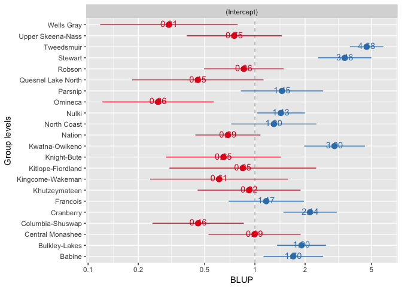

``` r
sjPlot::sjp.glmer(m_glmer, type = "fe")
```

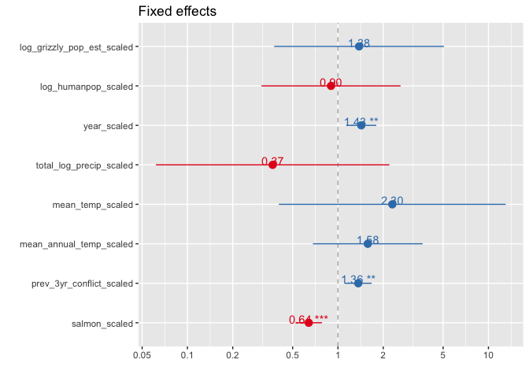

``` r
sjPlot::sjp.glmer(m_glmer, type = "re.qq")
```

    ## Testing for normal distribution. Dots should be plotted along the line.

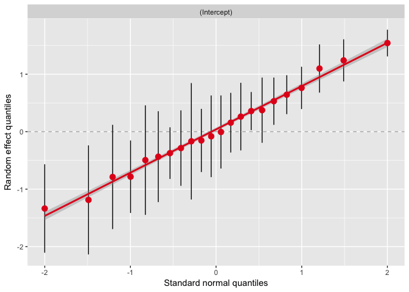

``` r
# sjPlot::sjp.glmer(m, type = "ma") # many
p <- sjPlot::sjp.glmer(m_glmer, type = "eff", show.ci = T)
```

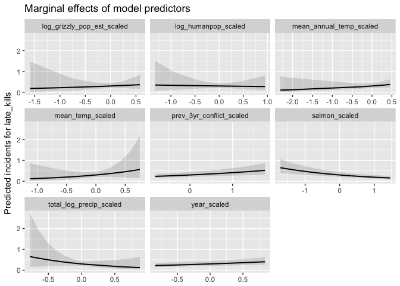

``` r
head(p$data)
```

    ##           x         y  conf.low conf.high          term            labels
    ## 1 -1.716285 0.6498885 0.3945583 1.0704502 salmon_scaled -1.71628475361601
    ## 2 -1.563530 0.6070243 0.3758112 0.9804885 salmon_scaled -1.56353018460401
    ## 3 -1.470963 0.5824370 0.3646699 0.9302464 salmon_scaled -1.47096255542707
    ## 4 -1.409130 0.5665709 0.3573160 0.8983717 salmon_scaled -1.40913048228347
    ## 5 -1.352828 0.5524999 0.3506790 0.8704715 salmon_scaled -1.35282809693149
    ## 6 -1.199861 0.5160102 0.3329226 0.7997851 salmon_scaled -1.19986146464669
    ##           label
    ## 1 salmon_scaled
    ## 2 salmon_scaled
    ## 3 salmon_scaled
    ## 4 salmon_scaled
    ## 5 salmon_scaled
    ## 6 salmon_scaled

We can try the function `glmmPQL` in the package MASS, which lets us fit the model with something fancy called penalized quasi-likelihood. "Penalized quasi-likelihood" doubles as a great conservation starter at cocktail parties.

``` r
m_pql <- MASS::glmmPQL(f, random = ~ 1 | gbpu/obs, data = d, 
  family = poisson(link = "log"))
```

    ## iteration 1

    ## iteration 2

    ## iteration 3

    ## iteration 4

    ## iteration 5

    ## iteration 6

    ## iteration 7

    ## iteration 8

    ## iteration 9

    ## iteration 10

``` r
summary(m_pql)
```

    ## Linear mixed-effects model fit by maximum likelihood
    ##  Data: d 
    ##   AIC BIC logLik
    ##    NA  NA     NA
    ## 
    ## Random effects:
    ##  Formula: ~1 | gbpu
    ##         (Intercept)
    ## StdDev:   0.8189203
    ## 
    ##  Formula: ~1 | obs %in% gbpu
    ##         (Intercept)     Residual
    ## StdDev:    1.742671 1.495467e-05
    ## 
    ## Variance function:
    ##  Structure: fixed weights
    ##  Formula: ~invwt 
    ## Fixed effects: late_kills ~ salmon_scaled + prev_3yr_conflict_scaled + mean_annual_temp_scaled +      mean_temp_scaled + total_log_precip_scaled + year_scaled +      log_humanpop_scaled + log_grizzly_pop_est_scaled + offset(log(gbpu_usable_area)) 
    ##                                Value Std.Error  DF    t-value p-value
    ## (Intercept)                -5.374226 0.1881577 656 -28.562340  0.0000
    ## salmon_scaled              -0.328818 0.1350081 656  -2.435541  0.0151
    ## prev_3yr_conflict_scaled    0.330425 0.1368550 656   2.414418  0.0160
    ## mean_annual_temp_scaled     0.323906 0.4134714 656   0.783381  0.4337
    ## mean_temp_scaled            0.936700 0.8736412  17   1.072179  0.2986
    ## total_log_precip_scaled    -1.048569 0.9186126  17  -1.141470  0.2695
    ## year_scaled                 0.381096 0.1373057 656   2.775531  0.0057
    ## log_humanpop_scaled        -0.082727 0.5457140  17  -0.151593  0.8813
    ## log_grizzly_pop_est_scaled  0.412257 0.6709524  17   0.614435  0.5471
    ##  Correlation: 
    ##                            (Intr) slmn_s pr_3__ mn_n__ mn_tm_ ttl___
    ## salmon_scaled               0.000                                   
    ## prev_3yr_conflict_scaled    0.000 -0.011                            
    ## mean_annual_temp_scaled     0.000  0.011  0.066                     
    ## mean_temp_scaled            0.000 -0.004 -0.022 -0.330              
    ## total_log_precip_scaled     0.000  0.005  0.029  0.438 -0.867       
    ## year_scaled                 0.000  0.091 -0.171  0.054 -0.018  0.023
    ## log_humanpop_scaled         0.000 -0.001 -0.006 -0.094 -0.514  0.371
    ## log_grizzly_pop_est_scaled  0.000 -0.005 -0.029 -0.440  0.639 -0.742
    ##                            yr_scl lg_hm_
    ## salmon_scaled                           
    ## prev_3yr_conflict_scaled                
    ## mean_annual_temp_scaled                 
    ## mean_temp_scaled                        
    ## total_log_precip_scaled                 
    ## year_scaled                             
    ## log_humanpop_scaled        -0.005       
    ## log_grizzly_pop_est_scaled -0.024  0.020
    ## 
    ## Standardized Within-Group Residuals:
    ##           Min            Q1           Med            Q3           Max 
    ## -4.174956e-05 -2.403592e-05 -1.458375e-05  3.630430e-06  2.196629e-05 
    ## 
    ## Number of Observations: 682
    ## Number of Groups: 
    ##          gbpu obs %in% gbpu 
    ##            22           682

This one converges. In the background the function is using nlme. Therefore, we have to work with the object as if it was from nlme. E.g.

``` r
nlme::intervals(m_pql)
```

    ## Approximate 95% confidence intervals
    ## 
    ##  Fixed effects:
    ##                                  lower       est.       upper
    ## (Intercept)                -5.74124381 -5.3742256 -5.00720748
    ## salmon_scaled              -0.59216275 -0.3288177 -0.06547262
    ## prev_3yr_conflict_scaled    0.06347751  0.3304251  0.59737277
    ## mean_annual_temp_scaled    -0.48260641  0.3239058  1.13041792
    ## mean_temp_scaled           -0.89431961  0.9366998  2.76771920
    ## total_log_precip_scaled    -2.97384144 -1.0485688  0.87670390
    ## year_scaled                 0.11326943  0.3810963  0.64892320
    ## log_humanpop_scaled        -1.22646026 -0.0827265  1.06100726
    ## log_grizzly_pop_est_scaled -0.99395786  0.4122566  1.81847101
    ## attr(,"label")
    ## [1] "Fixed effects:"
    ## 
    ##  Random Effects:
    ##   Level: gbpu 
    ##                     lower      est.    upper
    ## sd((Intercept)) 0.5847447 0.8189203 1.146877
    ##   Level: obs 
    ##                    lower     est.   upper
    ## sd((Intercept)) 1.651164 1.742671 1.83925
    ## 
    ##  Within-group standard error:
    ##        lower         est.        upper 
    ## 3.705318e-29 1.495467e-05 6.035708e+18

What distribution might work best?

``` r
dg <- group_by(d, gbpu) %>%
  summarise(m = mean(late_kills), v = var(late_kills))
ggplot(dg, aes(m, v)) +
  geom_smooth(method = "lm", formula = y ~ x - 1, se = F) +
  geom_smooth(colour = "red", se = F) +
  geom_smooth(method = "lm", 
    formula = y ~ I(x^2) + offset(x) - 1, colour = "purple", se = F) +
  geom_abline(intercept = 0, slope = 1, lty = 2) +
  geom_point()
```

    ## `geom_smooth()` using method = 'loess'

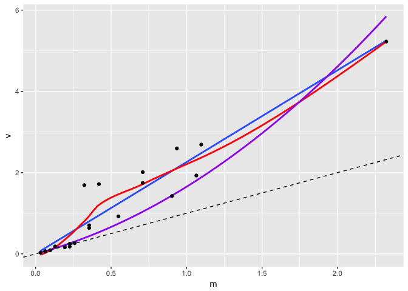

It's always a good idea to fit GLMMs with multiple methods if possible to ensure the conclusions are not sensitive to the optimization method or that your model has not converged.

One of the greatest things since sliced bread is the new TMB package for R. TMB normally requires you to write your own model template, but the package glmmTMB comes with a number of pre-written and tested GLMMs.

TMB, and therefore glmmTMB, is *FAST* and very robust. <https://github.com/glmmTMB>

``` r
library(glmmTMB)

m_tmb <- glmmTMB(f_lme4, data = d, family = poisson(link = "log"))
summary(m_tmb)
```

    ##  Family: poisson  ( log )
    ## Formula: 
    ## late_kills ~ salmon_scaled + prev_3yr_conflict_scaled + mean_annual_temp_scaled +  
    ##     mean_temp_scaled + total_log_precip_scaled + year_scaled +  
    ##     log_humanpop_scaled + log_grizzly_pop_est_scaled + offset(log(gbpu_usable_area)) +  
    ##     (1 | gbpu)
    ##    Data: d
    ## 
    ##      AIC      BIC   logLik deviance df.resid 
    ##   1266.3   1311.5   -623.1   1246.3      672 
    ## 
    ## Random effects:
    ## 
    ## Conditional model:
    ##  Groups Name        Variance Std.Dev.
    ##  gbpu   (Intercept) 0.6698   0.8184  
    ## Number of obs: 682, groups:  gbpu, 22
    ## 
    ## Conditional model:
    ##                            Estimate Std. Error z value Pr(>|z|)    
    ## (Intercept)                 -3.6715     0.1946 -18.864  < 2e-16 ***
    ## salmon_scaled               -0.4467     0.1043  -4.281 1.86e-05 ***
    ## prev_3yr_conflict_scaled     0.3110     0.1063   2.924  0.00345 ** 
    ## mean_annual_temp_scaled      0.4576     0.4334   1.056  0.29107    
    ## mean_temp_scaled             0.8314     0.8902   0.934  0.35031    
    ## total_log_precip_scaled     -0.9986     0.9152  -1.091  0.27520    
    ## year_scaled                  0.3570     0.1190   2.999  0.00271 ** 
    ## log_humanpop_scaled         -0.1057     0.5446  -0.194  0.84609    
    ## log_grizzly_pop_est_scaled   0.3234     0.6652   0.486  0.62685    
    ## ---
    ## Signif. codes:  0 '***' 0.001 '**' 0.01 '*' 0.05 '.' 0.1 ' ' 1

``` r
m_tmb_obs <- glmmTMB(f_lme4_obs, data = d, family = poisson(link = "log"))
summary(m_tmb_obs)
```

    ##  Family: poisson  ( log )
    ## Formula: 
    ## late_kills ~ salmon_scaled + prev_3yr_conflict_scaled + mean_annual_temp_scaled +  
    ##     mean_temp_scaled + total_log_precip_scaled + year_scaled +  
    ##     log_humanpop_scaled + log_grizzly_pop_est_scaled + (1 | gbpu) +  
    ##     (1 | obs)
    ##    Data: d
    ## 
    ##      AIC      BIC   logLik deviance df.resid 
    ##   1173.5   1223.3   -575.8   1151.5      671 
    ## 
    ## Random effects:
    ## 
    ## Conditional model:
    ##  Groups Name        Variance Std.Dev.
    ##  obs    (Intercept) 1.0847   1.0415  
    ##  gbpu   (Intercept) 0.5342   0.7309  
    ## Number of obs: 682, groups:  obs, 682; gbpu, 22
    ## 
    ## Conditional model:
    ##                            Estimate Std. Error z value Pr(>|z|)    
    ## (Intercept)                -1.70355    0.20313  -8.387   <2e-16 ***
    ## salmon_scaled              -0.36948    0.15702  -2.353   0.0186 *  
    ## prev_3yr_conflict_scaled    0.32110    0.16039   2.002   0.0453 *  
    ## mean_annual_temp_scaled     0.44075    0.45799   0.962   0.3359    
    ## mean_temp_scaled           -0.24363    0.85011  -0.287   0.7744    
    ## total_log_precip_scaled    -0.52642    0.88130  -0.597   0.5503    
    ## year_scaled                 0.36740    0.17228   2.133   0.0330 *  
    ## log_humanpop_scaled         0.05489    0.51528   0.107   0.9152    
    ## log_grizzly_pop_est_scaled -0.28158    0.63746  -0.442   0.6587    
    ## ---
    ## Signif. codes:  0 '***' 0.001 '**' 0.01 '*' 0.05 '.' 0.1 ' ' 1

``` r
m_tmb_nb <- glmmTMB(f_lme4, data = d, family = nbinom2(link = "log"))
summary(m_tmb_nb)
```

    ##  Family: nbinom2  ( log )
    ## Formula: 
    ## late_kills ~ salmon_scaled + prev_3yr_conflict_scaled + mean_annual_temp_scaled +  
    ##     mean_temp_scaled + total_log_precip_scaled + year_scaled +  
    ##     log_humanpop_scaled + log_grizzly_pop_est_scaled + offset(log(gbpu_usable_area)) +  
    ##     (1 | gbpu)
    ##    Data: d
    ## 
    ##      AIC      BIC   logLik deviance df.resid 
    ##   1171.3   1221.1   -574.7   1149.3      671 
    ## 
    ## Random effects:
    ## 
    ## Conditional model:
    ##  Groups Name        Variance Std.Dev.
    ##  gbpu   (Intercept) 0.5873   0.7663  
    ## Number of obs: 682, groups:  gbpu, 22
    ## 
    ## Overdispersion parameter for nbinom2 family (sigma): 0.728 
    ## 
    ## Conditional model:
    ##                            Estimate Std. Error z value Pr(>|z|)    
    ## (Intercept)                 -3.6431     0.1907 -19.107  < 2e-16 ***
    ## salmon_scaled               -0.4128     0.1543  -2.675  0.00747 ** 
    ## prev_3yr_conflict_scaled     0.3113     0.1621   1.921  0.05476 .  
    ## mean_annual_temp_scaled      0.5541     0.4713   1.176  0.23974    
    ## mean_temp_scaled             0.7992     0.8775   0.911  0.36240    
    ## total_log_precip_scaled     -0.9766     0.9058  -1.078  0.28100    
    ## year_scaled                  0.4041     0.1738   2.324  0.02010 *  
    ## log_humanpop_scaled         -0.1309     0.5324  -0.246  0.80582    
    ## log_grizzly_pop_est_scaled   0.3253     0.6589   0.494  0.62158    
    ## ---
    ## Signif. codes:  0 '***' 0.001 '**' 0.01 '*' 0.05 '.' 0.1 ' ' 1

``` r
m_tmb_nb1 <- glmmTMB(f_lme4, data = d, family = nbinom1(link = "log"))
summary(m_tmb_nb1)
```

    ##  Family: nbinom1  ( log )
    ## Formula: 
    ## late_kills ~ salmon_scaled + prev_3yr_conflict_scaled + mean_annual_temp_scaled +  
    ##     mean_temp_scaled + total_log_precip_scaled + year_scaled +  
    ##     log_humanpop_scaled + log_grizzly_pop_est_scaled + offset(log(gbpu_usable_area)) +  
    ##     (1 | gbpu)
    ##    Data: d
    ## 
    ##      AIC      BIC   logLik deviance df.resid 
    ##   1174.2   1224.0   -576.1   1152.2      671 
    ## 
    ## Random effects:
    ## 
    ## Conditional model:
    ##  Groups Name        Variance Std.Dev.
    ##  gbpu   (Intercept) 0.4585   0.6771  
    ## Number of obs: 682, groups:  gbpu, 22
    ## 
    ## Overdispersion parameter for nbinom1 family (sigma): 0.967 
    ## 
    ## Conditional model:
    ##                            Estimate Std. Error z value Pr(>|z|)    
    ## (Intercept)                 -3.5513     0.1778 -19.972   <2e-16 ***
    ## salmon_scaled               -0.2897     0.1378  -2.103   0.0355 *  
    ## prev_3yr_conflict_scaled     0.3182     0.1349   2.358   0.0184 *  
    ## mean_annual_temp_scaled      0.4035     0.4257   0.948   0.3432    
    ## mean_temp_scaled             0.8929     0.7898   1.130   0.2583    
    ## total_log_precip_scaled     -1.1220     0.8256  -1.359   0.1741    
    ## year_scaled                  0.2258     0.1469   1.537   0.1243    
    ## log_humanpop_scaled         -0.1338     0.4795  -0.279   0.7802    
    ## log_grizzly_pop_est_scaled   0.5007     0.5892   0.850   0.3954    
    ## ---
    ## Signif. codes:  0 '***' 0.001 '**' 0.01 '*' 0.05 '.' 0.1 ' ' 1

``` r
bbmle::AICtab(m_tmb, m_tmb_nb, m_tmb_nb1)
```

    ##           dAIC df
    ## m_tmb_nb   0.0 11
    ## m_tmb_nb1  2.9 11
    ## m_tmb     94.9 10

``` r
plot(log(fitted(m_tmb)), residuals(m_tmb, type = "pearson"))
```

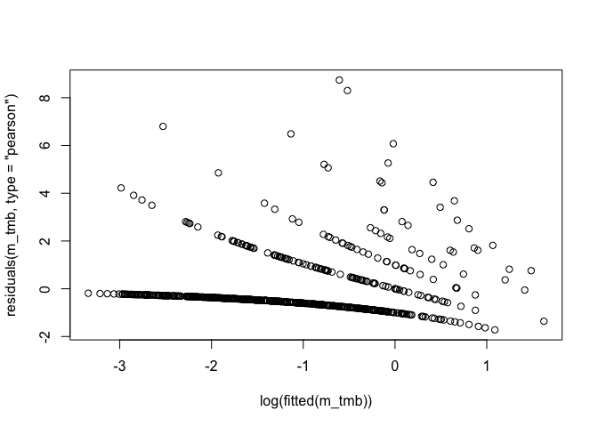

``` r
plot(log(fitted(m_tmb_obs)), residuals(m_tmb_obs, type = "pearson"))
```

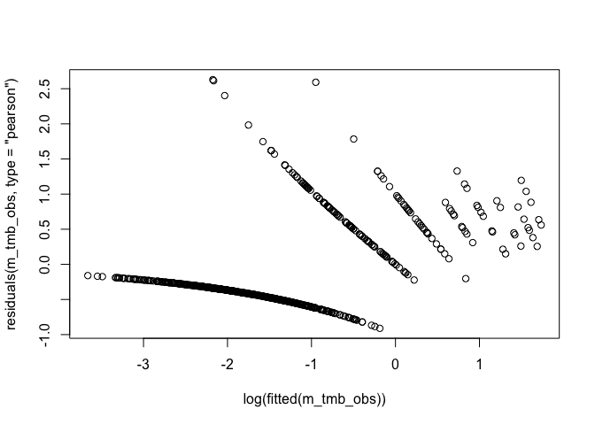

``` r
plot(log(fitted(m_tmb_nb)), residuals(m_tmb_nb, type = "pearson"))
```

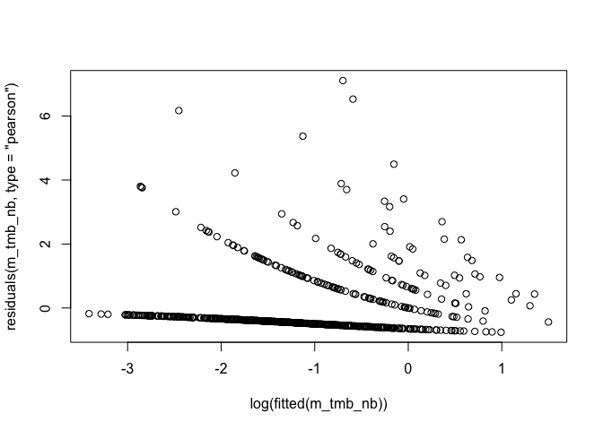

``` r
plot(log(fitted(m_tmb_nb1)), residuals(m_tmb_nb1, type = "pearson"))
```

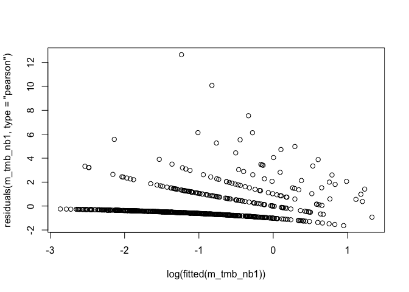

The residuals from the negative binomial model look the best to me.

``` r
plot(log(fitted(m_tmb)), sqrt(abs(residuals(m_tmb, type = "pearson"))))
```

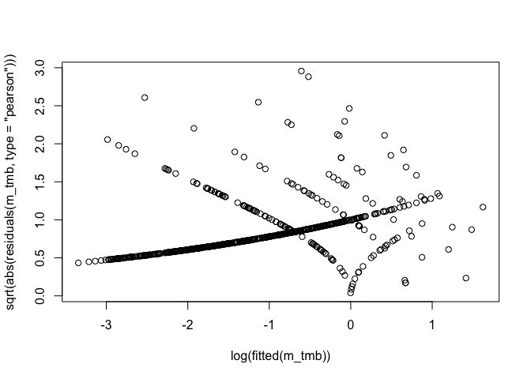

``` r
plot(log(fitted(m_tmb_nb)), sqrt(abs(residuals(m_tmb_nb, type = "pearson"))))
```

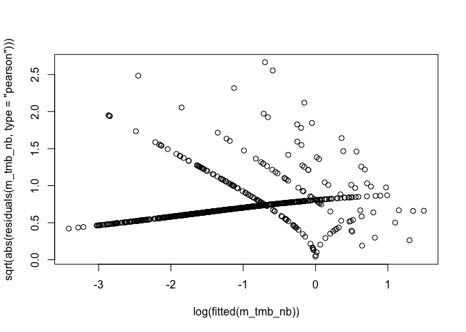

Let's plot the residuals by group:

``` r
d$res_nb <- residuals(m_tmb_nb, type = "pearson")
ggplot(d, aes(gbpu, res_nb)) + geom_boxplot() + coord_flip()
```

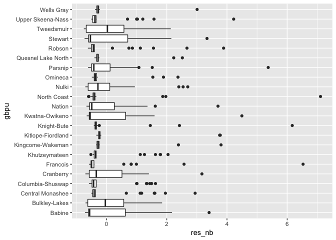

Quick Bayesian version:

``` r
library(rstanarm)
library(rstan)
options(mc.cores = parallel::detectCores())

mstan <- rstanarm::stan_glmer(f_lme4, data = d, 
  family = poisson(link = "log"), chains = 2, iter = 300)
summary(mstan)

mstan_nb <- rstanarm::stan_glmer.nb(f_lme4, data = d, chains = 2,
  iter = 300)

summary(mstan_nb)
stan_plot(mstan_nb)
stan_trace(mstan_nb)
stan_rhat(mstan_nb)
stan_hist(mstan_nb)
stan_est <- broom::tidyMCMC(mstan_nb, conf.int = TRUE, 
  estimate.method = "median")

stan_est %>% filter(grepl("gbpu", term)) %>%
  ggplot(aes(term, estimate, ymin = conf.low, ymax = conf.high)) +
  geom_pointrange() +
  coord_flip()

stan_re_int <- stan_est %>% filter(grepl("gbpu", term))
qqnorm(stan_re_int$estimate)
qqline(stan_re_int$estimate)
save(mstan, mstan_nb, file = "data/generated/stan-models.rda")
```

Let's compare confidence intervals:

``` r
load("data/generated/stan-models.rda")
get_tmb_cis <- function(x, name) {
  ci <- list()
  ci <- data.frame(confint(x), fixef(x)[[1]])
  names(ci) <- c("conf.low", "conf.high", "estimate")
  ci$model <- name
  ci$term <- names(fixef(x)$cond)
  ci
}
cis <- list()
cis[[1]] <- get_tmb_cis(m_tmb, "Poisson")
cis[[2]] <- get_tmb_cis(m_tmb_obs, "Poisson w obs RE")
cis[[3]] <- get_tmb_cis(m_tmb_nb, "Negative binomial")
cis[[4]] <- get_tmb_cis(m_tmb_nb1, "Negative binomial 1")
cis[[5]] <- broom::tidy(m_glmer, conf.int = TRUE) %>%
  dplyr::select(conf.low, conf.high, estimate, term) %>%
  mutate(model = "Poisson (glmer)") %>%
  filter(term != "sd_(Intercept).gbpu")
cis[[6]] <- stan_est %>%
  dplyr::select(conf.low, conf.high, estimate, term) %>%
  filter(!grepl("Intercept", term), term != "overdispersion") %>%
  mutate(model = "Negative binomial (Stan)")

cis_df <- bind_rows(cis) %>% filter(term != "(Intercept)")
```

``` r
ggplot(cis_df, aes(term, estimate, 
  ymin = conf.low, ymax = conf.high, colour = model)) +
  geom_pointrange(position = position_dodge(width = 0.5)) +
  coord_flip() +
  geom_hline(yintercept = 0, linetype = 2)
```

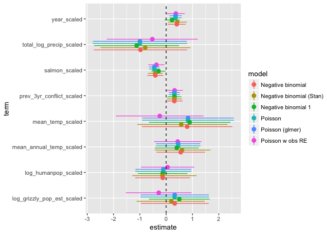

``` r
filter(cis_df, term == "salmon_scaled") %>%
  ggplot(aes(term, estimate, ymin = conf.low, ymax = conf.high, 
    colour = model)) +
  geom_pointrange(position = position_dodge(width = 0.5)) +
  coord_flip() +
  geom_hline(yintercept = 0, linetype = 2)
```

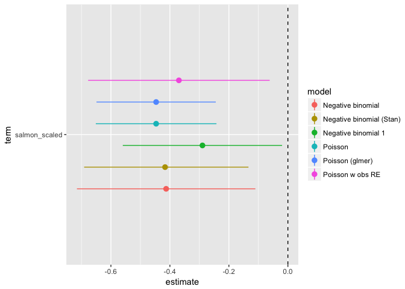

Harrison, X. A. 2014. Using observation-level random effects to model overdispersion in count data in ecology and evolution. PeerJ 2:e616.

<https://peerj.com/articles/616/>

Y ~ NB(lambda, alpha) Var(Y) = lambda + lambda^2 / alpha
