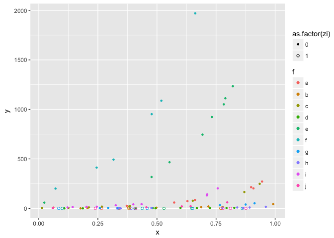
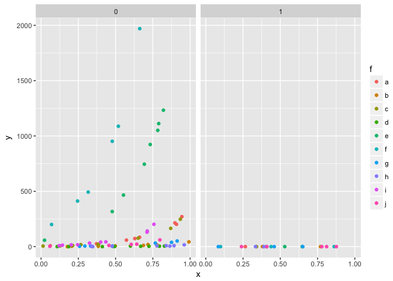
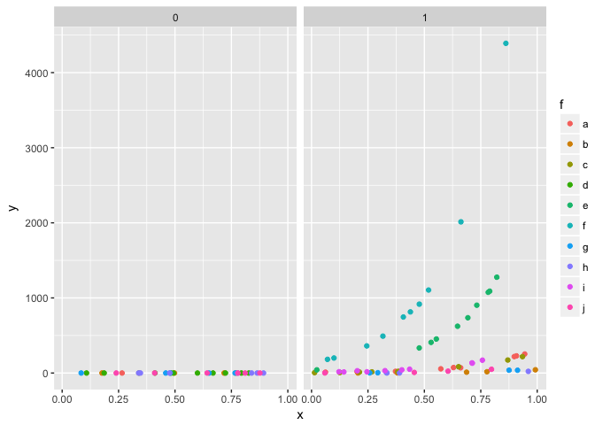

Zero-inflated models
====================

Goals
=====

-   Gain familiarity with the concept of zero-inflated models
-   Understand the difference between estimating a zero-inflated parameter and a hurdle/delta model
-   Learn how to approach continuous positive data that also has zeros

Introduction
============

Let's try fitting models with a zero inflation parameter.

``` r
library(tidyverse)
library(glmmTMB)
```

Zero-inflation: With probability 1-pz, Y comes from a Poisson (or negative binomial) distribution, and with probability pz, Y is zero (Bohning et al. 1999).

<https://groups.nceas.ucsb.edu/non-linear-modeling/projects/owls/WRITEUP/owls.pdf>

BB: <https://stat.ethz.ch/pipermail/r-sig-mixed-models/2012q3/018874.html>

``` r
# simulated zero-inflated Poisson example
set.seed(1)
d <- data.frame(f = factor(rep(letters[1:10], each = 10)), x = runif(100))
u <- rnorm(10, sd = 2)
d$eta <- with(d, u[f] + 1 + 4 * x)
pz <- 0.2 # probability of excess zeros
zi <- rbinom(100, size = 1, prob = pz)
d$y <- ifelse(zi, 0, rpois(100, lambda = exp(d$eta)))
d$zi <- zi

ggplot(d, aes(x, y, colour = f, shape = as.factor(zi))) + geom_point() +
  scale_shape_manual(values = c(20, 21))
```



``` r
ggplot(d, aes(x, y, colour = f)) + geom_point() +
  facet_wrap(~zi)
```



``` r
# zip_admb <- glmmADMB::glmmadmb(y ~ x + (1 | f), 
#   data = d, family = "poisson", zeroInflation = TRUE)
# summary(zip_admb)
```

``` r
zip_tmb <- glmmTMB(y ~ x + (1 | f), data = d, family = "poisson", ziformula = ~ 1)
summary(zip_tmb)
```

``` r
zi <- coef(summary(zip_tmb))$zi[1, "Estimate"]
zi_se <- coef(summary(zip_tmb))$zi[1, "Std. Error"]

# CIs:
plogis(zi - 2 * zi_se) %>% round(2)
plogis(zi) %>% round(2)
plogis(zi + 2 * zi_se) %>% round(2)
```

Hurdle/delta model
==================

``` r
# simulated zero-inflated Poisson example
set.seed(1)
d <- data.frame(f = factor(rep(letters[1:10], each = 10)), x = runif(100))
u <- rnorm(10, sd = 2)
d$eta0 <- with(d, u[f] + 1 + 0.5 * x)
d$eta <- with(d, u[f] + 1 + 4 * x)
pz <- plogis(d$eta0) # probability of excess zeros
zi <- rbinom(100, size = 1, prob = pz)
rtpois <- function(N, lambda) qpois(runif(N, dpois(0, lambda), 1), lambda)
d$y <- ifelse(zi==0, 0, rtpois(100, lambda = exp(d$eta)))
d$zi <- zi

ggplot(d, aes(x, y, colour = f, shape = as.factor(zi))) + geom_point() +
  scale_shape_manual(values = c(20, 21))
```


``` r
ggplot(d, aes(x, y, colour = f)) + geom_point() +
  facet_wrap(~zi)
```



``` r
hurd_a <- glmmTMB(y ~ x + (1 | f), data = dplyr::filter(d, y > 0), 
  family = list(family = "truncated_poisson", link = "log"))
summary(hurd_a)
```

``` r
d <- mutate(d, y1 = y > 0)
hurd_b <- glmmTMB(y1 ~ x + (1 | f), data = d, 
  family = binomial(link = "logit"))
summary(hurd_b)
```

We can derive the prediction of the hurdle model by

``` r
pred_a <- predict(hurd_a, newdata = d)
pred_b <- predict(hurd_b, newdata = d)

head(pred_a)
head(pred_b)
d$pred <- pred_a * pred_b

ggplot(d, aes(y, pred, colour = f, shape = as.factor(zi))) + 
  geom_point() + scale_shape_manual(values = c(20, 21))
```

We can calculate the AIC of the hurdle model simply by adding the AIC of the 2 component models.

``` r
AIC(zip_tmb)
AIC(hurd_a) + AIC(hurd_b)
```
