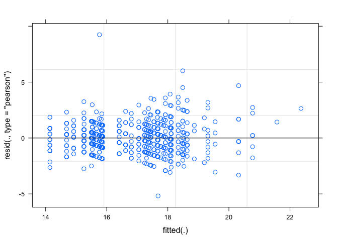
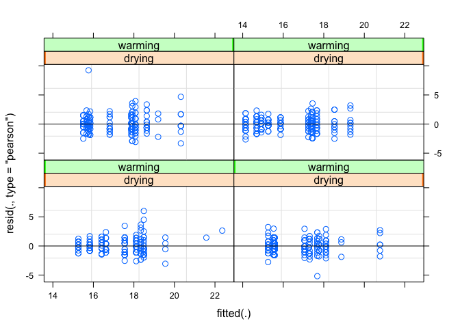
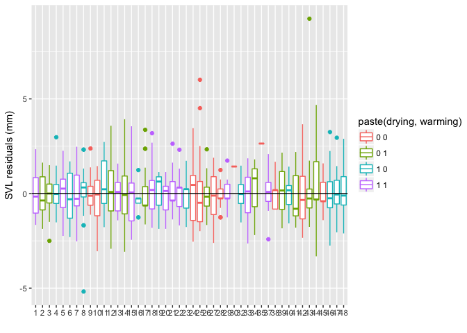

``` r
library(tidyverse)
d <- read_csv("data/raw/oregan-etal-2013/meso.csv")
```

    ## Parsed with column specification:
    ## cols(
    ##   tank = col_integer(),
    ##   date = col_character(),
    ##   climate = col_character(),
    ##   drying = col_character(),
    ##   treatment = col_character(),
    ##   species = col_character(),
    ##   svl = col_double(),
    ##   mass = col_double(),
    ##   time = col_integer(),
    ##   cumulative = col_integer(),
    ##   prop.meta = col_double(),
    ##   devel.rate = col_double(),
    ##   final.stage = col_integer(),
    ##   algaemass = col_double()
    ## )

``` r
species_letters <- tibble(species = c("spadefoot", "treefrog", "redlegged"),
  sp = c("b", "c", "a"))
d <- inner_join(d, species_letters) %>%
  rename(species_true = species, species = sp) %>%
  mutate(warming = ifelse(climate == "warming", 1, 0),
    drying = ifelse(drying == "temp", 1, 0)) %>%
  select(tank, date, drying, warming, species, species_true, svl, mass, time) %>%
  mutate(species = as.factor(species), tank = as.factor(tank))
```

    ## Joining, by = "species"

``` r
d
```

    ## # A tibble: 843 × 9
    ##      tank      date drying warming species species_true   svl  mass  time
    ##    <fctr>     <chr>  <dbl>   <dbl>  <fctr>        <chr> <dbl> <dbl> <int>
    ## 1       1 6/27/2012      1       1       b    spadefoot  16.0 0.670    49
    ## 2       1 6/29/2012      1       1       b    spadefoot  16.0 0.597    51
    ## 3       1  7/1/2012      1       1       b    spadefoot  17.0 0.523    53
    ## 4       1  7/1/2012      1       1       b    spadefoot  16.0 0.492    53
    ## 5       1  7/1/2012      1       1       b    spadefoot  18.0 0.609    53
    ## 6       1  7/2/2012      1       1       b    spadefoot  16.0 0.476    54
    ## 7       1  7/2/2012      1       1       b    spadefoot  17.5 0.536    54
    ## 8       1  7/4/2012      1       1       b    spadefoot  16.5 0.368    56
    ## 9       1  7/4/2012      1       1       b    spadefoot  18.5 0.642    56
    ## 10      1  7/4/2012      1       1       b    spadefoot  19.0 0.698    56
    ## # ... with 833 more rows

``` r
library(lme4)
m <- lmer(svl ~ (warming + drying + species)^2 + (1 | tank), data = d)

# m2 <- lmer(log(svl) ~ (warming + drying + sp)^2 + ((warming + drying + sp)^2 | tank), data = d)

# m3 <- glmmTMB::glmmTMB(log(svl) ~ (warming + drying + species)^2 + ((warming + drying + species)^2 | tank), data = d)
# summary(m3)
```

``` r
plot(m)
```



``` r
plot(m, resid(., type = "pearson") ~ fitted(.) | drying + warming, abline = 0)
```



``` r
summary(m)
```

    ## Linear mixed model fit by REML ['lmerMod']
    ## Formula: svl ~ (warming + drying + species)^2 + (1 | tank)
    ##    Data: d
    ## 
    ## REML criterion at convergence: 2882.3
    ## 
    ## Scaled residuals: 
    ##     Min      1Q  Median      3Q     Max 
    ## -4.1055 -0.6040 -0.0595  0.5016  7.3208 
    ## 
    ## Random effects:
    ##  Groups   Name        Variance Std.Dev.
    ##  tank     (Intercept) 1.031    1.015   
    ##  Residual             1.592    1.262   
    ## Number of obs: 843, groups:  tank, 46
    ## 
    ## Fixed effects:
    ##                  Estimate Std. Error t value
    ## (Intercept)      18.31782    0.48434   37.82
    ## warming          -0.37064    0.64764   -0.57
    ## drying           -0.86162    0.62312   -1.38
    ## speciesb          2.33260    0.78872    2.96
    ## speciesc         -2.10468    0.64707   -3.25
    ## warming:drying    0.36205    0.65003    0.56
    ## warming:speciesb -1.35019    0.82610   -1.63
    ## warming:speciesc -0.33764    0.75685   -0.45
    ## drying:speciesb  -0.85417    0.82889   -1.03
    ## drying:speciesc  -0.06728    0.75677   -0.09
    ## 
    ## Correlation of Fixed Effects:
    ##             (Intr) warmng drying specsb specsc wrmng:d wrmng:spcsb
    ## warming     -0.574                                                
    ## drying      -0.640  0.207                                         
    ## speciesb    -0.506  0.165  0.225                                  
    ## speciesc    -0.671  0.294  0.357  0.419                           
    ## wrmng:dryng  0.308 -0.537 -0.482  0.160  0.022                    
    ## wrmng:spcsb  0.300 -0.523  0.071 -0.609 -0.241 -0.064             
    ## wrmng:spcsc  0.359 -0.625  0.030 -0.210 -0.542  0.030   0.476     
    ## dryng:spcsb  0.330  0.108 -0.515 -0.638 -0.279 -0.129   0.067     
    ## dryng:spcsc  0.394  0.061 -0.616 -0.254 -0.584 -0.035  -0.031     
    ##             wrmng:spcsc dryng:spcsb
    ## warming                            
    ## drying                             
    ## speciesb                           
    ## speciesc                           
    ## wrmng:dryng                        
    ## wrmng:spcsb                        
    ## wrmng:spcsc                        
    ## dryng:spcsb -0.037                 
    ## dryng:spcsc -0.037       0.480

``` r
d$svl_res <- residuals(m, type = "pearson")
ggplot(d, aes(as.factor(tank), svl_res, colour = paste(drying, warming))) +
  geom_boxplot() + 
  geom_hline(yintercept = 0) + 
  xlab("") + ylab("SVL residuals (mm)")
```



``` r
fe <- fixef(m)
se <- arm::se.fixef(m)

arm::display(m)
```

    ## lmer(formula = svl ~ (warming + drying + species)^2 + (1 | tank), 
    ##     data = d)
    ##                  coef.est coef.se
    ## (Intercept)      18.32     0.48  
    ## warming          -0.37     0.65  
    ## drying           -0.86     0.62  
    ## speciesb          2.33     0.79  
    ## speciesc         -2.10     0.65  
    ## warming:drying    0.36     0.65  
    ## warming:speciesb -1.35     0.83  
    ## warming:speciesc -0.34     0.76  
    ## drying:speciesb  -0.85     0.83  
    ## drying:speciesc  -0.07     0.76  
    ## 
    ## Error terms:
    ##  Groups   Name        Std.Dev.
    ##  tank     (Intercept) 1.02    
    ##  Residual             1.26    
    ## ---
    ## number of obs: 843, groups: tank, 46
    ## AIC = 2906.3, DIC = 2884.6
    ## deviance = 2883.5

``` r
fe_comp <- fe[["drying:speciesb"]] + fe[["drying"]]
se_comp <- sqrt(se[["drying:speciesb"]]^2 - se[["drying"]]^2)
fe_comp + c(-1.96, 1.96) * se_comp
```

    ## [1] -2.7871383 -0.6444398

``` r
comparison_effect <- function(model, base_par, comparison_par) {
  if (class(model) == "glmmTMB") {
    fe <- fixef(model)$cond
    se <- coef(summary(m4))$cond[,"Std. Error"]
  } else {
    se <- arm::se.fixef(model)
    fe <- fixef(model)
  }
  if (base_par != comparison_par) {
    fe_comp <- fe[[comparison_par]] + fe[[base_par]]
    se_comp <- sqrt(se[[comparison_par]]^2 - se[[base_par]]^2)
  } else {
    fe_comp <- fe[[base_par]]
    se_comp <- se[[base_par]]
  }
  
  ci <- fe_comp + c(-1.96, 1.96) * se_comp
  data.frame(lwr = ci[1], est = fe_comp, upr = ci[2])
}

comparison_effect(m, "drying", "drying")
```

    ##         lwr        est       upr
    ## 1 -2.082938 -0.8616222 0.3596937

``` r
comparison_effect(m, "drying", "drying:speciesb")
```

    ##         lwr       est        upr
    ## 1 -2.787138 -1.715789 -0.6444398

``` r
comparison_effect(m, "drying", "drying:speciesc")
```

    ##         lwr        est         upr
    ## 1 -1.770609 -0.9289071 -0.08720509

``` r
base_par <- rep("drying", 3)
comparison_par <- c("drying", "drying:speciesb", "drying:speciesc")
out <- purrr::map2_df(base_par, comparison_par, comparison_effect, model = m)
out
```

    ##         lwr        est         upr
    ## 1 -2.082938 -0.8616222  0.35969375
    ## 2 -2.787138 -1.7157890 -0.64443981
    ## 3 -1.770609 -0.9289071 -0.08720509
